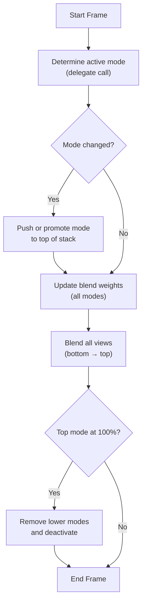
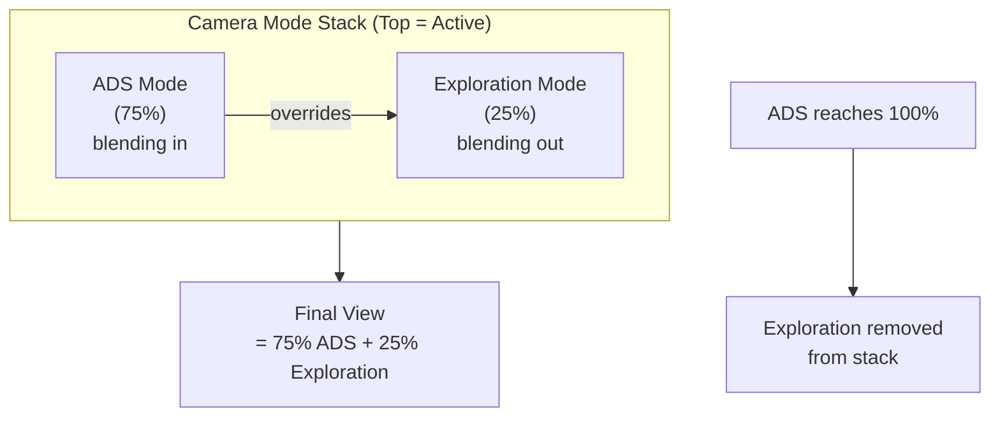

# Camera Modes

You're in third-person exploration mode. The player aims down sights, the camera smoothly transitions to a tighter over-shoulder view. They release, it blends back. Each of these perspectives is a camera mode, and the transitions are handled by a blending stack.

## What a Camera Mode Is

Each camera mode produces a complete camera view every frame: where the camera is in the world, where it's looking, and the field of view. When the active mode changes, the system blends between the old and new views rather than cutting.

Modes define the visual parameters for their perspective. The field of view defaults to 80 degrees. The player can look up and down within pitch limits (default +/- 89 degrees). Each mode also controls how long it takes to transition in, by default, 0.5 seconds with an ease-out curve.

The camera's position starts from the character's head, the **pivot**. For characters with capsule components, the system automatically adjusts the pivot height when crouching. It compares the current capsule height to the default and offsets accordingly, so the camera stays at eye level rather than snapping when the capsule shrinks.

Modes can also tag the owning pawn with a gameplay tag while active. The tag is added when the mode activates and removed when it deactivates. Animation blueprints use this to know the current camera perspective without coupling to specific mode classes, for example, applying tighter upper-body animations when the player is aiming, or enabling first-person IK arms only when the camera is actually in first person.

### The Camera Mode Stack

The stack manages which modes are active and blends between them. Only one mode is "on top" at a time, but during transitions, multiple modes contribute to the final view.

<!-- gb-stepper:start -->
<!-- gb-step:start -->
**Determine the active mode**

The camera component asks "which mode should be active?" via its delegate. This runs every frame.
<!-- gb-step:end -->

<!-- gb-step:start -->
**Push if changed**

If the answer changed, the new mode is pushed onto the top of the stack. If it was already somewhere in the stack, it gets promoted to the top with its prior contribution as the starting blend weight.
<!-- gb-step:end -->

<!-- gb-step:start -->
**Update blend weights**

Each mode on the stack updates its blend weight based on elapsed time and its blend curve. The top mode blends in toward full weight; lower modes blend out.
<!-- gb-step:end -->

<!-- gb-step:start -->
**Blend all views**

The stack combines all mode views, starting from the bottom. Each mode above blends its view on top using its current weight. Location and FOV are linearly interpolated; rotations use normalized delta blending to avoid gimbal issues.
<!-- gb-step:end -->

<!-- gb-step:start -->
**Clean up**

When a mode reaches full weight (100%), every mode below it is removed from the stack and deactivated. The transition is complete.
<!-- gb-step:end -->
<!-- gb-stepper:end -->

High-level lifecycle

During an ADS transition:

### Blend Curves

The blend curve controls how the transition feels. **EaseOut** (the default) starts fast and decelerates, the camera snaps toward the new view quickly then settles smoothly. **Linear** is constant speed from start to finish. **EaseIn** starts slow and accelerates toward the end. **EaseInOut** is smooth at both ends.

The blend exponent (default 4.0) controls the curve's steepness, higher values make the ease more pronounced. With EaseOut at exponent 4, most of the visual change happens in the first moments of the transition, which is why mode switches feel responsive even with a 0.5-second blend time.

Why are mode instances pooled?

The stack caches mode instances in a separate pool rather than creating new ones each time a mode is pushed. When you switch to a mode class, the stack checks whether an instance already exists and reuses it. Switching back to a previous mode (like returning from ADS to exploration) reuses the existing instance, avoiding allocation overhead during rapid mode changes. The pool lives for the lifetime of the stack, so instances are only created once per unique mode class.

