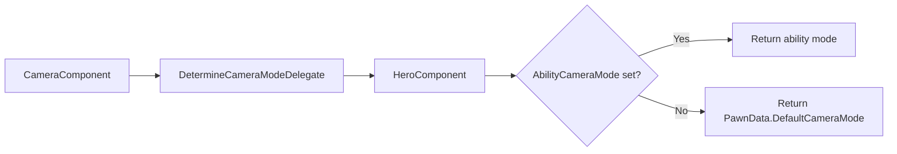

# Integration

The default camera mode comes from PawnData, set once when the character is configured. An aiming ability temporarily overrides it with a tighter view. A cutscene system takes full control of the camera position. Each of these uses a different integration mechanism.

### Default Camera Mode

Every pawn has a `ULyraPawnData` data asset. One of its properties is `DefaultCameraMode`, the camera mode used when nothing else overrides it.

During initialization, the hero component registers as the camera mode provider. Each frame, the camera component asks "which mode should be active?" The hero component checks whether an ability is currently overriding the camera. If yes, it returns the ability's mode. If no, it returns the default from PawnData.

The returned mode class is pushed onto the camera mode stack, where it blends in and produces the final view. Camera mode selection is handled internally, the component reads the `DetermineCameraModeDelegate` each frame. To change the active mode, use `SetAbilityCameraMode` on the hero component or change the pawn's `DefaultCameraMode` in PawnData; there is no public `PushCameraMode` call.

### Ability Camera Override

Any `ULyraGameplayAbility` can take temporary control of the camera by calling `SetCameraMode()`. This stores the requested camera mode on the hero component, along with the ability's spec handle as an ownership token. On the next frame, `DetermineCameraMode()` returns this override instead of the default.

Cleanup is automatic, `EndAbility()` calls `ClearCameraMode()`, so abilities do not need to manually restore the previous camera. Only the ability that set the override can clear it, because the hero component checks the spec handle before resetting.

A practical example: an ADS ability calls `SetCameraMode()` with a tighter third-person mode on activation. When the player releases the aim input and the ability ends, `EndAbility()` automatically calls `ClearCameraMode()`, and the camera returns to the PawnData default.

### External View Override

`ULyraCameraComponent` provides `SetExternalViewOverride()` and `ClearExternalViewOverride()` for systems that need full camera control, bypassing the mode stack entirely.

The override uses `FLyraExternalCameraViewOverride`, a struct with three individually toggleable properties: location, rotation, and FOV. Each has its own enable flag, so you can override just the rotation while letting the mode stack control location and FOV, or override all three for complete control.

The override is applied after the mode stack evaluates, so it takes absolute priority over any active camera mode.

Use cases: cutscenes, UI cameras, spectator systems, anything that needs to place the camera at an exact position regardless of the mode stack.

### FOV Offset

`AddFieldOfViewOffset()` adds a one-frame FOV adjustment on top of the active mode's output. The offset is additive, multiple callers can contribute in the same frame. After the offset is applied, it is cleared back to zero.

To sustain an FOV change, call `AddFieldOfViewOffset()` every frame. This is intentional, it prevents stale offsets from persisting if the calling system is destroyed or deactivated.

Use cases: weapon zoom, sprint FOV widening, or any per-frame visual feedback that layers on top of the camera mode.

### Camera Tags for Animation

Each camera mode can define a `CameraTagToAddToPlayer`, a gameplay tag applied as a loose tag to the pawn while the mode is active.

When a camera mode activates, it adds this tag as a loose gameplay tag on the pawn's ability system; when the mode deactivates, the tag is removed.

Animation blueprints can check this tag to adjust their behavior based on the current camera perspective. For example, a first-person camera mode might tag the pawn so the animation blueprint activates an upper-body IK layer, while a third-person mode uses a different tag that skips head stabilization.

## Engine Integration

`ALyraPlayerCameraManager` sits above `ULyraCameraComponent` in the engine pipeline. It holds infrastructure for a UI camera override, but this is currently a stub, gameplay camera modes always have priority. Default FOV is 80° with a pitch range of -89° to 89°.
