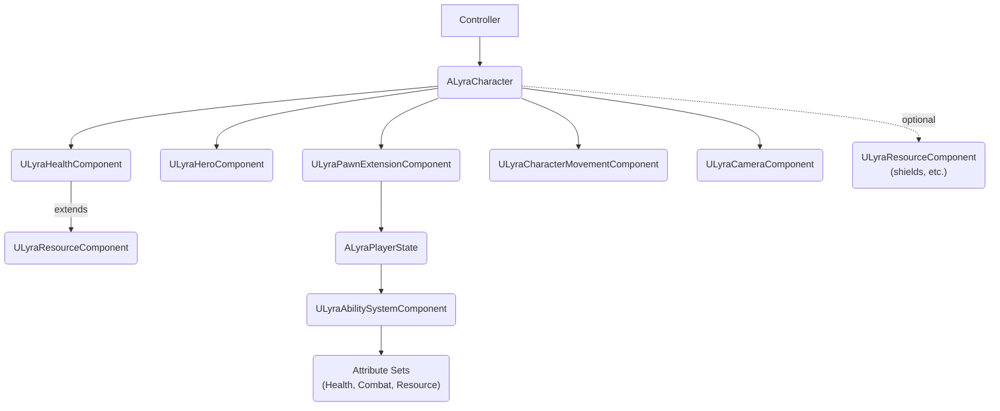

# Character

The character system builds on component-based pawns integrated with the Gameplay Ability System. `ULyraPawnData` drives configuration, you compose characters by combining components and data assets, not deep class hierarchies.

## Architecture

```mermaid
graph TD
    Controller --> Pawn("ALyraCharacter")

    Pawn --> PawnExt("ULyraPawnExtensionComponent")
    Pawn --> Hero("ULyraHeroComponent")
    Pawn --> Health("ULyraHealthComponent")
    Pawn --> Movement("ULyraCharacterMovementComponent")
    Pawn --> Camera("ULyraCameraComponent")

    Health -- extends --> ResourceComp("ULyraResourceComponent")
    Pawn -. optional .-> ExtraResource("ULyraResourceComponent<br/>(shields, etc.)")

    PawnExt --> PlayerState("ALyraPlayerState")
    PlayerState --> ASC("ULyraAbilitySystemComponent")
    ASC --> AttrSets("Attribute Sets<br/>(Health, Combat, Resource)")
```

## Key Classes

| Class                         | Description                                                                                                        |
| ----------------------------- | ------------------------------------------------------------------------------------------------------------------ |
| `ALyraCharacter`              | Standard humanoid pawn with skeletal mesh, movement, and the core component set listed below.                      |
| `ALyraPawn`                   | Lightweight pawn extending `AModularPawn`. No skeletal mesh or movement component. Used for non-humanoid entities. |
| `ALyraCharacterWithAbilities` | Self-contained character that owns its own ASC and attribute sets directly, bypassing Player State.                |
| `ALyraPlayerState`            | Owns the ASC and attribute sets for player-controlled pawns.                                                       |
| `ULyraPawnData`               | Data asset that configures pawn behavior: input config, camera mode, ability sets.                                 |

## Pawn Components

| Component                         | Description                                                                                                                        |
| --------------------------------- | ---------------------------------------------------------------------------------------------------------------------------------- |
| `ULyraPawnExtensionComponent`     | Coordinator. Locates the ASC, manages `ULyraPawnData`, drives the InitState lifecycle.                                             |
| `ULyraHeroComponent`              | Binds Enhanced Input actions to GAS ability tags. Manages camera mode selection from `ULyraPawnData`.                              |
| `ULyraHealthComponent`            | Extends `ULyraResourceComponent` with death-state tracking, death gameplay events, and elimination messaging.                      |
| `ULyraResourceComponent`          | Generic depletable resource bound to a `ULyraResourceAttributeSet`. Used directly for shields, mana, or other secondary resources. |
| `ULyraCharacterMovementComponent` | Extends `UCharacterMovementComponent` with replicated acceleration compression and GAS tag-driven movement blocking.               |
| `ULyraCameraComponent`            | Manages camera mode stacking and blending. Abilities can push/pop camera mode overrides.                                           |

## Section Contents

* [**Pawn Classes**](pawn-classes.md) — Pawn class hierarchy and when to use each
* [**Components**](components.md) — Component responsibilities and how they compose a character
* [**Initialization**](initialization.md) — InitState system and phase-based startup
* [**Networking**](networking.md) — Replication optimizations and ASC networking

