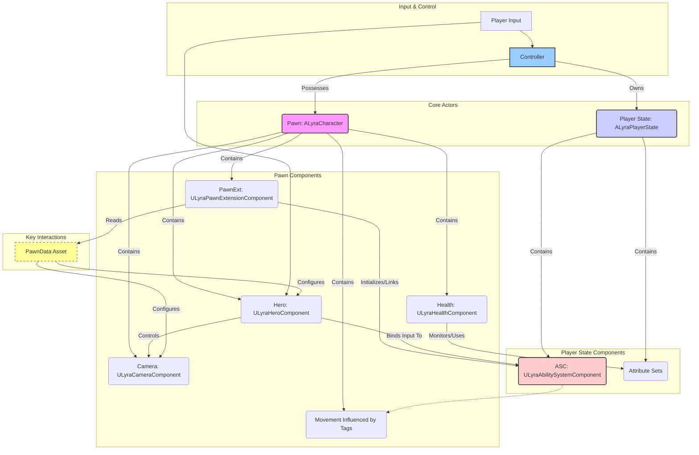

# Character

This system serves as the robust and flexible foundation for all player-controlled characters and potentially sophisticated AI entities within your projects. Built upon and extending Epic Games' Lyra Starter Game, it provides a powerful, networked, and highly customizable framework designed to accelerate the development of your shooter game.

The goal of this asset is to be a generic shooter template, providing the core building blocks without imposing overly specific gameplay. This character system is central to that goal, offering tools and patterns that support a wide variety of shooter mechanics and styles.

### Core Design Philosophy

Understanding the underlying principles will help you leverage the system effectively and extend it confidently:

1. **Modularity and Composition:**
   * The system heavily utilizes Unreal Engine's component-based architecture, building upon AModularCharacter and AModularPawn.
   * Functionality is broken down into distinct components (e.g., `ULyraPawnExtensionComponent`, `ULyraHeroComponent`, `ULyraHealthComponent`, `ULyraCharacterMovementComponent`).
   * **Benefit:** This allows you to easily add, remove, or replace features by managing components, rather than getting locked into complex inheritance hierarchies. You can compose the exact character behavior you need.
2. **Gameplay Ability System (GAS) Centric:**
   * Epic's Gameplay Ability System is the backbone for character actions, statistics (Attributes), status effects, cooldowns, and more.
   * Core classes like `ULyraAbilitySystemComponent` (ASC), `ULyraAttributeSet` derivatives (`ULyraHealthSet`, `ULyraCombatSet`), Gameplay Effects, and Gameplay Abilities are deeply integrated.
   * **Benefit:** GAS provides a robust, network-ready framework for complex gameplay interactions, significantly reducing the need to build such systems from scratch.
3. **Data-Driven Configuration:**
   * Key aspects of a character's setup are defined in data assets, primarily through `ULyraPawnData`.
   * `ULyraPawnData` specifies things like the default camera mode, input configurations (`ULyraInputConfig`), and potentially the initial ability sets granted to a pawn.
   * **Benefit:** Allows designers and developers to configure different character types, tweak input, and adjust starting abilities without modifying C++ or complex Blueprints, speeding up iteration.
4. **Network First Design:**
   * The system is built from the ground up with multiplayer networking in mind, inheriting Lyra's solid replication foundation.
   * **GAS** handles ability activation, attribute changes, and effect replication efficiently.
   * Custom replication enhancements like compressed acceleration (`FLyraReplicatedAcceleration`) and fast-path movement updates (`FSharedRepMovement`) are included for optimization.
   * **Benefit:** Provides a reliable starting point for networked shooter games, handling many common replication challenges.

### Key Components & Interactions (High Level)

Several classes work together to bring a character to life:

* **Pawn (`ALyraCharacter`, `ALyraPawn`):** The physical representation in the world. `ALyraCharacter` is the standard base for humanoid characters, including movement capabilities.
* **Controller (`APlayerController,`** **`AAIController)`:** Represents the "will" controlling the Pawn (player input or AI logic).
* **Player State (`ALyraPlayerState)`:** For player-controlled pawns, this often holds persistent player data, including the **`ULyraAbilitySystemComponent` (ASC)** and associated **`ULyraAttributeSets`**.
* **`ULyraAbilitySystemComponent` (ASC):** The heart of GAS interactions for the character. Manages abilities, effects, and attributes.
* **`ULyraPawnExtensionComponent`:** The crucial **coordinator**. Lives on the Pawn. Its primary jobs are:
  * Finding and initializing the correct ASC (usually from the Player State) for the Pawn.
  * Linking the Pawn as the "Avatar" for the ASC.
  * Managing the `ULyraPawnData` asset associated with the Pawn.
  * Participating in the Lyra initialization system (InitState).
* **`ULyraHeroComponent`:** Lives on the Pawn. Handles player-specific logic:
  * Setting up Enhanced Input using `ULyraInputConfig`.
  * Binding input actions to Gameplay Tags for triggering abilities via the ASC.
  * Managing camera modes (`ULyraCameraComponent`).
* **`ULyraHealthComponent`:** Lives on the Pawn. Manages health state:
  * Interacts with the `ULyraHealthSet` on the ASC.
  * Tracks the character's death state (`ELyraDeathState`).
  * Broadcasts events for health changes and death.
* **`ULyraCharacterMovementComponent`:** Lives on the Pawn. Extends UE's standard movement component with Lyra-specific hooks and optimizations (like handling replicated acceleration).

**Simplified Interaction Flow:**

### Benefits for Developers

Working with this character system provides several advantages:

* **Flexibility:** Easily create diverse character types by composing components and configuring PawnData.
* **Power:** Leverage the full capabilities of **GAS** for complex abilities, status effects, and attribute management.
* **Maintainability:** Component-based design leads to cleaner, more isolated code compared to monolithic character classes.
* **Network-Ready:** Start developing multiplayer games with confidence, knowing the core systems handle replication.
* **Lyra Alignment:** Builds on Epic's well-structured Lyra project, making it potentially easier to integrate other Lyra-compatible features or understand for those familiar with Lyra.

### What's Next?

Now that you have a high-level understanding of the design and key pieces, you can delve deeper into specific areas:

* **Pawn Architecture:** Understand the differences between `ALyraCharacter`, `ALyraPawn`, and `ALyraCharacterWithAbilities`.
* **Core Pawn Components:** Explore the detailed responsibilities of `PawnExtensionComponent`, `HeroComponent`, `HealthComponent`, and `CharacterMovementComponent`.
* **GAS Integration:** Learn how Attributes, Effects, Executions, and Tags work within this character context.
* **Initialization & Spawning:** Understand the InitState system and how pawns are brought into the world correctly.
* **Replication & Networking:** Dive into the specifics of how character state and actions are synchronized.

