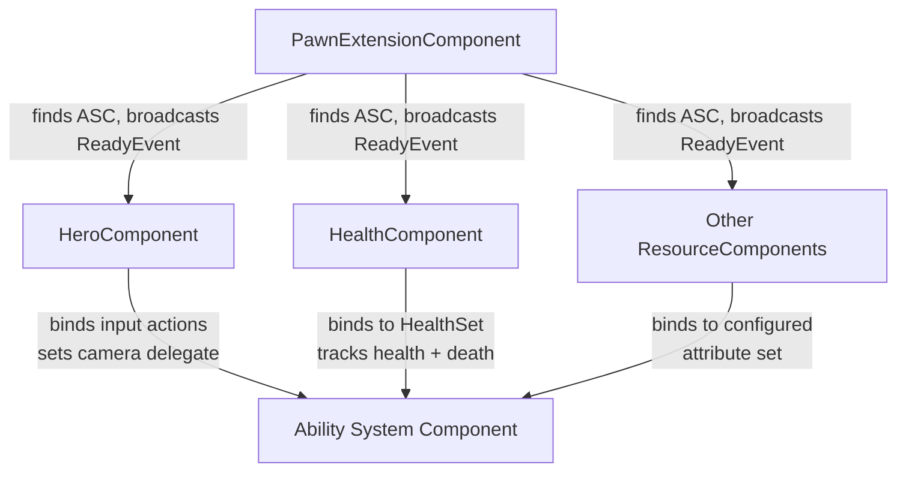
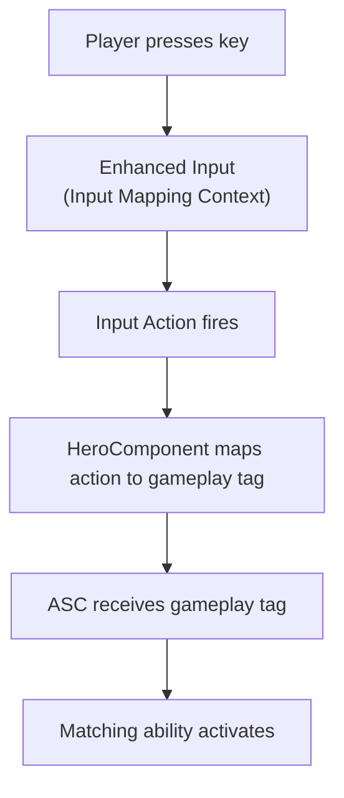
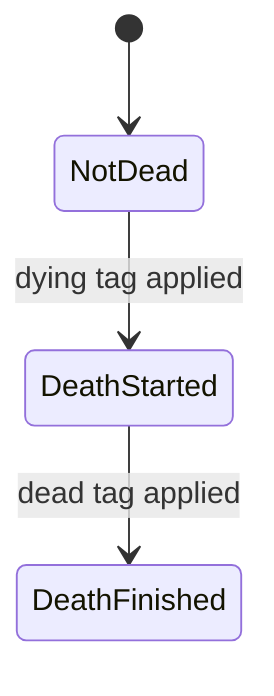

# Components

A character doesn't do anything on its own. Every capability it has comes from a component plugged into it. Input handling, health tracking, camera control, movement, each one is a separate component with a single job. This prevents the character from being monothilic and housing all the logic.

This page walks through the core components on every Lyra pawn, what problems they solve, and how they coordinate with each other.

***

### How the components connect at runtime

***

### The Coordinator — `ULyraPawnExtensionComponent`

Every other component waits for this one.

Components need the Ability System Component to function, but the ASC might not exist yet when they initialize. For player characters, the ASC lives on the PlayerState, which might not have replicated to the client yet. For AI, it might live on the character itself. Someone needs to find it, cache it, and tell every other component when it's safe to proceed.

That's `ULyraPawnExtensionComponent`. It holds the reference to `ULyraPawnData`, the data asset that configures what this pawn _is_, its abilities, input config, camera mode, and pawn specific UI. PawnData is replicated, so clients get it automatically. Other components read it to configure themselves.

It also finds and caches the ASC, whether it lives on the PlayerState or on the character itself. When the ASC is ready, it broadcasts an event that other components listen for. Subscribing uses a "RegisterAndCall" pattern. If the ASC is already initialized when you subscribe, your callback fires immediately. No race conditions, no missed events.

The component implements `IGameFrameworkInitStateInterface` and participates in the [InitState system](initialization.md) to coordinate the full startup sequence.

#### Coordination flow

<!-- gb-stepper:start -->
<!-- gb-step:start -->
#### PawnData is set

From replication or direct assignment. This tells the pawn what it _is_.
<!-- gb-step:end -->

<!-- gb-step:start -->
#### Controller is detected

PlayerState for players, self for AI. This determines where the ASC lives.
<!-- gb-step:end -->

<!-- gb-step:start -->
#### ASC is located and cached

The PawnExtensionComponent receives the ASC and stores it. Every other component accesses it through this cache.
<!-- gb-step:end -->

<!-- gb-step:start -->
#### OnAbilitySystemInitialized fires

The pawn becomes the ASC's avatar actor and the event broadcasts.
<!-- gb-step:end -->

<!-- gb-step:start -->
#### Dependent components bind to the ASC

Health, hero, and any other resource components initialize themselves using the now-ready ASC.
<!-- gb-step:end -->
<!-- gb-stepper:end -->

For a full explanation of where the ASC lives and how it gets initialized, see [ASC Setup](../gas/asc-setup.md).

#### Key Operations

| Method                                       | Purpose                                       |
| -------------------------------------------- | --------------------------------------------- |
| `FindPawnExtensionComponent`                 | Static: find this component on any actor      |
| `GetPawnData`                                | Returns the current pawn data asset           |
| `GetLyraAbilitySystemComponent`              | Returns the cached ASC                        |
| `OnAbilitySystemInitialized_RegisterAndCall` | Register a delegate for when the ASC is ready |
| `OnAbilitySystemUninitialized_Register`      | Register a delegate for ASC cleanup           |

***

### Input & Camera — `ULyraHeroComponent`

The player interface. Handles input binding and camera mode selection.

A player presses the fire button. The keypress enters Unreal's Enhanced Input system, but the ability system speaks in gameplay tags and ability activation. The HeroComponent bridges the gap.

It waits for the PawnExtensionComponent to finish its setup, then reads the `ULyraInputConfig` from PawnData. That config maps Enhanced Input actions to gameplay tags. When the player presses a bound key, the component routes the tag to the ASC, which activates the matching ability. Release works the same way.

#### How input flows

On top of the tag-routed ability inputs, the component also handles movement, camera look (mouse and gamepad), crouch, and auto-run directly, these bypass the ability system.

The `DefaultInputMappings` array (configured in Blueprint defaults) defines the baseline input contexts that are always active. You can layer additional input configs at runtime and remove them later, which is useful for game modes or vehicle controls that add temporary bindings.

#### Camera

The HeroComponent decides which camera mode is active. The camera component queries it each frame through a delegate.

Under normal conditions, it returns the default camera mode defined in PawnData. But abilities can override the camera, a scoping ability might push a zoomed mode, and a third-person finisher might push a cinematic mode. The override is keyed to the specific ability instance, so only the ability that set the override can clear it. When the ability ends, the camera returns to the PawnData default.

#### Key Operations

| Method                        | Purpose                                      |
| ----------------------------- | -------------------------------------------- |
| `FindHeroComponent`           | Static: find this component on any actor     |
| `AddAdditionalInputConfig`    | Adds mode-specific input bindings at runtime |
| `RemoveAdditionalInputConfig` | Removes mode-specific input bindings         |

***

### Health & Resources — `ULyraResourceComponent`

The base for any depletable resource, health, shields, mana, stamina.

Every game has depletable resources, and you don't want to write separate components for each one. `ULyraResourceComponent` is a generic component that binds to any `ULyraResourceAttributeSet` you point it at. Set the `ResourceSetClass` property in Blueprint defaults to the attribute set that backs your resource, a shield set, a mana set, a stamina set, and the component handles the rest.

When the ASC initializes, the resource component finds the matching attribute set on the ASC and binds to its value-change callbacks. It broadcasts events when the resource value changes, when the max value changes, and when the resource is fully depleted.

For how attribute sets work and how to create new resources, see [Attribute Sets](../gas/attribute-sets.md).

#### Automatic lifecycle

`ALyraCharacter` discovers all `ULyraResourceComponent` instances on itself and initializes them when the ASC becomes available. It uninitializes them when the ASC is removed. No Blueprint wiring needed, add the component, set `ResourceSetClass`, and it works.

#### Reading values

| Method                    | Returns                        |
| ------------------------- | ------------------------------ |
| `GetResource()`           | Current resource value         |
| `GetMaxResource()`        | Current maximum resource value |
| `GetResourceNormalized()` | Resource as a 0.0–1.0 fraction |

#### Reacting to changes

| Delegate               | Fires when                     | Signature                                             |
| ---------------------- | ------------------------------ | ----------------------------------------------------- |
| `OnResourceChanged`    | The resource value changes     | `(ResourceComponent, OldValue, NewValue, Instigator)` |
| `OnMaxResourceChanged` | The max resource value changes | `(ResourceComponent, OldValue, NewValue, Instigator)` |
| `OnResourceDepleted`   | The resource reaches zero      | `(ResourceComponent, OldValue, NewValue, Instigator)` |

To find a specific resource component on an actor, use the static helper: `FindResourceComponentByType(Actor, ResourceSetClass)`.

### `ULyraHealthComponent` — Death on top of resources

The health-specific resource component. Adds death handling.

Health is a resource, but it's a special one. When health reaches zero, the character should die, not just sit at zero. `ULyraHealthComponent` extends `ULyraResourceComponent` and defaults `ResourceSetClass` to `ULyraHealthSet` in its constructor, so you never need to configure it manually.

On top of the base resource behavior, it adds a replicated death state machine:

<!-- gb-stepper:start -->
<!-- gb-step:start -->
#### Health reaches zero

`HandleOutOfResource` fires. A `GameplayEvent_Death` gameplay event is sent and an elimination message is broadcast.
<!-- gb-step:end -->

<!-- gb-step:start -->
#### StartDeath is called

The death state changes to `DeathStarted`. The `Status.Death.Dying` gameplay tag is applied to the ASC.
<!-- gb-step:end -->

<!-- gb-step:start -->
#### Death ability activates

The gameplay event triggers a death ability (server only). This is where death animations, ragdoll, loot drops, or respawn logic happen.
<!-- gb-step:end -->

<!-- gb-step:start -->
#### FinishDeath completes the sequence

The death state changes to `DeathFinished`. The `Status.Death.Dead` tag is applied. The state replicates through `OnRep_DeathState`, so all clients see the death play out.
<!-- gb-step:end -->
<!-- gb-stepper:end -->

The component can also programmatically kill its owner through `DamageSelfDestruct`, useful for fall-out-of-world damage or admin commands.

***

### Movement — `ULyraCharacterMovementComponent`

Custom character movement with two key behaviors.

#### Tag-based movement stopping

If the `Gameplay.MovementStopped` tag is present on the ASC, both `GetMaxSpeed()` and `GetDeltaRotation()` return zero. The character freezes in place but the movement component stays fully active, physics, replication, and everything else keeps working.

This means any system, abilities, gameplay effects, Blueprint logic, can freeze a character just by adding a tag. No coupling, no special movement modes, no state flags to manage.

#### Compressed acceleration replication

The component packs acceleration into 3 bytes instead of the default 24, reducing bandwidth for simulated proxies. See [networking](networking.md) for details.
