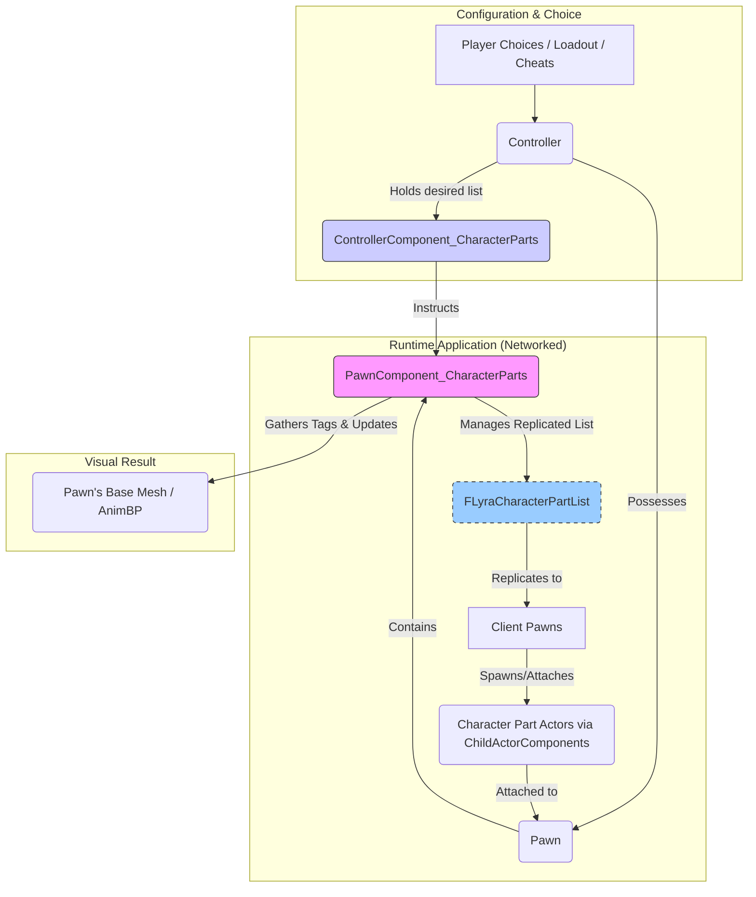

# Cosmetics

This system provides a flexible and robust framework for dynamically changing the visual appearance of Pawns by attaching modular "Character Parts". It's designed to handle everything from simple accessory attachments to driving changes in the base character mesh or associated animations, all within a networked environment.

Built upon Lyra's foundations, this system focuses on modularity and data-driven configuration, aligning with the overall goal of providing a powerful yet generic shooter template.

### Purpose

The primary goals of the Cosmetic System are:

1. **Modular Visual Customization:** Allow developers and players to attach distinct visual elements (represented by Actors) to a base Pawn (e.g., helmets, backpacks, armor pieces).
2. **Dynamic Application:** Enable these cosmetic parts to be added or removed during gameplay based on player choices, loadouts, or game events.
3. **Networked Synchronization:** Ensure that applied cosmetics are correctly replicated and displayed on all clients.
4. **Animation & Base Mesh Influence:** Optionally allow applied cosmetics (via Gameplay Tags) to influence the selection of the base character mesh or animation layers.
5. **Persistence:** Allow cosmetic selections associated with a player (Controller) to persist across Pawn respawns.

### Core Design Philosophy

1. **Separation of Concerns:** The system separates the request for cosmetics (what a player wants applied, typically managed on the Controller) from the runtime execution (the actual spawning and attaching of Actors, managed on the Pawn).
2. **Component-Based:** Functionality is encapsulated within dedicated components (`ULyraPawnComponent_CharacterParts` and `ULyraControllerComponent_CharacterParts`), promoting composition.
3. **Data-Driven Parts:** Character parts are defined simply by the Actor class to spawn (`FLyraCharacterPart`). More complex interactions (like mesh swapping) are driven by Gameplay Tags associated with these parts.
4. **Network Reliability:** Utilizes Unreal Engine's `FFastArraySerializer` for efficient replication of the list of applied parts, ensuring clients correctly reflect the server's state.

**Client-Only Execution for Cosmetic Spawning:**\
Cosmetic part Actors are **never spawned on dedicated servers**. Only clients (and listen servers with local players) will instantiate cosmetic parts visually. This is an intentional optimization: since no one is viewing the dedicated server's visuals, spawning purely aesthetic actors would be wasted processing. The system detects dedicated server context and bypasses all spawning logic for cosmetic parts accordingly.

### Key Components & Concepts

* **`FLyraCharacterPart` (Data Struct):** The fundamental unit defining a cosmetic piece. It specifies the Actor class to spawn, the `SocketName` to attach it to, and the desired `CollisionMode`.
* **`ULyraPawnComponent_CharacterParts` (on the Pawn):**
  * The **Executor**. Lives on the Pawn being customized.
  * Manages the replicated list (`FLyraCharacterPartList`) of currently applied `FLyraCharacterPart` entries.
  * Responsible for spawning `UChildActorComponent` instances on clients to host the actual part Actors.
  * Attaches spawned actors to the Pawn's mesh or root component.
  * Can collect Gameplay Tags from attached parts and trigger base mesh/animation updates via `BroadcastChanged`.
* **`ULyraControllerComponent_CharacterParts` (on the Controller):**
  * The **Persistent Store**. Lives on the Controller (`PlayerController` or `AIController`).
  * Holds the list of desired `FLyraCharacterPart` entries for that controller.
  * When its Controller possesses a Pawn, it instructs the Pawn's `ULyraPawnComponent_CharacterParts` to apply the desired parts.
  * Ensures cosmetic choices persist across respawns by reapplying parts to newly possessed Pawns.
  * Handles applying parts from different sources (natural gameplay, cheats, developer settings).
* **`FLyraAnimBodyStyleSelectionSet` / `FLyraAnimLayerSelectionSet` (Data Structs):** Data structures used to define rules (based on Gameplay Tags) for selecting the appropriate base Skeletal Mesh or Animation Layer Class based on the currently applied cosmetics.

### Simplified Workflow Diagram

**Flow Explanation:**

1. The Controller (representing the player or AI) determines which cosmetic parts should be applied, storing this list in its `ULyraControllerComponent_CharacterParts`.
2. When the Controller possesses a Pawn, the `ControllerComponent` tells the Pawn's `ULyraPawnComponent_CharacterParts` which parts to add.
3. The `PawnComponent` updates its internal replicated list (`FLyraCharacterPartList`).
4. This list replicates efficiently to all clients.
5. On each client (and the server), the `PawnComponent` reacts to the replicated list changes, spawning `UChildActorComponents` that host the actual `FLyraCharacterPart` Actors and attaching them to the Pawn.
6. The `PawnComponent` can then gather tags from the applied parts and potentially update the Pawn's base mesh or trigger animation changes.

### Benefits

* **Decoupled:** Separates cosmetic choice persistence from the runtime spawning logic.
* **Flexible:** Attach almost any Actor as a cosmetic part.
* **Networked:** Built with replication in mind using efficient mechanisms.
* **Extensible:** Can drive base mesh and animation changes via Gameplay Tags.
* **Persistent:** Player choices automatically reapply on respawn via the Controller component.

### What's Next?

Dive deeper into the specific components and data structures:

* **Applying Cosmetics to Pawns (`ULyraPawnComponent_CharacterParts`):** Understand the runtime execution, replication, and visual updates.
* **Managing Desired Cosmetics (`ULyraControllerComponent_CharacterParts`):** Learn how cosmetic choices are stored and persist.
* **Core Data Structures:** Detail the key structs like `FLyraCharacterPart`.
* **Animation & Body Style Integration:** Explore how tags influence mesh and animation selection.
* **Developer Tools & Cheats:** See how to test and override cosmetics during development.
