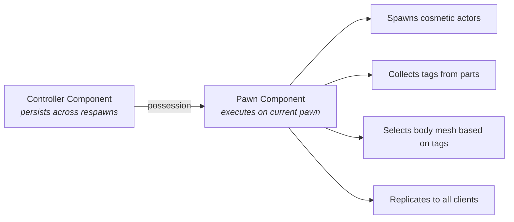
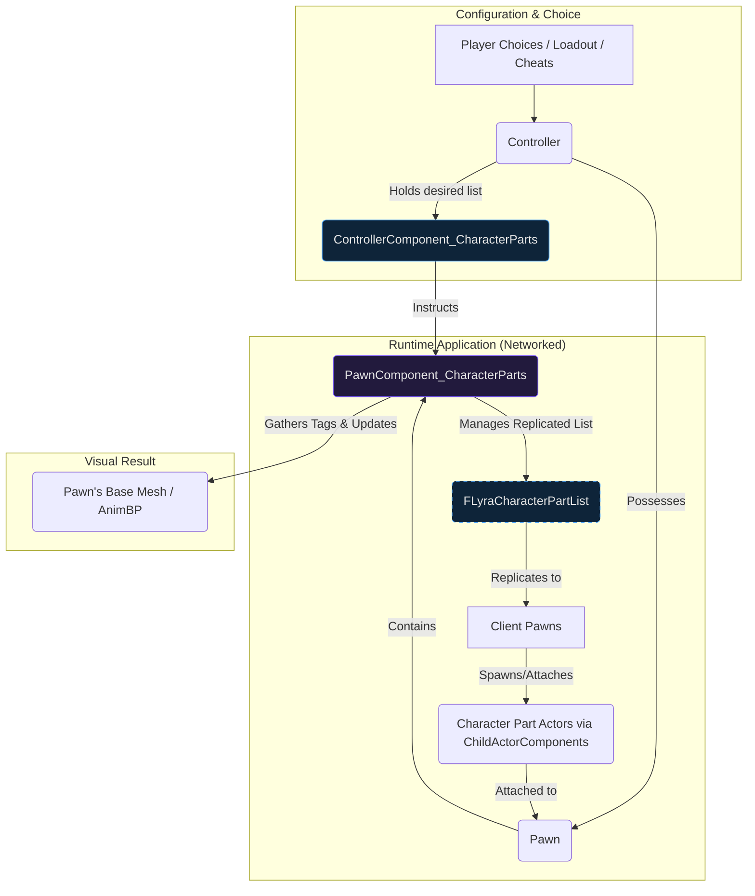

# Cosmetics

A player customizes their character with a helmet, backpack, and weapon skin. Each cosmetic piece is a separate actor attached to the pawn. When the player dies and respawns, all their cosmetics reappear automatically. When they equip different armor, the body mesh and animation layers update to match the new look. The cosmetics system manages all of this through two cooperating components.

***

## Two-Component Architecture

The system splits cosmetic management across two components, one persistent and one per-life:

* **Controller component** (`ULyraControllerComponent_CharacterParts`) — lives on the player controller. It holds the list of desired cosmetic parts and persists across respawns. When the player possesses a new pawn, it re-applies all parts automatically.
* **Pawn component** (`ULyraPawnComponent_CharacterParts`) — lives on the pawn. It spawns the actual cosmetic actors, handles replication, and collects gameplay tags from equipped parts to drive body mesh and animation selection.

<!-- tabs:start -->
#### **Simple**

```mermaid
graph LR
    CC[Controller Component<br/><i>persists across respawns</i>]
    CC -- possession --> PC[Pawn Component<br/><i>executes on current pawn</i>]
    PC --> A[Spawns cosmetic actors]
    PC --> B[Collects tags from parts]
    PC --> C[Selects body mesh based on tags]
    PC --> D[Replicates to all clients]
```

#### **More Detailed**

```mermaid
graph TD
    subgraph "Configuration & Choice"
        A[Player Choices / Loadout / Cheats] --> B(Controller);
        B -- Holds desired list --> C(ControllerComponent_CharacterParts);
    end

    subgraph "Runtime Application (Networked)"
        B -- Possesses --> D(Pawn);
        D -- Contains --> E(PawnComponent_CharacterParts);
        C -- Instructs --> E;

        E -- Manages Replicated List --> F(FLyraCharacterPartList);
        F -- Replicates to --> G[Client Pawns];

        G -- Spawns/Attaches --> H(Character Part Actors via ChildActorComponents);
    end

    subgraph "Visual Result"
         H -- Attached to --> D;
         E -- Gathers Tags & Updates --> I(Pawn's Base Mesh / AnimBP);
    end

    style C fill:#0e2439,stroke:#4ea8ff,stroke-width:1px,color:#e6e6e6
    style E fill:#221a3d,stroke:#7c5cff,stroke-width:1px,color:#e6e6e6
    style F fill:#0e2439,stroke:#4ea8ff,stroke-width:1px,color:#e6e6e6,stroke-dasharray: 5 5
```

**Flow Explanation:**

1. The Controller (representing the player or AI) determines which cosmetic parts should be applied, storing this list in its `ULyraControllerComponent_CharacterParts`.
2. When the Controller possesses a Pawn, the `ControllerComponent` tells the Pawn's `ULyraPawnComponent_CharacterParts` which parts to add.
3. The `PawnComponent` updates its internal replicated list (`FLyraCharacterPartList`).
4. This list replicates efficiently to all clients.
5. On each client (and the server), the `PawnComponent` reacts to the replicated list changes, spawning `UChildActorComponents` that host the actual `FLyraCharacterPart` Actors and attaching them to the Pawn.
6. The `PawnComponent` can then gather tags from the applied parts and potentially update the Pawn's base mesh or trigger animation changes.

<!-- tabs:end -->

***

## Sub-Pages

* [**Cosmetic Parts**](cosmetic-parts.md) - How parts are defined, applied, persisted, and replicated.
* [**Body Style & Animation**](body-style-and-animation.md) - How equipped parts drive body mesh and animation layer selection.
* [**Developer Tools**](developer-tools.md) - Console commands and editor settings for testing cosmetics.
