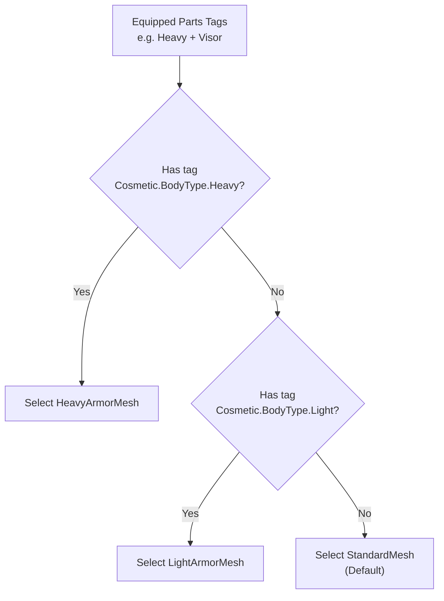

# Body Style and Animation

A character equips heavy armor. The body mesh changes from a light build to a bulky armored model. The animation layer switches to a heavier movement set. None of this requires custom code, the cosmetics system uses gameplay tags from equipped parts to automatically select the right visuals.

***

## Tag-Driven Selection

Every cosmetic part can carry gameplay tags. When parts are attached to a pawn, the pawn component collects tags from all equipped parts into a single combined tag set.

Selection sets define rules against that combined set: "if the combined tags contain X, use mesh Y" or "if they contain Z, use animation layer W." Rules are evaluated in order, and the first match wins. A default fallback handles the case where no rules match.

This pattern is used in two places: body mesh selection and animation layer selection. Both work the same way conceptually, but they differ in how the result gets applied.

***

## Body Mesh Selection

The pawn component holds a `BodyMeshes` property, a body style selection set that maps tag combinations to skeletal meshes.

<!-- tabs:start -->
#### **Blueprints**


#### **C++**
```cpp
// Defined in LyraCosmeticAnimationTypes.h

USTRUCT(BlueprintType)
struct FLyraAnimBodyStyleSelectionEntry
{
    GENERATED_BODY()

    // The Skeletal Mesh to apply if the tags match.
    UPROPERTY(EditAnywhere, BlueprintReadWrite)
    TObjectPtr<USkeletalMesh> Mesh = nullptr;

    // All of these cosmetic tags must be present on the combined applied parts
    // for this rule to be considered a match.
    UPROPERTY(EditAnywhere, BlueprintReadWrite, meta=(Categories="Cosmetic"))
    FGameplayTagContainer RequiredTags;
};

USTRUCT(BlueprintType)
struct FLyraAnimBodyStyleSelectionSet
{
    GENERATED_BODY()

    // List of mesh rules to check, processed in order. First match wins.
    UPROPERTY(EditAnywhere, BlueprintReadWrite, meta=(TitleProperty=Mesh))
    TArray<FLyraAnimBodyStyleSelectionEntry> MeshRules;

    // The Skeletal Mesh to use if none of the MeshRules match the combined tags.
    UPROPERTY(EditAnywhere, BlueprintReadWrite)
    TObjectPtr<USkeletalMesh> DefaultMesh = nullptr;

    // Optional: If set, this Physics Asset will always be applied to the mesh,
    // overriding the one specified in the selected Skeletal Mesh asset.
    UPROPERTY(EditAnywhere)
    TObjectPtr<UPhysicsAsset> ForcedPhysicsAsset = nullptr;

    // Function to determine the best mesh based on tags.
    USkeletalMesh* SelectBestBodyStyle(const FGameplayTagContainer& CosmeticTags) const;
};
```


dd

<!-- tabs:end -->

Whenever cosmetic parts change (added, removed, or modified), the component automatically:

<!-- gb-stepper:start -->
<!-- gb-step:start -->
**Collects tags**

Gathers gameplay tags from all currently equipped cosmetic parts into a combined tag set.
<!-- gb-step:end -->

<!-- gb-step:start -->
**Evaluates rules**

Passes the combined tags to the body style selection set. The first rule whose required tags are all present wins. If nothing matches, the default mesh is used.
<!-- gb-step:end -->

<!-- gb-step:start -->
**Applies the mesh**

Sets the winning skeletal mesh directly on the character's mesh component. If the mesh hasn't actually changed, this is a no-op.
<!-- gb-step:end -->

<!-- gb-step:start -->
**Applies physics override**

If the selection set has a forced physics asset defined, it is applied to the mesh component. This is useful when different body types need different collision shapes.
<!-- gb-step:end -->
<!-- gb-stepper:end -->

This entire flow is automatic. No manual triggering is needed, the pawn component runs it every time parts change.

***

## Animation Layer Selection

Animation layer selection works the same way as body mesh selection, rules that map tag combinations to animation layer classes.

<!-- tabs:start -->
#### **Blueprints**


#### **C++**
```cpp
// Defined in LyraCosmeticAnimationTypes.h

USTRUCT(BlueprintType)
struct FLyraAnimLayerSelectionEntry
{
    GENERATED_BODY()

    // The Anim Instance class (representing an Anim Layer) to apply if the tags match.
    UPROPERTY(EditAnywhere, BlueprintReadWrite)
    TSubclassOf<UAnimInstance> Layer;

    // All of these cosmetic tags must be present on the combined applied parts
    // for this rule to be considered a match.
    UPROPERTY(EditAnywhere, BlueprintReadWrite, meta=(Categories="Cosmetic"))
    FGameplayTagContainer RequiredTags;
};

USTRUCT(BlueprintType)
struct FLyraAnimLayerSelectionSet
{
    GENERATED_BODY()

    // List of layer rules to check, processed in order. First match wins.
    UPROPERTY(EditAnywhere, BlueprintReadWrite, meta=(TitleProperty=Layer))
    TArray<FLyraAnimLayerSelectionEntry> LayerRules;

    // The Anim Instance class (Layer) to use if none of the LayerRules match.
    UPROPERTY(EditAnywhere, BlueprintReadWrite)
    TSubclassOf<UAnimInstance> DefaultLayer;

    // Function to determine the best layer class based on tags.
    TSubclassOf<UAnimInstance> SelectBestLayer(const FGameplayTagContainer& CosmeticTags) const;
};
```

<!-- tabs:end -->

However, unlike body mesh selection, **layer selection is not automatically applied by the pawn component.** The pawn component provides the selection data, but the Animation Blueprint must query it and apply the result.

This is intentional. Animation layer binding is controlled by the AnimBP because it may need to blend between layers over time, maintain state across transitions, or apply layers conditionally based on animation state.

In practice, the integration looks like this:

<!-- gb-stepper:start -->
<!-- gb-step:start -->
**AnimBP queries tags**

The Animation Blueprint calls `GetCombinedTags()` on the pawn component to get the current combined tag set from all equipped parts.
<!-- gb-step:end -->

<!-- gb-step:start -->
**AnimBP evaluates the selection set**

The tags are passed to the animation layer selection set's evaluation function. The first matching rule determines the layer class.
<!-- gb-step:end -->

<!-- gb-step:start -->
**AnimBP links the layer**

The AnimBP links the resulting anim layer class. It controls when and how this happens, it might blend, delay, or conditionally skip the link based on the current animation state.
<!-- gb-step:end -->
<!-- gb-stepper:end -->

<details class="gb-toggle">

<summary>Why is body mesh automatic but animation layers manual?</summary>

Body mesh selection is a simple swap, one mesh replaces another. The pawn component can handle this directly because there is no ambiguity about timing or blending.

Animation layers are more complex. The AnimBP may need to blend between layers over time, maintain state across transitions, or combine multiple layers simultaneously. Forcing automatic layer application would remove that control from the animation team. By leaving the final link step to the AnimBP, animators retain full authority over how and when layer transitions happen.

</details>

***

## How Selection Rules Work

Each rule has a set of required tags and a result (a mesh or a layer class). Rules are evaluated top to bottom. The first rule whose required tags are **all** present in the combined tag set wins. If no rule matches, the default is used.



The order matters. If a character's combined tags satisfy multiple rules, only the first one in the list applies. Place more specific rules (with more required tags) above broader ones to get the right priority.
