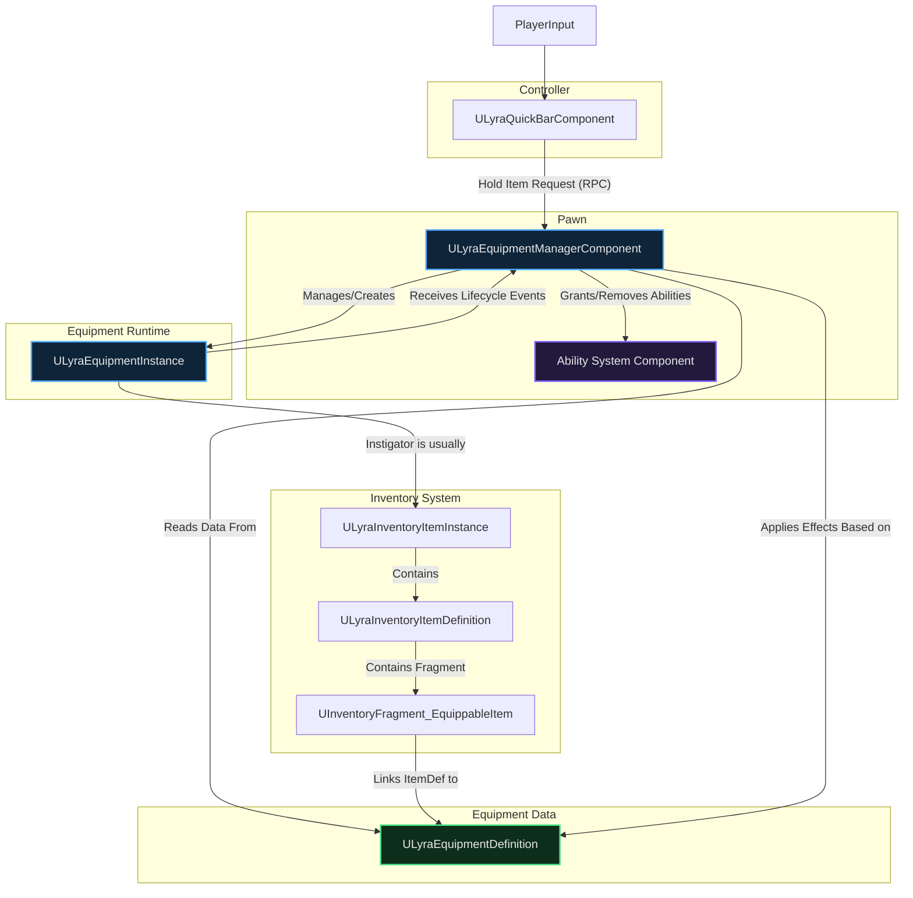

# Equipment

At its core, the Equipment System solves a crucial problem: **How does an item stored in an inventory translate into active gameplay?**

Think about:

* Making a weapon appear in the character's hands.
* Allowing the character to _use_ that weapon (shoot, aim, reload) by granting abilities.
* Showing armor visually on the character model.
* Giving passive benefits (like increased speed or damage resistance) just by _carrying_ certain gear.

The Equipment System manages this entire process, bridging the gap between abstract inventory data and tangible in-world interaction.

Unlike [Inventory](../inventory/) (which is pure storage), equipment applies **behavior** to the pawn, abilities, actors, input mappings. It implements the unified [Item Container](../item-container/) interface with full support for client-side prediction.

***

## How Equipment Works

Equipment manages items that **do something** when equipped. A rifle grants firing abilities and spawns a visible mesh. Armor provides damage reduction. A flashlight toggles illumination.

The system uses a **two-level slot model**. Each equipped item has a storage slot (where it lives, like "hip" or "back") and optionally an active held slot (which hand holds it, like "primary" or "secondary"). An item on your back is equipped but holstered. An item in your hands is equipped and held.

This distinction matters because held and holstered items have different behaviors. A held rifle spawns in your hands with firing abilities. A holstered rifle spawns on your back with no abilities. The equipment system switches between these automatically as players hold and holster items.

### Dependencies

To function correctly, the Equipment System relies on:

* **Inventory System:** Provides the core item definitions (`ULyraInventoryItemDefinition`) and instances (`ULyraInventoryItemInstance`).
* **Gameplay Ability System (GAS):** Essential for granting abilities defined in `ULyraEquipmentDefinition`. You need GAS set up on your Pawns.
* **Gameplay Tags:** Used extensively for defining slots. Ensure the `GameplayTags` plugin is enabled and understand how to create and manage tags.

***

## The Core Components

* The [**Equipment Manager Component**](equipment-manager-component.md) is the container that stores equipped items. It handles behavior application, spawning actors, granting abilities, applying input, based on each item's current state.
* Each equipped item gets an [**Equipment Instance**](equipment-instance.md), a runtime object that tracks spawned actors and manages the held state callbacks.
* Items become equippable through an [**Equippable Item Fragment**](defining-equippable-items.md) that references an Equipment Definition. The definition specifies what behaviors to apply in each state.

***

## Beyond the Basics

* The [**Quick Bar Component**](quick-bar-component.md) provides hotbar-style selection on top of the equipment manager, letting players quickly switch between held weapons.
* [**ViewModels**](equipment-viewmodels.md) give UI widgets a clean interface to equipment state, handling prediction complexity behind the scenes.

***
