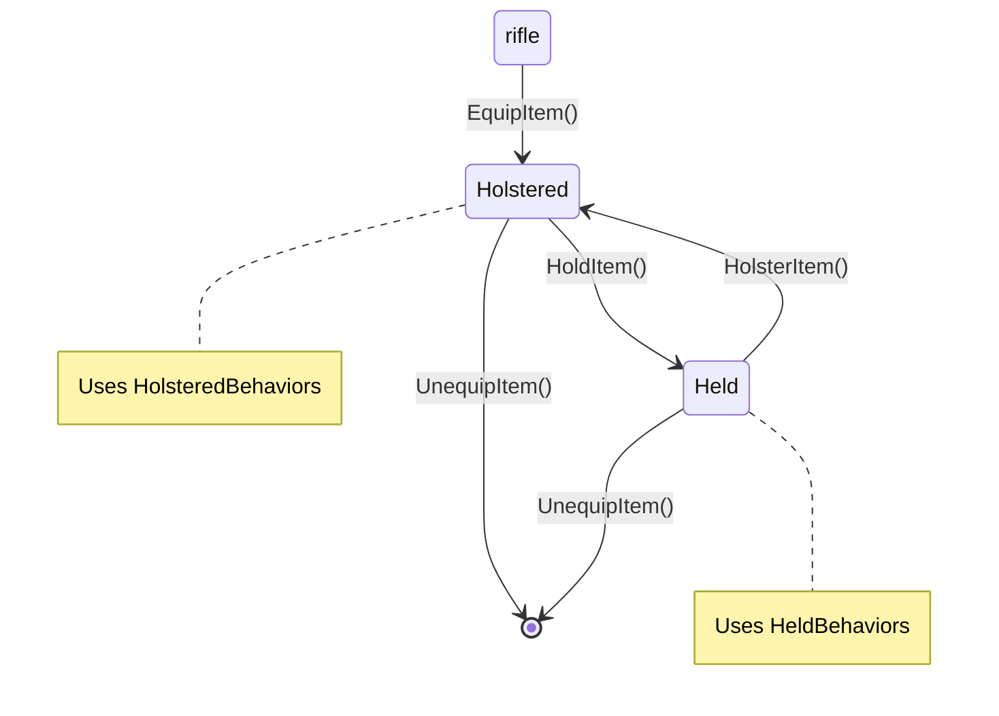
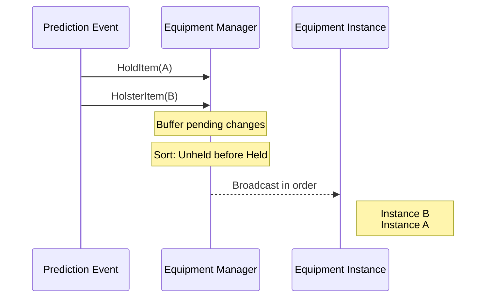
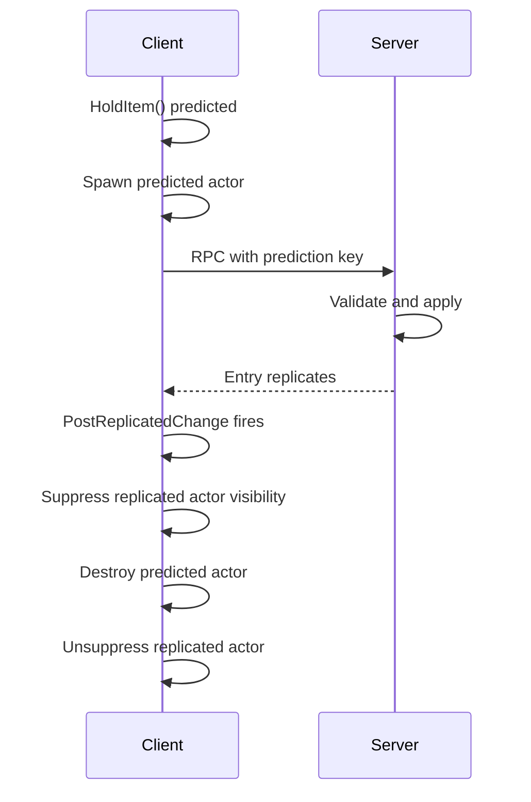

# Equipment Manager Component

You pick up a rifle, equip it to your back, then draw it into your hands. The weapon mesh appears, firing abilities activate, and input bindings apply. You holster it - the mesh moves to your back, firing abilities disappear. How does the system know what to do in each state?

The Equipment Manager handles this. It stores equipped items and applies different **behaviors** based on whether each item is held or holstered.

***

### The Two-Level Slot Model

Every equipped item has two slot properties - and understanding this distinction is key to understanding the entire equipment system.

```
┌─────────────────────────────────────────────────────────────┐
│                    Equipment Entry                           │
├─────────────────────────────────────────────────────────────┤
│                                                              │
│   SlotTag (Storage)              ActiveHeldSlot (State)      │
│   ─────────────────              ─────────────────────       │
│   Where the item LIVES           Which hand is HOLDING       │
│                                                              │
│   Examples:                      Examples:                   │
│   • Equipment.Slot.Back          • Held.Primary              │
│   • Equipment.Slot.Hip           • Held.Secondary            │
│   • Equipment.Slot.Chest         • (empty = holstered)       │
│                                                              │
│   Changes when:                  Changes when:               │
│   Moving to different slot       Hold or holster             │
│                                                              │
└─────────────────────────────────────────────────────────────┘
```

**SlotTag** is the storage location - where the item physically lives on the player's body. A rifle on your back has `SlotTag = Equipment.Slot.Back`. This doesn't change when you draw or holster the weapon.

**ActiveHeldSlot** is the held state - which hand (if any) is holding the item. When you draw the rifle, `ActiveHeldSlot = Held.Primary`. When you holster it, `ActiveHeldSlot` becomes invalid (empty).

#### Why Two Levels?

This separation exists because games need both pieces of information independently:

* For paperdoll UI: show where items are stored, regardless of what's currently held.
* For weapon switching: storage slots remain the same while held state changes.
* For akimbo weapons: multiple ActiveHeldSlot values (Primary, Secondary) while storage slots are independent.

<details class="gb-toggle">

<summary>Entry Structure Deep Dive</summary>

Each equipment entry is stored as `FLyraAppliedEquipmentEntry`:

```cpp
struct FLyraAppliedEquipmentEntry : public FFastArraySerializerItem
{
    // The two-level slot model
    FGameplayTag SlotTag;                    // Storage location (Back, Hip, etc.)
    FGameplayTag ActiveHeldSlot;             // Which hand is holding (empty = holstered)
    FGameplayTagContainer ClaimedHeldSlots;  // For two-handed: all slots claimed

    // The equipment
    TObjectPtr<ULyraEquipmentInstance> Instance;  // Runtime state object
    TObjectPtr<ULyraInventoryItemInstance> Instigator;  // The inventory item

    // Behavior tracking (not replicated)
    FLyraAbilitySet_GrantedHandles GrantedHandles;  // For cleanup on state change

    // Prediction
    FContainerPredictionStamp Prediction;  // For reconciliation
};
```

**Why these fields?**

* `ClaimedHeldSlots` tracks all slots a two-handed weapon is blocking, not just the primary slot
* `Instigator` links back to the inventory item for persistent data like ammo count
* `GrantedHandles` is local-only because abilities are granted per-client-authority

</details>

***

## Equipment States: Holstered vs Held

With the slot model understood, we can talk about equipment states. An item is in one of two states based on its `ActiveHeldSlot`:

* **Holstered:** `ActiveHeldSlot` is invalid (empty) - the item is stored but not in hand
* **Held:** `ActiveHeldSlot` is valid - the item is actively in the player's hand



#### What Changes Between States

Each state applies a different set of **behaviors** from the Equipment Definition:

| State     | Behavior Source                 | Typical Effects                                  |
| --------- | ------------------------------- | ------------------------------------------------ |
| Holstered | `HolsteredBehaviors[SlotTag]`   | Weapon mesh on back, no active abilities         |
| Held      | `HeldBehaviors[ActiveHeldSlot]` | Weapon in hand, fire/reload/aim abilities active |

The key rule: **equipment is always in exactly one state**. When state changes, the old behavior is fully removed before the new behavior applies. Your rifle's Fire ability disappears completely when holstered and reappears when held.

> [!INFO]
> For how behaviors are configured on Equipment Definitions, see [Defining Equippable Items](defining-equippable-items.md).

### Held State Change Notifications

When equipment transitions between held and holstered states, the Equipment Manager notifies each affected Equipment Instance. This notification system includes buffering and sorting for deterministic behavior.

#### The Notification Flow



#### Notification Buffering

When multiple equipment state changes happen in the same frame (common during weapon swaps), the Equipment Manager buffers notifications and broadcasts them in sorted order:

1. **Collection Phase**: When prediction events apply, held state changes are added to a pending buffer
2. **Sort Phase**: `BecameUnheld` notifications are sorted before `BecameHeld` notifications
3. **Broadcast Phase**: `NotifyHeldStateChanged` is called on each Equipment Instance in sorted order

This ordering ensures that the old weapon fully "puts away" before the new weapon starts its "draw" sequence, important for animation and ability coordination.

#### Previous Held State Cache

The Equipment Manager maintains a cache of previous held states for accurate change detection:

```cpp
TMap<FGuid, FGameplayTagContainer> PreviousHeldStateCache;
```

This cache enables the system to detect the actual change type:

| Previous State | New State      | Change Type    |
| -------------- | -------------- | -------------- |
| Empty          | Has tags       | `BecameHeld`   |
| Has tags       | Empty          | `BecameUnheld` |
| Has tags       | Different tags | `StillHeld`    |
| Empty          | Empty          | `NeverHeld`    |

After broadcasting notifications, the cache is updated with the new held states.

#### The `FHeldStateChangedEvent` Structure

```cpp
USTRUCT(BlueprintType)
struct FHeldStateChangedEvent
{
    // The type of change that occurred
    EHeldStateChangeType ChangeType;

    // Held slot tags before this change
    FGameplayTagContainer OldHeldSlotTags;

    // Held slot tags after this change
    FGameplayTagContainer NewHeldSlotTags;
};

enum class EHeldStateChangeType : uint8
{
    BecameHeld,    // Weapon just became held
    BecameUnheld,  // Weapon just became unheld
    StillHeld,     // Weapon remains held (slot may have changed)
    NeverHeld      // Weapon was never held and still isn't
};
```

#### Why This Matters

Without buffering and sorting:

* Weapon A might start its "draw" animation before Weapon B finishes "holstering"
* Abilities could conflict if both weapons briefly grant the same input binding
* Visual effects might overlap incorrectly

With proper ordering:

* Clean transitions between weapons
* Deterministic ability grant/revoke sequences
* Predictable animation state machine behavior

***

### Starting Equipment

Most games don't start players empty-handed. The Equipment Manager has a `StartingEquipment` array that automatically equips items when the experience loads.

#### **Why This Exists**

Without starting equipment, you'd need a separate Actor or GameMode blueprint to spawn items, add them to inventory, then move them to equipment slots. That's fragile and experience-specific. `StartingEquipment` keeps loadout configuration on the component that owns the equipment, right where you'd look for it.

#### **The Starting Item Structure**

Each entry in the array describes one item to equip:

```cpp
USTRUCT(BlueprintType)
struct FEquipmentStartingItem
{
    // Which item to create
    TSubclassOf<ULyraInventoryItemDefinition> ItemDef;

    // Which storage slot to equip it into (e.g., Equipment.Slot.Back)
    FGameplayTag EquipmentSlot;

    // Should this item be immediately held after equipping?
    bool bAutoHold = false;

    // Per-instance data to apply to fragments (ammo, attachments, etc.)
    TArray<FInstancedStruct> FragmentInitData;
};
```

| Field              | Purpose                                                                                             |
| ------------------ | --------------------------------------------------------------------------------------------------- |
| `ItemDef`          | The item definition class to instantiate                                                            |
| `EquipmentSlot`    | Storage slot tag, must match a `HolsteredBehaviors` entry on the item                               |
| `bAutoHold`        | If `true`, the item is held immediately instead of starting holstered, this matches `HeldBehaviour` |
| `FragmentInitData` | Polymorphic fragment overrides applied before equipping                                             |

#### **The `bAutoHold` Flag**

By default, starting items are equipped in the holstered state - a rifle on your back, a pistol on your hip. Setting `bAutoHold = true` skips that and puts the item directly into the player's hand.

This is how you give a player a weapon that's ready to fire the moment they spawn. Only one item should typically have `bAutoHold` enabled (unless you're supporting akimbo weapons with multiple held slots).

> [!INFO]
> Be sure to add [equipment mapping](quick-bar-component.md#auto-sync-with-equipment) to the quick bar component as well, so it automatically syncs the equipment to the quick bar slots, or the quick bar slots would appear empty.

#### **Fragment Init Data**

`FragmentInitData` lets you customize each starting item without needing a separate item definition for every loadout variation. Want the same rifle definition but with different ammo counts or attachments per experience? Use init data.

Each entry is an `FInstancedStruct` containing a fragment-specific data payload. When the item is created, these payloads are applied to matching fragments before the item is equipped.

For the full details on how fragment initialization works, see Fragment Initialization.

#### **The Flow**

```
Experience Loads
       │
       ▼
AddStartingEquipment()
       │
       ▼
┌──────────────────────────────────────────┐
│  For each FEquipmentStartingItem:        │
│                                          │
│  1. Create item instance from ItemDef    │
│  2. Apply FragmentInitData to fragments  │
│  3. Equip item into EquipmentSlot        │
│  4. If bAutoHold → hold immediately      │
│                                          │
└──────────────────────────────────────────┘
```

**Practical Example**

A typical shooter loadout - primary rifle in hand, backup pistol holstered:

```
StartingEquipment:
┌─────────────────────────────────────────────────────────────────┐
│ [0] Assault Rifle                                               │
│     ItemDef:       ID_Rifle_Assault                             │
│     EquipmentSlot: Equipment.Slot.Back                          │
│     bAutoHold:     true                                         │
│     FragmentInitData:                                           │
│       ├─ FAmmoInitData { MagazineAmmo: 30, ReserveAmmo: 60 }    │
│       └─ FAttachmentInitData { Optic: RedDot }                  │
│                                                                 │
│ [1] Pistol                                                      │
│     ItemDef:       ID_Pistol_Standard                           │
│     EquipmentSlot: Equipment.Slot.Hip                           │
│     bAutoHold:     false                                        │
│                                                                 │
└─────────────────────────────────────────────────────────────────┘

Result on spawn:
  Back slot  → Rifle (HELD in primary hand, ready to fire)
  Hip slot   → Pistol (holstered, with default ammo)
```

> [!INFO]
> `StartingEquipment` is configured directly on the Equipment Manager Component. Each experience can use a different equipment manager component with different starting loadouts.

***

### How Equipment Gets Equipped

Equipment enters through the container transaction system. When an item moves from inventory to an equipment slot:



#### Validation

The system checks the item's Equipment Definition supports this storage slot.



#### Entry Creation

A new `FLyraAppliedEquipmentEntry` is created with the item.



#### Behavior Application

Holstered behavior is applied (items always start holstered, not held).



#### Replication

The entry replicates to clients.

The item's `CurrentSlot` is updated to an `FEquipmentAbilityData_SourceEquipment` - a slot descriptor that contains both the storage slot tag and the held state.



> [!INFO]
> For how transactions work across all containers, see [Item Container Transactions](../item-container/transactions/).

<details class="gb-toggle">

<summary>Replication Internals</summary>

Equipment uses a multi-layered replication strategy:

**FastArray for Entries** The equipment list uses `FFastArraySerializer` for delta replication - only changed entries sync. This provides callbacks (`PostReplicatedAdd`, `PostReplicatedChange`, `PostReplicatedRemove`) that integrate with prediction.

**Why ReplicateSubobjects Matters**

Unlike Actor properties, `UObjects` don't replicate automatically. `ULyraEquipmentInstance` is a `UObject` owned by the component - it won't replicate unless explicitly registered with the replication system.

The Equipment Manager overrides `ReplicateSubobjects` to handle this:

```cpp
bool ULyraEquipmentManagerComponent::ReplicateSubobjects(UActorChannel* Channel,
    FOutBunch* Bunch, FReplicationFlags* RepFlags)
{
    bool bWroteSomething = Super::ReplicateSubobjects(Channel, Bunch, RepFlags);

    for (FLyraAppliedEquipmentEntry& Entry : EquipmentList.Entries)
    {
        if (Entry.Instance)
        {
            // Replicate the equipment instance
            bWroteSomething |= Channel->ReplicateSubobject(Entry.Instance, *Bunch, *RepFlags);
        }

        if (Entry.Instigator)
        {
            // Replicate the backing inventory item
            bWroteSomething |= Channel->ReplicateSubobject(Entry.Instigator, *Bunch, *RepFlags);

            // And its runtime fragments (attachments, etc.)
            for (UTransientRuntimeFragment* Fragment : Entry.Instigator->GetRuntimeFragments())
            {
                bWroteSomething |= Channel->ReplicateSubobject(Fragment, *Bunch, *RepFlags);
            }
        }
    }
    return bWroteSomething;
}
```

Without this, clients would receive the FastArray entries (slot tags, held state) but the actual equipment instances would be null.

**What Replicates vs Local-Only**

| Data                  | Replicates | Notes                                   |
| --------------------- | ---------- | --------------------------------------- |
| Equipment entries     | Yes        | Via FastArray                           |
| Equipment Instance    | Yes        | Via `ReplicateSubobjects`               |
| Instigator (Item)     | Yes        | Via `ReplicateSubobjects`               |
| SpawnedActors array   | Yes        | Server-authoritative actors             |
| PredictedActors array | **No**     | Local to owning client                  |
| GrantedHandles        | **No**     | Abilities granted locally per authority |

**Note on SpawnedActors**

The `SpawnedActors` array contains replicated Actors (like weapon meshes), not subobjects. These are spawned on the server and replicate through normal Actor replication. The Equipment Instance just holds references to them.

</details>

***

### Holding and Holstering

Now that items are equipped (holstered), players need to hold them. When you hold an item:



#### Check availability

Is the target held slot free?



#### Switch behavior

Remove holstered behavior, apply held behavior.



#### Update state

Set `ActiveHeldSlot` to the target slot.



#### Apply effects

Spawn held actor, grant abilities, bind input.



Holstering reverses this - held behavior is removed, holstered behavior applies, and `ActiveHeldSlot` is cleared.

#### Two-Handed Weapons

Some weapons need both hands. The Equipment Definition specifies a `HeldSlotPolicy`:

| Policy      | Behavior                                         |
| ----------- | ------------------------------------------------ |
| `OneHanded` | Claims only the target held slot. Allows akimbo. |
| `TwoHanded` | Claims all available held slots atomically.      |

When a two-handed rifle is held:

```
Before: Dual pistols                After: Two-handed rifle
───────────────────────            ─────────────────────────
Pistol A → Held.Primary            Rifle → Held.Primary
Pistol B → Held.Secondary                 (claims both slots)
                                   Pistol A → Holstered
                                   Pistol B → Holstered
```

The rifle's `ClaimedHeldSlots` array contains both Primary and Secondary, preventing any other item from being held until the rifle is holstered.

#### Akimbo

With one-handed weapons and multiple held slots (configured via `AvailableHeldSlots` on the Equipment Manager), players can hold multiple items simultaneously. A pistol in Primary, another in Secondary - both held, both applying their behaviors.

***

### Working with Equipment in Code

Now that you understand the model, here's how to query it.

#### "What weapon is the player holding?"

When you need the currently held weapon - for firing logic, UI display, or ability checks:

```cpp
// Get what's in the primary hand
ULyraEquipmentInstance* Weapon = EquipmentManager->GetInstanceFromHeldSlot(TAG_Held_Primary);

// Or get any weapon type that's held
if (UWeaponInstance* Weapon = EquipmentManager->GetFirstHeldInstanceOfType<UWeaponInstance>())
{
    Weapon->StartFiring();
}
```

#### "What's stored in a specific slot?"

For paperdoll UI or checking slot availability:

```cpp
// What's on the player's back?
ULyraEquipmentInstance* BackItem = EquipmentManager->GetInstanceFromSlot(TAG_Slot_Back);
```

#### "Get all equipped items for UI"

For displaying all equipment in a character screen:

```cpp
const TArray<FLyraAppliedEquipmentEntry>& Entries = EquipmentManager->GetSlots();

for (const FLyraAppliedEquipmentEntry& Entry : Entries)
{
    FGameplayTag StorageSlot = Entry.SlotTag;
    bool bIsHeld = Entry.IsHeld();
    ULyraEquipmentInstance* Instance = Entry.Instance;

    // Display in UI...
}
```

`GetSlots()` returns what we call the **effective view** - it shows what the player should actually see right now. On the server, this is just the authoritative equipment list. On the owning client, it includes any pending predictions that haven't been confirmed yet. This is why UI code doesn't need to track predictions separately - `GetSlots()` always returns the correct visual state.

***

### Writing Equipment Abilities

When equipment grants abilities (like firing, reloading, or using a special feature), those abilities often need to interact with the equipment that granted them. A firing ability needs to know the weapon's damage, spread, and fire rate. A reload ability needs to access the magazine capacity and current ammo.

`ULyraGameplayAbility_FromEquipment` solves this. It provides direct access to both the equipment instance and the underlying inventory item.

#### Why Inherit From This Class?

Without it, you'd need to manually find your equipment:

```cpp
// The hard way - don't do this
void UMyAbility::ActivateAbility(...)
{
    APawn* Pawn = Cast<APawn>(GetAvatarActorFromActorInfo());
    ULyraEquipmentManagerComponent* Equipment = Pawn->FindComponentByClass<ULyraEquipmentManagerComponent>();
    ULyraEquipmentInstance* Weapon = Equipment->GetFirstHeldInstanceOfType<UWeaponInstance>();
    // Hope this is the right weapon...
}
```

With `ULyraGameplayAbility_FromEquipment`, the ability already knows which equipment granted it:

```cpp
// The right way
void UMyAbility::ActivateAbility(...)
{
    ULyraEquipmentInstance* Equipment = GetAssociatedEquipment();
    // This is guaranteed to be the equipment that granted this ability
}
```

#### What It Provides

| Method                     | Returns                       | Use Case                                                        |
| -------------------------- | ----------------------------- | --------------------------------------------------------------- |
| `GetAssociatedEquipment()` | `ULyraEquipmentInstance*`     | Access spawned actors, tag attributes, equipment-specific state |
| `GetAssociatedItem()`      | `ULyraInventoryItemInstance*` | Access persistent data like ammo count, durability, stat tags   |

#### Practical Example: Firing Ability

```cpp
UCLASS()
class UGA_WeaponFire : public ULyraGameplayAbility_FromEquipment
{
    virtual void ActivateAbility(...) override
    {
        // Get the equipment instance for weapon-specific data
        ULyraEquipmentInstance* Equipment = GetAssociatedEquipment();
        float Damage = Equipment->GetTagAttributeValue(TAG_Weapon_Damage);
        float FireRate = Equipment->GetTagAttributeValue(TAG_Weapon_FireRate);

        // Get the inventory item for persistent state
        ULyraInventoryItemInstance* Item = GetAssociatedItem();
        int32 CurrentAmmo = Item->GetStatTagStackCount(TAG_Weapon_Ammo);

        if (CurrentAmmo > 0)
        {
            // Consume ammo
            Item->RemoveStatTagStack(TAG_Weapon_Ammo, 1);

            // Fire the weapon...
            PerformFire(Damage);
        }
    }
};
```

#### The Instancing Requirement

> [!WARNING]
> Equipment abilities **must be instanced** (`InstancedPerActor` or `InstancedPerExecution`). The class validates this in the editor and will report an error if set to `NonInstanced`.

Why? The `GetAssociatedEquipment()` function retrieves the equipment from the ability spec's `SourceObject`. Non-instanced abilities don't have a reliable spec context during activation, so this lookup would fail.

If you see "Equipment ability must be instanced" validation errors, check your ability's `Instancing Policy` property.

***

### Client Prediction

When a player equips or holds a weapon, they expect immediate feedback. The Equipment Manager supports client-side prediction - actors appear instantly while the server validates.

Here's what happens when you hold a weapon:



#### Owning client

Spawns a local predicted actor immediately.



#### Server

Validates and spawns the replicated actor.



#### Reconciliation

When the server actor arrives, the predicted actor is destroyed.



#### Visual continuity

Visibility suppression prevents the replicated actor from "popping" in.



This means weapon switching feels instant, even with network latency.

> [!INFO]
> For the complete prediction model, see [Prediction Architecture](../item-container/prediction/prediction-architecture.md).

<details class="gb-toggle">

<summary>How Prediction is Wired for Equipment</summary>

Equipment uses `FEquipmentPredictionRuntime`, a PIMPL wrapper around `TGuidKeyedPredictionRuntime`.

**Two Actor Arrays** Equipment Instances maintain separate arrays for predicted vs replicated actors:

```cpp
SpawnedActors[]    // Replicated from server - the "truth"
PredictedActors[]  // Local-only, spawned immediately for instant feedback
```

**Timeline of a Hold Operation**



**Visibility Suppression** During reconciliation, both actors briefly exist. To prevent visual overlap:

```cpp
// Before predicted actor is destroyed
EquipmentInstance->SuppressActorVisibility();  // Hides replicated actor

// After predicted actor cleanup
EquipmentInstance->ClearActorVisibilitySuppression();  // Reveals replicated
```

</details>

***

### Customization

#### Adding New Storage Slots

To add a new equipment location (like a utility belt):

1. Create a new GameplayTag: `Lyra.Equipment.Slot.UtilityBelt`
2. In Equipment Definitions, add `HolsteredBehaviors` entries for this slot
3. UI can query for items via `GetInstanceFromSlot()`

#### Adding More Held Slots

To support three-weapon wielding or a shield slot:

1. Add tags to `AvailableHeldSlots` on your Equipment Manager component
2. Configure `HeldBehaviors` in Equipment Definitions to support these slots

#### Custom Behavior on State Change

Create a custom Equipment Instance class for special logic:

```cpp
UCLASS()
class UMyWeaponInstance : public ULyraEquipmentInstance
{
    virtual void NotifyHeldStateChanged(const FGameplayTagContainer& HeldSlotTags) override
    {
        Super::NotifyHeldStateChanged(HeldSlotTags);

        if (HeldSlotTags.IsEmpty())
        {
            // Holstered - stop active effects
        }
        else
        {
            // Held - start idle animations
        }
    }
};
```

> [!WARNING]
> Equipment Instances receive a single `NotifyHeldStateChanged()` callback, not separate hold/holster callbacks. Check `HeldSlotTags.IsEmpty()` to distinguish states.

***

### Troubleshooting

> [!INFO]
> **Equipment not appearing?** Check:
> 
> * Item definition has `UInventoryFragment_EquippableItem` fragment
> * Fragment references a valid Equipment Definition
> * Equipment Definition has `HolsteredBehaviors` entry for the storage slot tag
> * Socket name in `ActorToSpawn` exists on the character mesh

> [!INFO]
> **Abilities not granting?** Check:
> 
> * `AbilitySetsToGrant` is populated in the behavior
> * Operations are running on server (abilities require authority)
> * Ability is instanced if using `GetAssociatedEquipment()`

> [!INFO]
> **Actors appearing at world origin?** The socket name doesn't exist on the skeletal mesh. Verify the socket name in your behavior configuration matches your character's skeleton.
