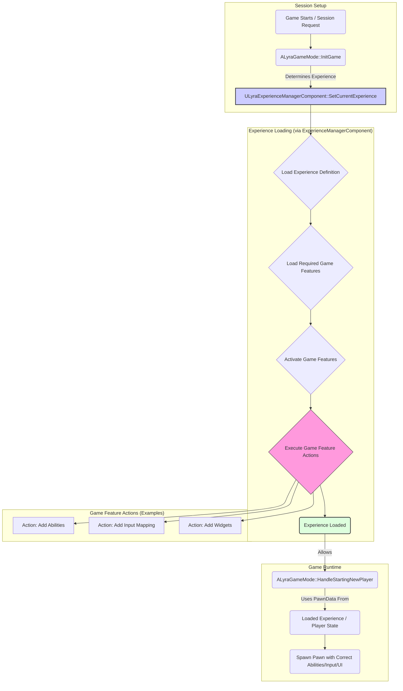

# GameFramework & Experience

This section delves into the core systems that manage the overall game flow, session rules, and modular content delivery within this asset. Building upon Unreal Engine's standard framework (Game Mode, Game State, etc.), it leverages Lyra's **Experience** system and Unreal's **Game Features** plugin infrastructure to create highly modular and customizable gameplay sessions.

### Purpose: Defining and Delivering Gameplay Sessions

The primary goal of these interconnected systems is to provide a structured way to:

1. **Define Gameplay Sessions:** Specify the rules, map, player configurations (Pawn types, abilities), UI layouts, and required features for different game modes or scenarios using **Experience Definitions**.
2. **Modular Content Delivery:** Load and activate specific gameplay logic, assets, UI elements, and input configurations on demand using the **Game Features** plugin system, driven by the selected Experience.
3. **Orchestrate Game Flow:** Manage the standard Unreal lifecycle (joining players, spawning Pawns, setting up game state) while integrating the Experience loading and Game Feature activation processes.
4. **Decouple Features:** Allow different gameplay features (defined in separate plugins/modules) to be activated or deactivated for different Experiences without creating hard dependencies between them.

Think of an **Experience** as the high-level blueprint for a specific match or gameplay session (e.g., "Team Deathmatch on Arena Map," "Capture the Flag Tutorial," "Main Menu"). **Game Features** are the modular packages containing the specific code and content needed for parts of that experience (e.g., "CTF Rules," "Arena UI Elements," "Standard Weapon Abilities"). The **Game Framework** classes (Game Mode, Game State) coordinate loading the correct Experience and activating its required Game Features.

### Key Concepts & Terminology

* **Experience Definition (`ULyraExperienceDefinition`):** A primary Data Asset defining the core components of a gameplay session, including the Game Features to enable, default Pawn configuration, and specific setup Actions.
* **Game Feature:** A self-contained plugin managed by Unreal Engine's Game Features subsystem. Experiences activate specific Game Features to load their content and logic.
* **Game Feature Action (`UGameFeatureAction`):** The mechanism by which a Game Feature executes logic when it's activated or deactivated (e.g., adding abilities, input mappings, widgets).
* **Experience Action Set (`ULyraExperienceActionSet`):** A reusable collection of Game Features and Actions that can be included in multiple Experience Definitions.
* **Game Mode (`ALyraGameMode`):** Server-authoritative class responsible for game rules, player joining, and initiating the Experience loading process.
* **Game State (`ALyraGameState`):** Replicated container for game-wide state, hosting the `ULyraExperienceManagerComponent` which manages the loading/activation lifecycle.
* **Pawn Data (`ULyraPawnData`):** A Data Asset defining the specific Pawn class, abilities, input, camera, and UI associated with a player character type, often specified by the loaded Experience.

### High-Level Interaction Flow

_(Simplified Diagram)_

**Explanation:**

1. The Game Mode starts and determines which Experience Definition needs to be loaded (based on URL options, world settings, etc.).
2. It tells the `ULyraExperienceManagerComponent` (on the Game State) to load this Experience.
3. The Experience Manager loads the Definition asset, identifies the required Game Feature plugins, and loads/activates them.
4. As Game Features activate, their associated Game Feature Actions execute, configuring the game world (e.g., adding global abilities, setting up input mappings, registering widgets).
5. Once the Experience (including its features and actions) is fully loaded, the Game Mode allows players to spawn.
6. When spawning a player, the Game Mode uses the `ULyraPawnData` (often specified by the loaded Experience) to configure the Pawn correctly with the right abilities, input, UI elements, etc.

### Structure of this Section

This documentation section explores these systems in detail:

* **Experiences:** Delving into data Experience Definitions, Action Sets, and User Facing Definitions.
* **Game Features Integration:** How Experiences activate Game Features, the role of the Experience Manager Component, and examples of common Game Feature Actions.
* **Core Game Flow Classes:** Detailed documentation for the customized Game Mode, Game State, Game Instance, and Game Session classes.
* **Supporting Data Assets:** Covering key configuration assets like World Settings, and the Asset Manager.

***

This overview introduces the core concepts of Experiences and Game Features as the foundation for modular gameplay sessions in this asset. Understanding this framework is key to customizing game modes, adding new features, and managing the overall game flow.
