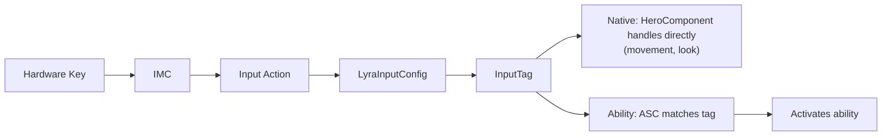

# Key Press To Gameplay Ability

This page traces a key press through the full input pipeline, from hardware event to gameplay ability activation. Each section covers one stage.




***

### Enhanced Input Layer

Enhanced Input is Unreal's built-in input system. The framework builds on top of it rather than replacing it, so all standard Enhanced Input concepts apply.

#### Input Mapping Contexts (IMCs)

An IMC is a data asset that maps hardware inputs (keys, buttons, analog axes) to abstract Input Actions. Think of it as a binding table: "W maps to IA_Move", "Space maps to IA_Jump", "LMB maps to IA_PrimaryFire".

Multiple IMCs can be active simultaneously, each with a priority. When two contexts bind the same key, the higher-priority context wins. A context can also consume its inputs, preventing lower-priority contexts from receiving them. This makes IMCs ideal for layering, a vehicle context can override movement keys without touching the rest of the bindings.

The framework registers IMCs from three sources:

* **PawnData** — `ULyraPawnData::InputMappings` supplies the pawn type's base contexts.
* **HeroComponent** — `ULyraHeroComponent::DefaultInputMappings` layers additional contexts on top (e.g., mode-specific overrides).
* **Game Features** — `UGameFeatureAction_AddInputContextMapping` pushes contexts when a feature activates, and removes them when it deactivates.

#### Input Actions (IAs)

An Input Action represents player intent in the abstract, "Move", "Jump", "Fire". Each IA declares a value type that determines the shape of data it carries:

| Value Type | Use Case                | Example                                         |
| ---------- | ----------------------- | ----------------------------------------------- |
| `Bool`     | Buttons, binary toggles | Jump, Crouch, Fire                              |
| `Axis1D`   | Single-axis analog      | Mouse wheel, throttle                           |
| `Axis2D`   | Dual-axis analog        | WASD movement, mouse look delta, stick movement |
| `Axis3D`   | Full 3D input           | Motion controllers                              |

The value type should match the hardware producing it. A button press is `Bool`. Mouse look produces an `Axis2D` delta each frame. WASD movement is also `Axis2D` because Enhanced Input composites the four keys into a 2D vector.

IAs are the handoff point between Enhanced Input and the framework. Enhanced Input knows how to fire them; the framework's `ULyraInputConfig` knows what they mean.

#### Triggers and Modifiers

**Triggers** determine _when_ an action fires:

* **Pressed** — once, on the initial press
* **Released** — once, when the key comes up
* **Down** — every tick while the key is held
* **Hold** — fires after the key has been held for a specified duration
* **Tap** — fires on a quick press-and-release within a time window

**Modifiers** transform the raw input value _before_ the trigger evaluates:

* **Negate** — inverts the value (used to make S produce negative forward movement)
* **Scalar** — multiplies by a constant (sensitivity scaling)
* **Dead Zone** — clamps small values to zero (prevents stick drift)
* **Swizzle** — remaps axes (turns an X-axis input into Y-axis input)

Both triggers and modifiers can be set per-mapping (in the IMC) or per-action (on the IA asset itself). Per-action settings act as defaults; per-mapping settings override them.

The framework provides custom modifiers for gamepad sensitivity, aim-assist dead-zones, and axis inversion. See [Customizing Input Behaviour](customizing-input-behaviour.md) for details.

***

### Lyra's Bridge — `ULyraInputConfig`

Enhanced Input produces abstract Input Actions. The framework's ability system speaks Gameplay Tags. `ULyraInputConfig` is the bridge, a data asset that maps each Input Action to a Gameplay Tag.

This decoupling is what makes the system flexible. The same `IA_PrimaryAction` can mean "Fire Weapon" in one InputConfig and "Melee Attack" in another. The key binding never changes; only the tag mapping does.

### Two Arrays, Two Dispatch Paths

A `ULyraInputConfig` holds two arrays. Both use the same `FLyraInputAction` struct (a pair of `UInputAction*` and `FGameplayTag`), but they serve different purposes.

**`NativeInputActions`** — maps IAs to tags for direct C++ handling. These bypass GAS entirely; the HeroComponent handles them itself. At runtime, `FindNativeInputActionForTag()` retrieves the Input Action associated with a given tag from this array.

**`AbilityInputActions`** — maps IAs to tags for ability activation. These route through the Ability System Component, which matches the tag to a granted ability. The corresponding lookup method is `FindAbilityInputActionForTag()`.

```
NativeInputActions:
  IA_Move          -> InputTag.Move
  IA_Look_Mouse    -> InputTag.Look.Mouse
  IA_Look_Stick    -> InputTag.Look.Stick
  IA_Crouch        -> InputTag.Crouch

AbilityInputActions:
  IA_Jump          -> InputTag.Ability.Jump
  IA_PrimaryFire   -> InputTag.Ability.Primary
  IA_Interact      -> InputTag.Ability.Interact
```

### Where InputConfigs Come From

* **`ULyraPawnData::InputConfig`** — the default config for that pawn type. Applied during `ULyraHeroComponent::InitializePlayerInput`.
* **`UGameFeatureAction_AddInputBinding`** — layers additional InputConfigs at runtime when a game feature activates, calling `AddAdditionalInputConfig` on the HeroComponent.

***

## Binding and Dispatch

The InputConfig defines the mappings. Now something needs to bind Enhanced Input events and route the resulting tags to the right handler. That is the job of `ULyraInputComponent` (binding) and `ULyraHeroComponent` (orchestration).

### `ULyraInputComponent`

Extends `UEnhancedInputComponent` with two tag-aware binding methods:

**`BindNativeAction(InputConfig, InputTag, TriggerEvent, Object, Func)`** looks up the Input Action matching `InputTag` in the config's `NativeInputActions` array, then calls the standard Enhanced Input `BindAction` to wire it to a C++ function. Returns a handle for later removal.

**`BindAbilityActions(InputConfig, Object, PressedFunc, ReleasedFunc, BindHandles)`** iterates every entry in the config's `AbilityInputActions`. For each valid entry, it binds `ETriggerEvent::Triggered` to `PressedFunc` and `ETriggerEvent::Completed` to `ReleasedFunc`, passing the entry's InputTag as a parameter. All bind handles are collected for later teardown via `RemoveBinds()`.

The key insight: `BindNativeAction` binds one action at a time (you choose the trigger event), while `BindAbilityActions` binds all ability actions in bulk with a fixed press/release pattern. When bindings need to be torn down, for example, when swapping input configs at runtime, `RemoveBinds()` takes the collected handles and removes them cleanly.

### `ULyraHeroComponent` — the Orchestrator

When the InitState system reaches `DataInitialized`, the HeroComponent's `InitializePlayerInput` wires everything together:

<!-- gb-stepper:start -->
<!-- gb-step:start -->
#### Retrieve the subsystem

Retrieves the `UEnhancedInputLocalPlayerSubsystem` and clears existing mappings.
<!-- gb-step:end -->

<!-- gb-step:start -->
#### Register input mappings

Registers IMCs from `PawnData->InputMappings` and its own `DefaultInputMappings` with the subsystem.
<!-- gb-step:end -->

<!-- gb-step:start -->
#### Bind ability inputs

Calls `BindAbilityActions` for all ability inputs, press and release both route to the HeroComponent's `Input_AbilityInputTagPressed` / `Released`.
<!-- gb-step:end -->

<!-- gb-step:start -->
#### Bind native actions

Calls `BindNativeAction` for crouch (`InputTag.Crouch`) and auto-run (`InputTag.AutoRun`).
<!-- gb-step:end -->

<!-- gb-step:start -->
#### Bind movement and look dynamically

Binds move and look inputs dynamically through `HandleBlockInputTagsChanged`, which adds or removes those bindings based on whether `Status.BlockInput.Movement` or `Status.BlockInput.Look` tags are active on the ASC.
<!-- gb-step:end -->

<!-- gb-step:start -->
#### Broadcast input readiness

Broadcasts `NAME_BindInputsNow` so game features and other systems know input is ready and can layer their own bindings. External systems can check `IsReadyToBindInputs()` to verify the HeroComponent has reached this stage before attempting to add bindings.
<!-- gb-step:end -->
<!-- gb-stepper:end -->

After initialization, game features and other runtime systems can layer additional input configs by calling `AddAdditionalInputConfig()` on the HeroComponent, which binds the new config's ability actions and returns handles for later removal via `RemoveAdditionalInputConfig()`.

#### Two Dispatch Paths

Once bindings are in place, every input follows one of two paths:

```
Input Action fires
  |
  |-- Native path: HeroComponent handler called directly
  |     Input_Move(Value)       -> Pawn->AddMovementInput()
  |     Input_LookMouse(Value)  -> AddControllerYawInput / PitchInput
  |     Input_LookStick(Value)   -> Same, frame-rate scaled
  |     Input_Crouch(Value)     -> Character->ToggleCrouch()
  |     Input_AutoRun(Value)    -> Toggle auto-run state
  |
  `-- Ability path: HeroComponent forwards to ASC
        Input_AbilityInputTagPressed(Tag)  -> ASC->AbilityInputTagPressed(Tag)
        Input_AbilityInputTagReleased(Tag) -> ASC->AbilityInputTagReleased(Tag)
```

Native handlers respect gameplay-tag blocks. `Input_Move` and the look handlers early-out if the ASC carries the corresponding `Status.BlockInput` tag, allowing abilities to temporarily suppress movement or camera input.

***

### Ability Activation

The ASC has received an input tag. Now it needs to find a matching ability and activate it.

#### The Tag Connection

When an ability is granted (typically through a `ULyraAbilitySet`), its `InputTag` from the grant entry is added to the ability spec's `DynamicSpecSourceTags`. This is the only link between an input and the ability it triggers, the ability class itself has no knowledge of which key drives it. The same ability class can respond to different inputs depending on how it was granted.

#### The Matching Process

When `AbilityInputTagPressed(Tag)` is called, the ASC iterates all granted specs in `ActivatableAbilities.Items` and checks each spec's `DynamicSpecSourceTags` for an exact match. Every match gets its handle added to `InputPressedSpecHandles` and `InputHeldSpecHandles`. On release, matching handles move to `InputReleasedSpecHandles` and are removed from `InputHeldSpecHandles`.

#### `ProcessAbilityInput` — the Per-Frame Loop

`ProcessAbilityInput()` runs each tick and is where activation decisions happen:

<!-- gb-stepper:start -->
<!-- gb-step:start -->
#### Guard

If `TAG_Gameplay_AbilityInputBlocked` is present on the ASC, all pending input is cleared and nothing fires.
<!-- gb-step:end -->

<!-- gb-step:start -->
#### Held abilities

For each handle in `InputHeldSpecHandles`, if the ability's policy is `WhileInputActive` and it is not already active, it is queued for activation.
<!-- gb-step:end -->

<!-- gb-step:start -->
#### Pressed abilities

For each handle in `InputPressedSpecHandles`, if the ability is already active, the press is forwarded via `AbilitySpecInputPressed`. Otherwise, if the policy is `OnInputTriggered`, it is queued for activation.
<!-- gb-step:end -->

<!-- gb-step:start -->
#### Activate queued abilities

`TryActivateAbility` is called for every queued handle. Batching press and held activations together prevents a held input from both activating and sending a duplicate press in the same frame.
<!-- gb-step:end -->

<!-- gb-step:start -->
#### Handle releases

For each handle in `InputReleasedSpecHandles`, `AbilitySpecInputReleased` is called, which can cause `WhileInputActive` abilities to end.
<!-- gb-step:end -->

<!-- gb-step:start -->
#### Cleanup

`InputPressedSpecHandles` and `InputReleasedSpecHandles` are cleared. `InputHeldSpecHandles` persists until release.
<!-- gb-step:end -->
<!-- gb-stepper:end -->

#### Activation Policies

Each `ULyraGameplayAbility` declares an `ActivationPolicy`:

* **OnInputTriggered** — activates once per press. Does not re-activate while held.
* **WhileInputActive** — activates on press, ends on release. The ASC tracks these in `InputHeldSpecHandles`.
* **OnSpawn** — activates when granted (avatar assigned), ignoring input entirely.

For full details on activation policies and activation groups, see [Abilities](../gas/abilities.md).
