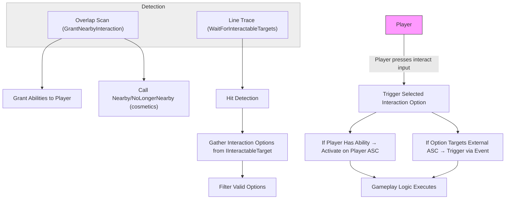

# How Interaction Works

This section explains the full flow of the Lyra Interaction System — how it detects interactables, gathers interaction options, and triggers gameplay logic via GAS (Gameplay Ability System). It also covers how abilities are correctly assigned and executed, either on the player or on external targets.

***

### Detection: Finding Interactable Objects

The system uses  two scanning methods to find nearby or focused interactables:

* **`UAbilityTask_GrantNearbyInteraction`**
  * **Scan type:** Sphere overlap using `Lyra_TraceChannel_Interaction`, run every `InteractionScanRate` seconds
  * **Runs on:** Server and owning client
  * **Purpose:**
    * Grants interaction abilities to the player when nearby actors request them
    * Triggers cosmetic events (`Nearby` / `NoLongerNearby`) on those actors
* **`UAbilityTask_WaitForInteractableTargets_SingleLineTrace`** (a subclass of `WaitForInteractableTargets`)
  * **Scan type:** Camera-based line trace using a collision profile (not an object channel)
  * **Runs on:** Owning client only
  * **Purpose:**
    * Identifies which interactable the player is currently looking at
    * Gathers and filters available interaction options
    * Pushes valid options to the UI or to an interaction-choosing system

#### How the scans work together:

* The **overlap scan is a core part of the interaction system** — it is responsible for granting abilities to the player so they can interact. If it doesn't run (or fails to detect something), the player won’t receive the ability, and the trace system won’t consider that interaction valid.
* The **line trace is responsible for determining the current focus target** — it decides what the player is trying to interact with when pressing the interaction input.
* In some cases, an interaction may be set up to **trigger an ability directly on the target actor’s Ability System**. In that case, no ability is granted to the player, and the overlap scan doesn’t play a functional role, but it’s still active and part of the system's design. _(See “_[_Ability Assignment_](how-interaction-works.md#ability-assignment-two-approaches)_” below for how this works in detail.)_
* **Key takeaway:** Both scans are part of the complete interaction pipeline. The overlap grants interaction capabilities; the trace resolves the current target. If either is disabled or misconfigured, interactions will fail.

> [!INFO]
> The interaction&#x20;

***

### Option Gathering

Once interactables are detected, the system queries them using the interface(`IInteractableTarget`) function:

```cpp
void GatherInteractionOptions(const FInteractionQuery& InteractQuery, TArray<FInteractionOption>& OutOptions);
```

<!-- tabs:start -->
#### **Blueprint**


#### **C++**
```cpp
void AMyCollectableActor::GatherInteractionOptions_Implementation(
    const FInteractionQuery& InteractQuery,
    TArray<FInteractionOption>& OutOptions)
{
    FInteractionOption Option;

    // Set the label that will be shown in the interaction widget
    Option.Text = FText::FromString(TEXT("Pick up Gold Coin"));

    // Reference to the ability this interaction will trigger
    // (assumed to be set in Blueprint defaults)
    Option.InteractionAbilityToGrant = PickupAbility;

    // Optional: specify a widget class or anchor component
    Option.InteractionWidgetClass = InteractionWidgetClass;
    Option.InteractionWidgetComponent = WidgetAnchor;

    OutOptions.Add(Option);
}
```

<!-- tabs:end -->

Each interactable can return multiple `FInteractionOption`s that describe what interactions are available and how they behave.

These options contain:

* Display text and widget references
* Required hold time (if any)
* Either an ability to grant or a target ability to activate
* UI widget location for prompts or indicators

***

### Ability Execution Paths

When an interaction option is triggered, the ability runs in **one** of two places:

**Player ASC (ability granted to the player)**

* If `InteractionAbilityToGrant` is set, the ability is temporarily granted to the player via the overlap scanner. When the player interacts, that ability is activated on their Ability System Component.
* **Use this when:**
  * The logic should run on the player (inventory, UI, pickups)
  * Each player has their own context for the interaction
* **Common examples:**
  * Loot pickups
  * UI popups
  * Inventory actions
  * “Press E to interact” doors or triggers

**Target ASC (ability lives on the interactable)**

* If `TargetAbilitySystem` and `TargetInteractionAbilityHandle` are set, the system sends a gameplay event directly to the interactable’s ASC, activating the specified ability handle.
* **Use this when:**
  * The object owns persistent gameplay state
  * The effect needs to be shared or centralized
* **Common examples:**
  * Turrets with power states or cooldowns
  * Terminals with shared timers
  * Generators that apply team-wide buffs
  * Puzzle nodes or boss triggers

***

### Event Payload Customization

Before triggering the ability, the system constructs an `FGameplayEventData` payload. This includes:

* The instigating player
* The original interactable target
* A gameplay tag describing the action (typically `TAG_Ability_Interaction_Activate`)

Then, the interactable has the opportunity to customize this payload by overriding:

```cpp
void CustomizeInteractionEventData(const FGameplayTag& InteractionEventTag, FGameplayEventData& InOutEventData);
```

This enables powerful behaviors like:

* Redirecting the `Target` field to a different actor
* Injecting values or context into the payload (e.g., door IDs, interaction reasons)

***

### Triggering the Interaction

When the player chooses to interact, the system executes the selected interaction option in one of two ways:

* If the option specifies an ability that was granted to the player (via the overlap scan), that ability is activated on the player’s Ability System Component.
* If the option is configured to trigger an ability on the interactable itself, the system sends a gameplay event to the target’s Ability System Component and activates the specified ability handle.

In both cases, the interaction runs using standard Gameplay Ability System (GAS) logic — enabling animations, state changes, effects, UI updates, or any other gameplay behavior defined by the ability.

***

### Visual Feedback

As a final layer, the system provides cosmetic interaction feedback:

* **SetFocused** is called when the player is aiming at an object.
* **Nearby / NoLongerNearby** are called when entering or leaving proximity.
* **InteractionWidgetClass** is used to spawn UMG prompts at the object's world position.

This UI is client-side only and purely cosmetic, ensuring no unintended replication cost.

***

### Summary of Interaction Flow



***
