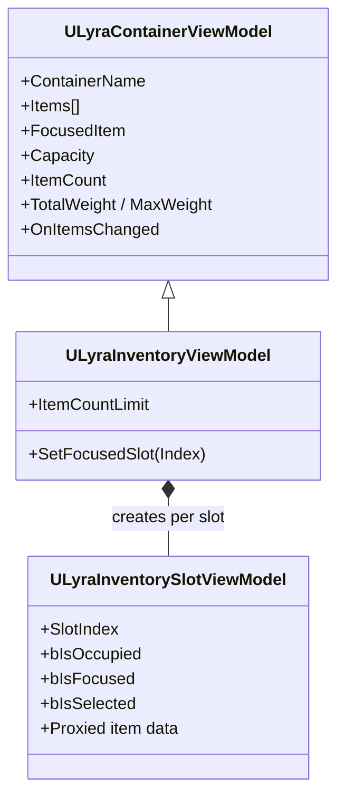

# Inventory Viewmodels and UI

You're building an inventory screen, a grid of slots showing the player's items, capacity bars, and drag-drop support. ViewModels bridge your widgets and the inventory system, providing bindable properties and handling prediction automatically so the player never notices the networked plumbing underneath.

> [!INFO]
> For the underlying MVVM architecture, see [MVVM](../../ui/item-container-ui-system/core-architecture-and-data-structures/mvvm.md) and [Data Layers (View Models)](../../ui/item-container-ui-system/data-layers-view-models/). ViewModels are acquired through the [Item Container UI Manager](../../ui/item-container-ui-system/item-container-ui-manager/).

***

### Class Hierarchy



`ULyraInventoryViewModel` inherits the shared container properties (items list, weight, capacity, focused item) and adds index-based slot management and capacity tracking.

***

### Index-Based Slots

Unlike equipment and attachment which are tag-based, inventory slots are identified by `SlotIndex` (0, 1, 2...). Slot ViewModels exist for every position, including empty ones, so your grid always has the right number of widgets.

```cpp
SlotVM->SlotIndex  // 0, 1, 2, 3...
```

```cpp
// Focus a slot programmatically
InventoryVM->SetFocusedSlot(5);
```

> [!INFO]
> See [Persistent Slot Pattern](../../ui/item-container-ui-system/data-layers-view-models/persistent-slot-pattern.md) for why slot ViewModels exist even when empty.

***

### Capacity & Weight

These properties track the inventory's limits. All are FieldNotify-enabled, so UMG bindings update automatically.

| Property         | Type    | Description                                  |
| ---------------- | ------- | -------------------------------------------- |
| `ItemCount`      | `int32` | Current number of items                      |
| `Capacity`       | `int32` | Maximum slot count                           |
| `ItemCountLimit` | `int32` | Maximum number of items the container allows |
| `TotalWeight`    | `float` | Sum of all item weights                      |
| `MaxWeight`      | `float` | Weight limit (0 = no limit)                  |

```cpp
CapacityText->SetText(FText::Format(
    LOCTEXT("Cap", "{0}/{1}"), InventoryVM->ItemCount, InventoryVM->Capacity));
WeightBar->SetPercent(InventoryVM->TotalWeight / InventoryVM->MaxWeight);
```

***

### Slot Properties

Each `ULyraInventorySlotViewModel` represents a single position in the inventory grid.

**Slot State:**

| Property      | Type    | Description                     |
| ------------- | ------- | ------------------------------- |
| `SlotIndex`   | `int32` | 0-based position in inventory   |
| `bIsOccupied` | `bool`  | Whether an item is in this slot |
| `bIsFocused`  | `bool`  | Navigation cursor is here       |
| `bIsSelected` | `bool`  | Selected for interaction        |
| `bIsGhost`    | `bool`  | Predicted but unconfirmed       |

**Proxied Item Data (when occupied):**

| Property          | Type          | When Empty |
| ----------------- | ------------- | ---------- |
| `ItemIcon`        | `UTexture2D*` | nullptr    |
| `ItemDisplayName` | `FText`       | Empty text |
| `StackCount`      | `int32`       | 0          |
| `TotalWeight`     | `float`       | 0          |

**Transaction:**

| Property         | Type               | Description                                     |
| ---------------- | ------------------ | ----------------------------------------------- |
| `SlotDescriptor` | `FInstancedStruct` | Pre-built descriptor for the transaction system |

***

### Delegates

| Delegate               | Signature                                                     | Fires When                                 |
| ---------------------- | ------------------------------------------------------------- | ------------------------------------------ |
| `OnItemsChanged`       | `()`                                                          | Items added, removed, or changed           |
| `OnFocusedItemChanged` | `(ULyraItemViewModel* Previous, ULyraItemViewModel* Current)` | Navigation focus moves to a different slot |

***

### Built-In Panels

The system provides two ready-made panels that handle the common inventory layouts.

**`ULyraInventoryListPanel`** - For lists showing only occupied items. Uses `ULyraItemViewModel` directly (not SlotViewModels). Good for: loot drops, shop inventories, crafting ingredients.

> [!INFO]
> See [Inventory List Panel](inventory-list-panel.md) for setup and navigation details.

**`ULyraInventoryTilePanel`** - For traditional RPG-style grids. Uses `ULyraInventorySlotViewModel` (including empty slots). Good for: player backpack, storage chest, bank.

> [!INFO]
> See [Inventory Tile Panel](inventory-tile-panel.md) for setup and navigation details.

<details class="gb-toggle">

<summary>When to build custom</summary>

Build a custom panel if you need non-standard layouts (hexagonal, radial), complex slot interactions beyond CommonUI, or spatial inventory (see the [TetrisInventory](../../../core-modules/tetris-inventory/) plugin).

</details>

***

### Drag-Drop

Slot ViewModels carry a pre-built `SlotDescriptor` that plugs directly into the transaction system, no manual descriptor construction needed:

```cpp
FInstancedStruct SourceSlot = SlotVM->SlotDescriptor;
FInstancedStruct DestSlot = TargetSlotVM->SlotDescriptor;
ItemTransactionAbility->MoveItem(SourceSlot, DestSlot);
```

> [!INFO]
> See [UI Transaction Pipeline](../../ui/item-container-ui-system/interaction-and-transactions/ui-transaction-pipeline.md) for the full request flow from drag start to server confirmation.

***

> [!INFO]
> For the shared container/slot/item ViewModel architecture, see [Data Layers (View Models)](../../ui/item-container-ui-system/data-layers-view-models/). For ghost state styling during prediction, see [Prediction & Visuals](../../ui/item-container-ui-system/data-layers-view-models/prediction-and-visuals.md).
