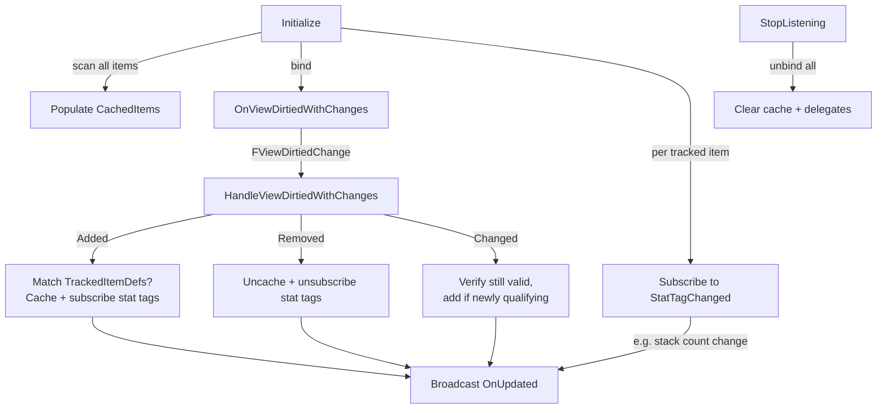

# Item Query System

While one-time queries can be handled directly using functions from `ULyraInventoryManagerComponent`, doing this repeatedly (e.g., polling every frame or on a timer) is inefficient and error-prone. It also fails to react instantly to inventory changes.

Your weapon component needs to know how much compatible ammo the player is carrying, and it needs to know the instant that count changes. A crafting UI needs live resource totals. A quest tracker needs to react the moment a key item enters the inventory. Polling every frame is wasteful and fragile. The Item Query system gives you reactive, cached tracking instead.

***

### How It Works

You define a query by specifying a target `ULyraInventoryManagerComponent` and one or more `ULyraInventoryItemDefinition` classes to track. The system:

1. **Scans** the inventory for all existing instances matching the tracked definitions
2. **Binds** to the inventory's `OnViewDirtiedWithChanges` delegate, a prediction-aware callback that fires whenever items are added, removed, or changed
3. **Subscribes** to each tracked item's stat tag changes via `GetStatTagChangedNative()`, catching property-level mutations like stack count updates
4. **Caches** matching instances internally, updating the cache when changes arrive and broadcasting delegates to your code

The result is a live, always-current list of matching items.

<details class="gb-toggle">

<summary><strong>Internals</strong></summary>



</details>

***

### C++ - `ULyraInventoryQuery`

Create a `ULyraInventoryQuery` as a `UPROPERTY` member. Call `Initialize` with the item definitions and target inventory, bind your delegate, and you're done.

<details class="gb-toggle">

<summary>Example - weapon component tracking ammo types</summary>

```cpp
UPROPERTY()
TObjectPtr<ULyraInventoryQuery> AmmoQuery;

void UMyWeaponComponent::InitializeAmmoTracking()
{
    ULyraInventoryManagerComponent* PlayerInventory =
        ULyraInventoryManagerComponent::FindInventoryComponent(GetOwner());

    if (!PlayerInventory) return;

    TArray<TSubclassOf<ULyraInventoryItemDefinition>> AmmoItemDefs;
    AmmoItemDefs.Add(UAmmo_556::StaticClass());
    AmmoItemDefs.Add(UAmmo_762::StaticClass());

    AmmoQuery = NewObject<ULyraInventoryQuery>(this);
    AmmoQuery->Initialize(AmmoItemDefs, PlayerInventory);
    AmmoQuery->OnUpdated.AddDynamic(this, &UMyWeaponComponent::HandleAmmoQueryUpdate);

    // Initial state is available immediately after Initialize
    UpdateAmmoDisplay(AmmoQuery->GetItems());
}

void UMyWeaponComponent::HandleAmmoQueryUpdate(
    const TArray<ULyraInventoryItemInstance*>& UpdatedAmmoItems)
{
    UpdateAmmoDisplay(UpdatedAmmoItems);
}

void UMyWeaponComponent::EndPlay(const EEndPlayReason::Type EndPlayReason)
{
    if (AmmoQuery)
    {
        AmmoQuery->StopListening();
    }
    Super::EndPlay(EndPlayReason);
}
```

</details>

> [!INFO]
> Declare the query as a `UPROPERTY()` to prevent garbage collection. Call `StopListening()` during cleanup, `BeginDestroy` on the query also handles this, but explicit cleanup is good practice.

#### Accessors

| Method                 | Returns                                           | Description                                                             |
| ---------------------- | ------------------------------------------------- | ----------------------------------------------------------------------- |
| `GetItems()`           | `const TArray<ULyraInventoryItemInstance*>&`      | The cached list of matching instances. Updated before `OnUpdated` fires |
| `GetInventory()`       | `ULyraInventoryManagerComponent*`                 | The inventory being monitored                                           |
| `GetTrackedItemDefs()` | `TSet<TSubclassOf<ULyraInventoryItemDefinition>>` | The item definitions this query tracks                                  |

#### Delegates

| Delegate                   | Signature                                                                                | Description                                                         |
| -------------------------- | ---------------------------------------------------------------------------------------- | ------------------------------------------------------------------- |
| `OnUpdated`                | `TArray<ULyraInventoryItemInstance*>`                                                    | Fires when tracked items change (add, remove, or stat tag mutation) |
| `OnUpdatedWithTrackedDefs` | `TSet<TSubclassOf<ULyraInventoryItemDefinition>>`, `TArray<ULyraInventoryItemInstance*>` | Same as above, but also passes the tracked definitions              |

***

### Blueprint - `UAsyncAction_ItemQuery`


The `QueryInventoryAsync` node wraps `ULyraInventoryQuery` for Blueprint use. It manages the underlying C++ query's lifecycle automatically and adds a convenient `TotalCount` output that sums the `Lyra.Inventory.Item.Count` stat tag across all matching items.

| Output Pin          | When It Fires                                  | Data                    |
| ------------------- | ---------------------------------------------- | ----------------------- |
| **On First Result** | Once, immediately after initialization         | `Items` + `Total Count` |
| **On Updated**      | Every subsequent change                        | `Items` + `Total Count` |
| **On Failed**       | If initialization fails (e.g., null inventory) | N/A                     |

Store the return value to call `Cancel()` when you no longer need tracking (e.g., weapon swap or widget destruction).

<details class="gb-toggle">

<summary>Blueprint example - HUD tracking spare inventory based ammo for the equipped weapon</summary>


The graph reads the weapon's `InventoryAmmoTypes` from its `InventoryFragment_Gun`, passes them to `QueryInventoryAsync`, and wires both **On First Result** and **On Updated** to the same `UpdateTotalAmmoLeft` event. The `Total Count` output gives the combined ammo count across all matching stacks.

</details>

***
