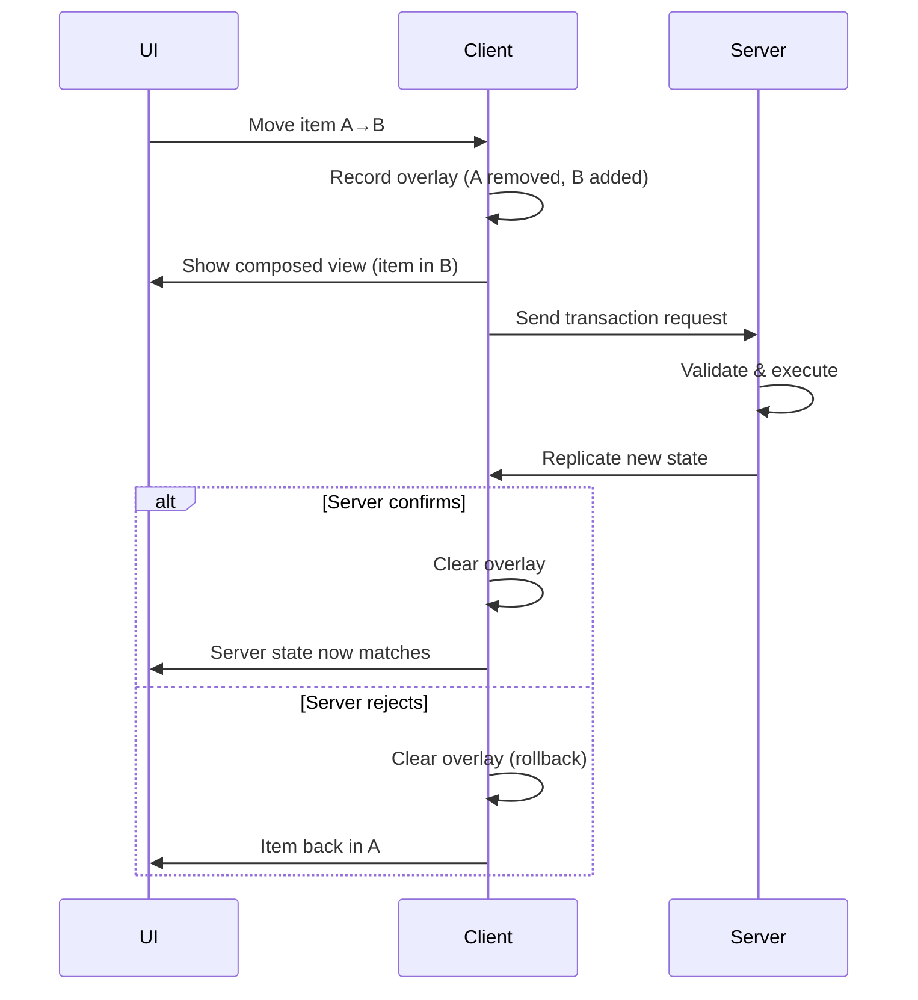

# Prediction

In a multiplayer game, every item operation must be validated by the server. Without prediction, players wait for a network round-trip before seeing any feedback, a noticeable delay that makes the game feel sluggish.

The prediction system solves this by applying operations locally while waiting for server confirmation. If the server agrees, the player never notices the delay. If the server disagrees, the system rolls back to the correct state.

***

### What You'll Learn

| Page                                                  | Description                                                                                       |
| ----------------------------------------------------- | ------------------------------------------------------------------------------------------------- |
| [Why Prediction](why-prediction.md)                   | The latency problem, optimistic UI philosophy, and when prediction matters.                       |
| [Prediction Architecture](prediction-architecture.md) | Item prediction system components, how they connect, and data flow.                               |
| [The Overlay Model](the-overlay-model/)               | How predicted state layers on top of server state. The mental model for understanding the system. |
| [Reconciliation](reconciliation/)                     | What happens when the server confirms or rejects. How overlays are cleared and state transfers.   |

***

### The Core Idea

The prediction system implements a **compose model**:

```
EffectiveView = Compose(ServerState, Overlay)
```

* **ServerState**: The replicated, authoritative state from the server
* **Overlay**: Client-side predicted changes (adds, changes, removals)
* **EffectiveView**: What the UI displays, a composition of both

When you move an item:



#### Record overlay

Client records overlay: "Item moved from slot A to slot B".



#### Show overlay in UI

UI shows overlay: Item appears in slot B immediately.



#### Send transaction

Client sends transaction request to the server.



#### Server processes

Server validates and executes the real move, then replicates new state.



#### Confirm or reject

* If server confirms: Overlay is cleared, server state takes over seamlessly.
* If server rejects: Overlay is cleared, rollback occurs, item reappears in slot A.





***

### Key Concepts

| Concept            | What It Means                                              |
| ------------------ | ---------------------------------------------------------- |
| **Overlay**        | Predicted changes layered on server state                  |
| **Compose**        | Combining server state + overlay into effective view       |
| **Phase**          | Where in the prediction lifecycle an event occurred        |
| **Reconciliation** | Matching predicted state with server state on confirmation |
| **Rollback**       | Clearing overlays when server rejects                      |

***

### The Four Phases

Every item change goes through one of four phases:

| Phase                  | When It Fires                       | Who Sees It            |
| ---------------------- | ----------------------------------- | ---------------------- |
| `PredictedApplied`     | Client applies prediction locally   | Predicting client only |
| `AuthoritativeApplied` | Server applies change, replicates   | Server + all proxies   |
| `PredictionConfirmed`  | Server confirms client's prediction | Predicting client only |
| `PredictionRejected`   | Server rejects client's prediction  | Predicting client only |

Understanding phases is crucial for implementing side effects correctly. See [Reconciliation](reconciliation/) for details.

***

### When to Use Prediction

Not all containers need prediction:

| Container Type   | Prediction Value | Reason                                     |
| ---------------- | ---------------- | ------------------------------------------ |
| Player inventory | High             | Frequent interaction during gameplay       |
| Equipment        | High             | Players swap weapons constantly            |
| Attachments      | Medium-High      | Weapon modding should feel responsive      |
| Vendor stock     | Low              | One-time transactions, can wait            |
| Loot drops       | Low              | Server-controlled, player just picks up    |
| Quest rewards    | None             | Server grants, no client prediction needed |

Prediction adds complexity. Use it where responsiveness matters.

***
