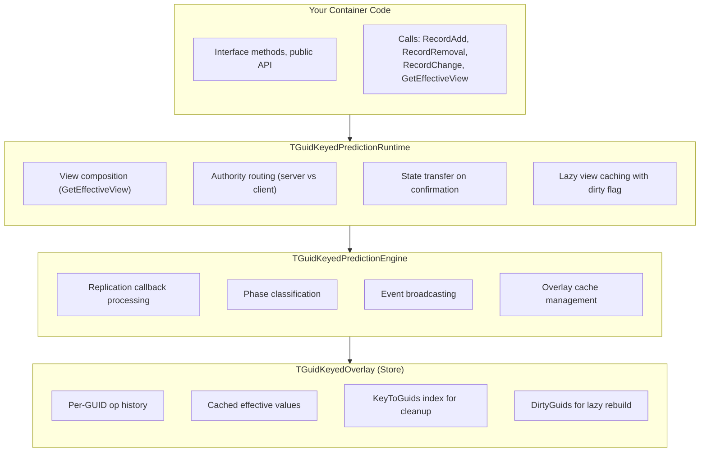
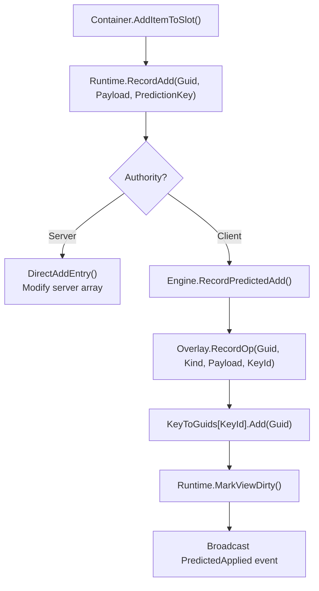
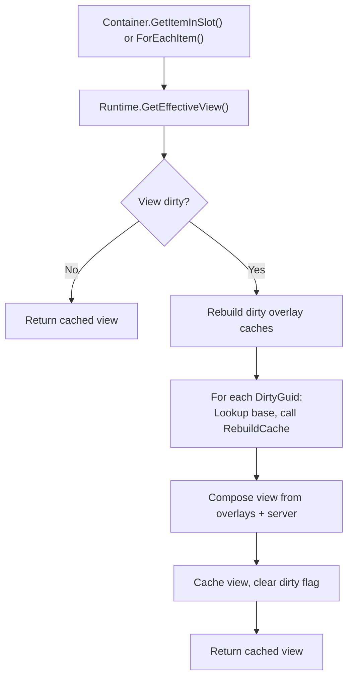
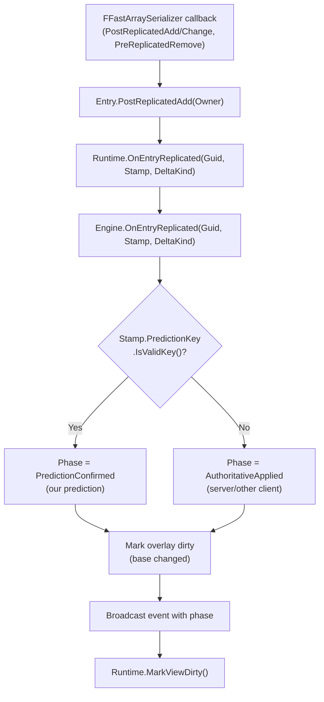

# Prediction Architecture

Before diving into overlays and reconciliation, it helps to understand the prediction system's structure: what components exist, how they connect, and where data flows. This page provides that top-down view.

***

### Component Overview

The prediction system is built from layered components, each with a specific responsibility:

| Component                       | Purpose                                    | Key File                             |
| ------------------------------- | ------------------------------------------ | ------------------------------------ |
| **TGuidKeyedPredictionRuntime** | Main interface for containers              | `LyraGuidKeyedPredictionRuntime.h`   |
| **TGuidKeyedPredictionEngine**  | Replication processing, event broadcasting | `LyraGuidKeyedPredictionEngine.h`    |
| **TGuidKeyedOverlay**           | Storage for predicted operations           | `LyraGuidKeyedPredictionStore.h`     |
| **Traits**                      | Container-specific adapter methods         | Per-container `*Traits.h` files      |
| **FContainerPredictionStamp**   | Embedded in replicated entries             | `LyraItemContainerPredictionTypes.h` |

***

### Layered Architecture

The components form a layered stack. Your container code interacts with the top layer, which delegates downward:



#### Layer Responsibilities

**Runtime (Top Layer)**

* The interface your container code uses
* Routes operations based on authority (server modifies arrays directly, client records overlays)
* Composes the effective view by merging server state with overlay caches
* Maintains GUID index for O(1) base lookup

**Engine (Middle Layer)**

* Processes FFastArraySerializer replication callbacks
* Classifies phases (PredictionConfirmed vs AuthoritativeApplied)
* Manages overlay lifecycle (recording, clearing)
* Broadcasts events for side effects

**Store (Bottom Layer)**

* Per-GUID overlay with operation history
* Cached effective values (rebuilt lazily when dirty)
* KeyToGuids index for O(affected) CaughtUp/Rejected handling
* DirtyGuids tracking for incremental cache rebuild

***

### Data Flows

Understanding the three main data flows helps you trace what happens during prediction.

<!-- tabs:start -->
#### **Client Predicts**
When a client predicts an operation:




#### **UI Reads**
When UI queries container state:




#### **Server Responds**
When server state replicates to client:



<!-- tabs:end -->

***

### The Traits Pattern

The prediction templates are generic, they don't know about your specific container types. Traits bridge this gap.

#### Why Traits Exist

The prediction system needs to work with any container's data types. Consider what the runtime must do:

* Extract a GUID from your payload struct
* Iterate your server entries array
* Convert your entry to a view entry
* Modify your `FFastArray` directly

Each container has different types: `FLyraInventoryEntry` vs `FLyraAppliedEquipmentEntry` vs `FAttachmentEntry`. The runtime template needs a way to call the right methods on the right types.

**Why not inheritance?** \
A base class would force all containers to inherit from `UPredictedContainerBase`. But containers can be anything, `UActorComponent`, `URuntimeTransientFragment`, or any other `UObjec`t type. Adding an inheritance requirement creates coupling and limits flexibility.

**Why not a prediction interface?** \
An interface like `ILyraPredictedContainer` could define virtual methods. But interfaces work with pointers, not value types. The prediction system operates on structs (`FPayload`, `FServerEntry`) that are stored by value. Virtual methods require object pointers and `vtable` lookups, overhead that adds up when composing views every frame.

**Why not template parameters directly?** \
You could template the runtime on `TPayload, TServerEntry, TViewEntry`. But then you'd need to pass conversion functions somehow. Traits bundle the types _and_ the operations together in one place.

#### What Traits Do

Traits are a struct of static methods that the templates call to interact with your container:

```cpp
struct FMyContainerTraits
{
    // Type definitions
    using TOwner = UMyContainerComponent;
    using FPayload = FMyContainerPayload;
    using FServerEntry = FMyContainerEntry;
    using FViewEntry = FMyContainerEntry;

    // Methods the templates call
    static FGuid GetGuid(const FPayload& Payload);
    static const TArray<FServerEntry>& GetServerEntries(const TOwner* Owner);
    static FViewEntry PayloadToViewEntry(const FPayload& Payload, const FPredictedOpMeta& Meta);
    // ... more methods
};
```

#### Why Static Methods?



Compile-time binding

No vtable overhead, templates can inline.



No inheritance required

Your container doesn't need to inherit from anything.



Type safety

Compiler catches missing methods at compile time.



Explicit types

Clear mapping between container types and prediction types.



#### Required Trait Methods

| Category            | Methods                                                                | Purpose                         |
| ------------------- | ---------------------------------------------------------------------- | ------------------------------- |
| **Types**           | `TOwner`, `FPayload`, `FServerEntry`, `FViewEntry`                     | Type aliases for templates      |
| **GUID**            | `GetGuid`, `GetGuidFromServerEntry`                                    | Extract stable identifier       |
| **Server Access**   | `GetServerEntries`, `FindServerEntryByGuidMutable`                     | Read/write server array         |
| **View Conversion** | `PayloadToViewEntry`, `ServerEntryToViewEntry`, `ServerEntryToPayload` | Build unified view entries      |
| **Authority**       | `IsAuthority`                                                          | Route operations correctly      |
| **Direct Ops**      | `DirectAddEntry`, `DirectRemoveEntry`, `DirectChangeEntry`             | Server-side array mutations     |
| **Replication**     | `TearOffItemReplication`                                               | Clear item's NetGUID on removal |
| **State Transfer**  | `TransferPredictionState`                                              | Move state on confirmation      |
| **Stamping**        | `GetPredictionStampMutable`, `MarkEntryDirty`                          | Access prediction stamp         |

> [!INFO]
> Don't be intimidated by the list. While the table above looks like a lot, traits follow a simple, repetitive pattern. Most methods are one-liners that just access your container's data structures, `GetGuid` returns a field, `GetServerEntries` returns an array reference, `IsAuthority` checks `HasAuthority()`. Once you've seen one traits file, you've seen them all.
> 
> Also remember: prediction is opt-in. You don't need any of this to create a working ItemContainer. Basic containers implement `ILyraItemContainerInterface` and work perfectly. Traits are only needed when you want client-side prediction for responsive multiplayer feel.

***

### Key Types

#### `FPredictedOp`

A single predicted operation stored in the overlay:

```cpp
template<typename TPayload>
struct FPredictedOp
{
    int32 PredictionKeyId;   // FPredictionKey.Current
    EItemDeltaKind Kind;     // Add, Change, Remove
    TPayload Payload;        // State after this op
};
```

#### `FGuidOverlay`

Per-GUID overlay with operation history and cached effective state:

```cpp
template<typename TPayload>
struct FGuidOverlay
{
    TArray<FPredictedOp<TPayload>> Ops;  // Operation history
    bool bCacheDirty;                     // Needs rebuild
    bool bCachedIsTombstone;              // Effective state is "removed"
    TPayload CachedValue;                 // Cached effective value
};
```

#### `TGuidKeyedOverlay`

The overlay store with indices for efficient operations:

```cpp
template<typename TPayload>
struct TGuidKeyedOverlay
{
    TMap<FGuid, FGuidOverlay<TPayload>> Overlays;
    TSet<FGuid> DirtyGuids;                    // For lazy cache rebuild
    TMap<int32, TSet<FGuid>> KeyToGuids;       // For O(affected) CaughtUp/Rejected
};
```

#### `FContainerPredictionStamp`

Embedded in each replicated entry to track prediction metadata:

```cpp
struct FContainerPredictionStamp
{
    // The GAS prediction key that last modified this entry
    FPredictionKey LastModifyingPredictionKey;

    // Local-only tracking (not replicated)
    int32 LastLocalPredictedKeyId = INDEX_NONE;
};
```

**`LastModifyingPredictionKey`**: Stamped by the server when a predicted operation is applied. Due to `FPredictionKey`'s network serialization, `IsValidKey()` returns true only on the originating client—enabling phase classification.

**`LastLocalPredictedKeyId`**: Used locally to track whether this entry has a pending prediction. Set when the client records an overlay, cleared when the prediction is confirmed or rejected.

#### `EReplicatedDeltaKind`

Indicates what kind of change occurred during replication:

```cpp
enum class EReplicatedDeltaKind : uint8
{
    Added,    // Entry was added to the server array
    Changed,  // Entry was modified in the server array
    Removed   // Entry was removed from the server array
};
```

***

### How Components Connect

Here's how a typical predicted container wires everything together:

```cpp
// Container can be any UObject type: UActorComponent, URuntimeTransientFragment, etc.
UCLASS()
class UMyContainer : public UObject, public ILyraItemContainerInterface
{
    // Replicated storage (FFastArraySerializer for callbacks)
    // NOTE: Your entry struct must include FContainerPredictionStamp!
    UPROPERTY(Replicated)
    FMyContainerList ItemList;

    // The prediction runtime (manages overlays, view composition)
    TGuidKeyedPredictionRuntime<FMyContainerTraits> PredictionRuntime;

public:
    // Initialize during construction or activation
    void Initialize()
    {
        ItemList.OwnerContainer = this;
        PredictionRuntime.Initialize(this);
    }

    // Interface methods delegate to runtime
    virtual bool AddItemToSlot(...) override
    {
        PredictionRuntime.RecordAdd(Guid, Payload, PredictionKey);
        return true;
    }

    // Query methods use effective view
    virtual ULyraInventoryItemInstance* GetItemInSlot(...) const override
    {
        for (const auto& Entry : PredictionRuntime.GetEffectiveView())
        {
            if (MatchesSlot(Entry, SlotInfo))
                return Entry.Item;
        }
        return nullptr;
    }
    
    // Prediction Key delegate handlers
    virtual void OnPredictionKeyRejected(int32 PredictionKeyCurrent)
    {
    	PredictionRuntime->Runtime.OnPredictionKeyRejected(PredictionKeyCurrent);
    }

    virtual void OnPredictionKeyCaughtUp(int32 PredictionKeyCurrent)
    {
    	PredictionRuntime->Runtime.OnPredictionKeyCaughtUp(PredictionKeyCurrent);
    }
};

// In your FastArray entry struct, FFastArray callbacks call the runtime:
void FMyContainerEntry::PostReplicatedAdd(const FMyContainerList& List)
{
    if (List.OwnerContainer)
    {
        List.OwnerContainer->PredictionRuntime.OnEntryReplicated(
            GetGuid(), Prediction, EReplicatedDeltaKind::Added);
    }
}

void FMyContainerEntry::PostReplicatedChange(const FMyContainerList& List)
{
    // Similar pattern for changes...
}

void FMyContainerEntry::PreReplicatedRemove(const FMyContainerList& List)
{
    // Similar pattern for removals...
}
```

> [!INFO]
> This is a brevity example showing the key wiring points. For the complete implementation including `FContainerPredictionStamp` setup, all interface methods (`RemoveItemFromSlot`, `MoveItemBetweenSlots`, etc.), and the full `FFastArray` callback implementation, see [Adding Prediction](../creating-containers/adding-prediction.md).

***

### Next Steps

Now that you understand the structure, learn how overlays compose with server state in [The Overlay Model](/broken/pages/610384bbe4519e6e7c91af00b5a5225c00660f0c).
