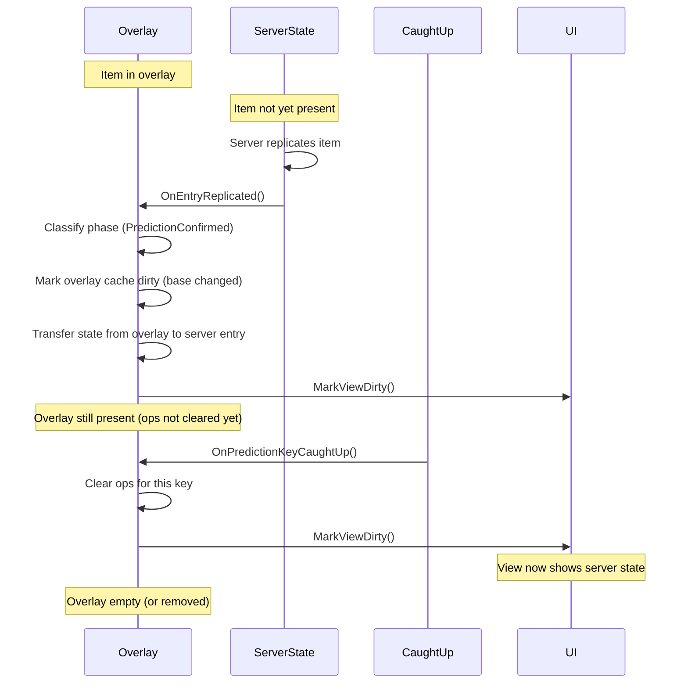
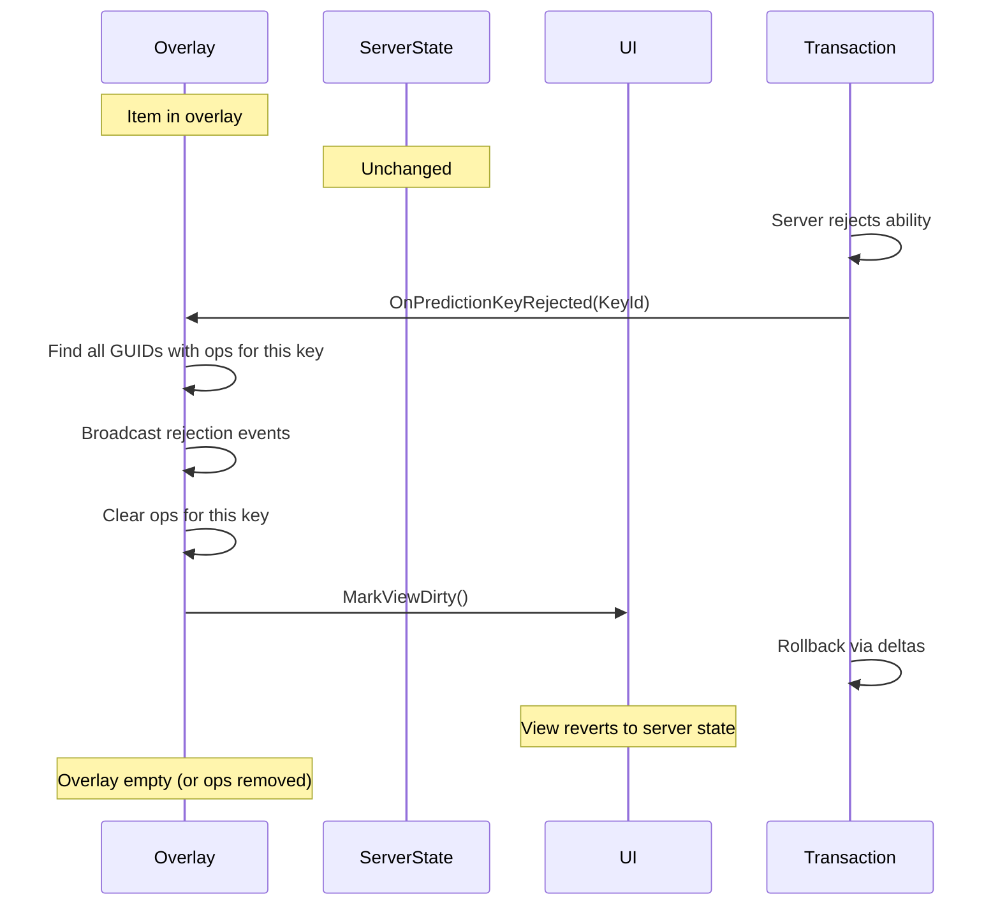

# Reconciliation

When the server responds to a predicted operation, the client must reconcile its overlay with the authoritative state. This page explains what happens on confirmation, rejection, and how state transfers between predicted and authoritative representations.

***

### The Four Phases

Every item delta goes through one of four phases:

| Phase                    | Description                                   |
| ------------------------ | --------------------------------------------- |
| **PredictedApplied**     | Client applied prediction locally             |
| **AuthoritativeApplied** | Server applied change, replicating to clients |
| **PredictionConfirmed**  | Server confirmed client's prediction          |
| **PredictionRejected**   | Server rejected client's prediction           |

#### Execution Matrix

| Phase                  | Predicting Client | Server | Simulated Proxies |
| ---------------------- | ----------------- | ------ | ----------------- |
| `PredictedApplied`     | Yes               |        |                   |
| `AuthoritativeApplied` |                   | Yes    | Yes               |
| `PredictionConfirmed`  | Yes               |        |                   |
| `PredictionRejected`   | Yes               |        |                   |

**Predicting Client**: The client that initiated the operation.\
**Server**: The authoritative game server.\
**Simulated Proxies**: Other clients who receive replicated state.

***

### Happy Path: Confirmation

When the server confirms a prediction:



### What Happens



#### Server replicates

The server applies the operation and replicates new state.



#### Phase classification

The system detects this is a confirmed prediction (see below).



#### Cache marked dirty

The overlay's base value changed, so cache needs rebuild.



#### State transfer

Any client-side state (actors, bindings) transfers from predicted to authoritative.



#### `CaughtUp` fires

When the prediction key catches up, ops for that key are cleared.



#### View updated

UI now shows server state seamlessly.



#### Phase Classification

How does the client know a replicated change confirms its prediction?

The answer lies in Unreal's `FPredictionKey` network serialization behavior. When the server stamps an entry with a client's prediction key and replicates it back:

* On the **originating client**: `IsValidKey()` returns `true`
* On **other clients**: `IsValidKey()` returns `false`
* On the **server**: `IsValidKey()` returns `false`

This is race-proof because the validity check happens on the receiving client, not the sender.

For details on how this works, see [Phase Classification](phase-classification.md).

***

### State Transfer

When a prediction is confirmed, state must transfer from the predicted representation to the authoritative one.

#### Item Reconciliation

The predicted and authoritative items are different objects with the same GUID. When the server confirms a prediction:



#### Find predicted payload

Locate the predicted payload from the overlay cache.



#### Find authoritative entry

Locate the authoritative entry from the server array.



#### Transfer item-level state

Move tag deltas, pending changes, and similar item-level state.



#### Transfer container-specific state

Transfer spawned actors, bindings, and other container-specific state.



#### Container-Specific State

Different containers have different state to transfer:

**Equipment:**

* Spawned actors (visual weapon representations)
* Input bindings
* Animation state

**Attachments:**

* Nested fragment references
* Attachment point bindings

Each container's Traits define what state needs transferring via `TransferPredictionState`.

***

### Recovery Path: Rejection

When the server rejects a prediction:



#### What Happens



#### Server rejects

The ability fails validation or execution on the server.



#### Key rejection

GAS notifies the client that the prediction key is rejected.



#### Ops cleared by key

All ops tagged with this prediction key are removed.



#### Transaction rollback

The transaction system reverses deltas.



#### View updated

UI reverts to show server state.



***

### Overlay Cleanup via `CaughtUp`

Overlays are cleaned up through the GAS CaughtUp delegate, which fires after the server has finished processing a prediction key.

#### Cleanup Flow

| Event                         | Action                         | Result                  |
| ----------------------------- | ------------------------------ | ----------------------- |
| **`OnEntryReplicated`**       | Mark overlay cache dirty       | Cache needs rebuild     |
| **`OnPredictionKeyCaughtUp`** | Clear ops for this key         | Ops removed, view dirty |
| **`OnPredictionKeyRejected`** | Broadcast rejection, clear ops | Ops removed, view dirty |

This design ensures consistent cleanup for all overlay types. Replication marks caches dirty (base changed), but `CaughtUp` handles the actual op removal.

#### Why `CaughtUp` Instead of Immediate Cleanup?

Immediate cleanup during replication creates edge cases:

* Overlays might be cleared before state transfer completes
* Multiple ops for the same prediction key might be cleared at different times
* Partial confirmation (some ops confirmed, others still pending) becomes complex

`CaughtUp` provides a single, consistent cleanup point after the server has fully processed the prediction.


***

### Partial Confirmation

The op-history model handles partial confirmation naturally.

#### Example

```
T=0:   Player adds Item A (K1)
T=5:   Player moves Item A (K2)
T=50:  Server confirms K1, CaughtUp fires
```

**Before K1 `CaughtUp`:**

| Ops                                         | Cache  |
| ------------------------------------------- | ------ |
| `[{K1, Add, slot:3}, {K2, Change, slot:5}]` | slot:5 |

**After K1 `CaughtUp`:**

| Ops                      | Cache                                 |
| ------------------------ | ------------------------------------- |
| `[{K2, Change, slot:5}]` | Rebuild: Server(slot:3) + K2 → slot:5 |

Only the K1 op is removed. K2's op remains in the overlay, and the cache is rebuilt using the now-confirmed server state as the base.

***

### Removal Confirmation

Removals use GUID matching for phase classification instead of stamp-based classification.

When the server removes an entry, the client checks if it has a pending removal overlay for that GUID:

* **GUID in removal overlay** → `PredictionConfirmed`
* **GUID not in overlay** → `AuthoritativeApplied`

GUID matching is simpler and more reliable than correlating stamps for removals. The `CaughtUp` delegate handles the actual op cleanup.

***

### Side Effect Phases

Different phases trigger different side effects:

<div class="gb-stack">
<details class="gb-toggle">

<summary><code>PredictedApplied</code></summary>

Apply visual-only feedback:

* Spawn predicted actors (no replication setup)
* Bind local input
* Show UI feedback

</details>
<details class="gb-toggle">

<summary><code>AuthoritativeApplied</code></summary>

Apply full side effects:

* Spawn replicated actors
* Grant gameplay abilities
* Trigger gameplay events

</details>
<details class="gb-toggle">

<summary><code>PredictionConfirmed</code></summary>

Reconcile predicted and authoritative:

* Transfer spawned actors to authoritative entry
* Destroy redundant predicted objects
* Clear temporary state

</details>
<details class="gb-toggle">

<summary><code>PredictionRejected</code></summary>

Rollback predicted state:

* Destroy predicted actors
* Revoke predicted abilities
* Restore UI to server state

</details>
</div>

***

### Deep Dive

For technical details on phase classification including the `FPredictionKey::NetSerialize` trick and edge cases, see [Phase Classification](phase-classification.md).
