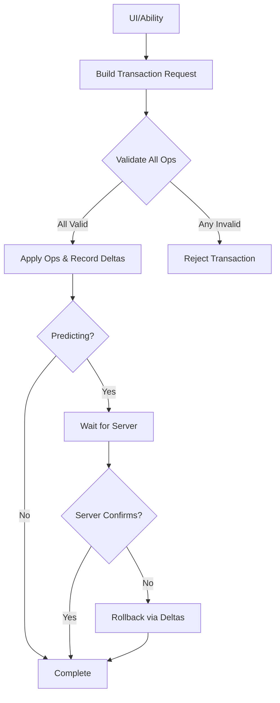

# Transactions

When you move an item, what actually happens? The source container removes it, the destination container adds it, permissions are checked, UI updates, and in multiplayer the server validates everything. If anything fails partway through, you need to undo what already happened.

The transaction system handles all of this. It provides atomic operations that either fully succeed or fully fail, with automatic rollback when needed.

***

### What You'll Learn

| Page                                                       | Description                                                                                                                                 |
| ---------------------------------------------------------- | ------------------------------------------------------------------------------------------------------------------------------------------- |
| [How Transactions Work](how-transactions-work/)            | The atomic execution model—how operations are validated, applied, and recorded for rollback. The mental model for understanding the system. |
| [Operation Types](operation-types.md)                      | The five operation types: Move, ModifyTagStack, SplitStack, RemoveItem, and AddItem. When to use each, how to construct them.               |
| [Validation and Permissions](validation-and-permission.md) | Two-stage validation (pre-filter vs full), the permission model, and how access is controlled.                                              |

***

### The Core Idea

A **transaction** is a batch of operations that execute atomically:


```cpp
FItemTransactionRequest Request;
Request.AddMoveOp(InventorySlot, EquipmentSlot);       // Move item to equipment
Request.AddModifyTagStackOp(AmmoSlot, AmmoTag, -10);   // Consume ammo
UItemContainerFunctionLibrary::ExecuteTransactionRequest(PC, Request);
```


Both operations must succeed, or neither happens. If the move succeeds but the ammo modification fails, the move is rolled back.

***

### Why Atomicity Matters

Consider equipping a weapon that requires removing the current weapon:

Without atomicity:

1. Remove old weapon from equipment ✓
2. Add new weapon to equipment ✗ (failed—slot incompatible)
3. Player now has no weapon and old weapon is... where?

With atomicity:

1. Validate: Can we remove old weapon? ✓
2. Validate: Can we add new weapon? ✗ (failed)
3. **Transaction rejected** — nothing changes

The transaction system validates all operations before applying any. If validation fails, the entire request is rejected cleanly.

***

### Transaction Flow





#### Build request

Compose operations into a transaction request.



#### Validate all

Check every operation before applying any.



#### Apply & record

Execute operations, recording deltas for potential rollback.



#### Wait for server (if predicting)

If predicting, wait for server confirmation.



#### Confirm or rollback

Server confirms (deltas discarded) or rejects (deltas reversed).



***

## Next Steps

Start with [How Transactions Work](how-transactions-work/) to understand the execution model.
