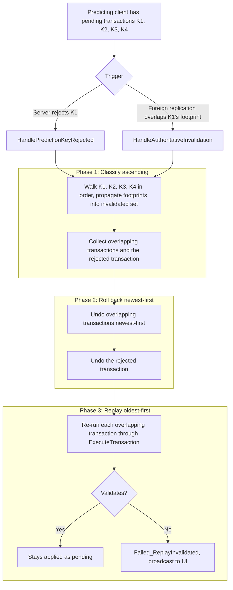

# Rollback and Replay

A single transaction's rejection or supersession does not happen in isolation. Players queue several inputs while latency masks the server response, so by the time a result arrives the client may have already predicted and applied additional transactions on top of the one being undone.

A naïve cascade rolls back every later prediction, even ones that touched unrelated items. This page explains how the framework classifies later predictions as disjoint or overlapping, replays only the affected subset, and applies the same machinery to two different triggers.

***

## The Core Idea

Every predicted transaction carries a **footprint**: a record of the slot keys it wrote, the item GUIDs it read and wrote, and the gameplay tags it modified. When one transaction needs to be undone, the framework collects the GUIDs and slot keys it invalidated, then walks every later pending transaction and compares footprints.

* **Disjoint** — the later transaction touches none of the invalidated state. It stays applied and visible. The player sees no interruption.
* **Overlapping** — the later transaction touches at least one invalidated slot or item. It is rolled back and re-executed against the post-rollback state. If it still validates, it stays applied. If it no longer validates, it is rejected and the player is shown a failure.

The dependency check operates on metadata. The replay re-runs the full validation path. So the framework never trusts a shortcut: it identifies _which_ transactions need re-checking, but the re-check itself uses the same code that originally validated them.

***

## When Reconciliation Triggers

Two different events route through the same algorithm:

| Trigger                        | Source                                                | Handler                           |
| ------------------------------ | ----------------------------------------------------- | --------------------------------- |
| **Rejection cascade**          | Explicit server failure RPC, GAS prediction rejection | `HandlePredictionKeyRejected`     |
| **Authoritative supersession** | Foreign replication overwrites a predicted overlay    | `HandleAuthoritativeInvalidation` |

### Rejection cascade

The predicting client sent a transaction. The server processed it, rejected it, and notified the client. The rejected transaction's footprint becomes the invalidated set, the cascade walks every later pending transaction, and disjoint transactions stay put while overlapping ones replay.

### Authoritative supersession

Another client or the server itself changed a slot the predicting client had a pending prediction on. Replication arrives. The prediction runtime detects that the authoritative state diverges from the predicted overlay for that GUID and broadcasts an invalidation footprint to any listening transaction ability. The same classification walk runs, but the trigger is foreign drift rather than an explicit rejection.

Supersession is not a substitute for server validation. The server's own rejection of the predicting client's transaction will arrive separately and runs the rejection cascade. Supersession only fires earlier when foreign replication moves first, eliminating the bookkeeping window where the predicted overlay and the authoritative state silently disagree.



***

## The Footprint

Each op handler implements `CollectFootprint`, which populates a `FItemTransactionFootprint` describing what that op touches. The transaction's overall footprint is the union across all its ops.

The footprint records four categories of dependency:

| Category               | Source on the op                                                                      | Used for                                                |
| ---------------------- | ------------------------------------------------------------------------------------- | ------------------------------------------------------- |
| Slot keys (read/write) | Normalised key from the resolved container plus the slot descriptor's stable identity | Detecting that two transactions touch the same location |
| Item GUIDs             | The op's expected item references and any newly created or removed item IDs           | Detecting that two transactions touch the same item     |
| Touched containers     | Every container the op resolved                                                       | Subscribing to authoritative supersession signals       |
| Modified tags          | The gameplay tag the op writes (count, durability, charges, etc.)                     | Reserved for finer-grained dependency rules             |

<details class="gb-toggle">

<summary>The footprint struct (simplified)</summary>

```cpp
struct FItemTransactionFootprint
{
    TArray<TWeakInterfacePtr<ILyraItemContainerInterface>> TouchedContainers;
    TSet<FItemTransactionSlotKey> ReadSlotKeys;
    TSet<FItemTransactionSlotKey> WrittenSlotKeys;
    TArray<FGuid> ReadItemGuids;
    TArray<FGuid> WrittenItemGuids;
    TArray<FGuid> CreatedItemGuids;
    TArray<FGuid> RemovedItemGuids;
    TArray<FGameplayTag> ModifiedStatTags;

    bool bReplaySafe = true;
    bool bHasUnstableSlotKeys = false;
};
```

</details>

### Why only written slot keys invalidate

The dependency engine treats a slot as invalidated only when a written entry has been undone. A read-only touch produces no state change to undo, so a later transaction's reads against the same slot do not need re-validation simply because the earlier transaction was rolled back.

The four overlap conditions the engine actually checks against the invalidated set:

* The later transaction reads a slot the rolled-back transaction wrote.
* The later transaction writes a slot the rolled-back transaction wrote.
* The later transaction touches an item GUID the rolled-back transaction read, wrote, created, or removed.
* The later transaction's footprint flagged itself replay-unsafe or carries unstable slot keys.

Any one of these classifies the later transaction as overlapping.

### Stable slot identity

Slot keys are composed from the resolved container object plus a stable string identifier the slot descriptor provides through `GetStableSlotIdentity`. This identifier is canonical, derived from the addressable location, and does not include mutable state like display names, item names, localised text, or timestamps.

When a slot descriptor cannot produce a stable identity, for example because the slot descriptor type does not override the virtual or the relevant fields are unset, the footprint marks `bHasUnstableSlotKeys = true`. The dependency engine then treats every comparison involving that footprint as overlapping, so the transaction is rolled back rather than preserved untouched. This is intentional: correctness wins over preservation whenever the data needed for a clean comparison is missing.

***

## Identity Verification

The dependency engine catches _which_ transactions need re-validation. Identity verification catches _whether the re-validation operates on the item the player originally targeted._

A slot-based op without an expected identity operates on whatever currently occupies the slot at apply time. Under contention that may be a different item than the player saw. The op then completes structurally even though the player's intent was about a different item entirely. Identity verification prevents that outcome by carrying an expected item GUID on the op:

* `FItemTxOp_Move::ItemInstance`
* `FItemTxOp_RemoveItem::ExpectedSourceItemGuid`
* `FItemTxOp_SplitStack::ExpectedSourceItemGuid`
* `FItemTxOp_ModifyTagStack::ExpectedSourceItemGuid`
* `FItemTxOp_AddItem::ExistingItem`

When the expected GUID is set and the slot's current item GUID does not match, the op rejects with `Reject_Item_Mismatch` and the transaction surfaces as `Failed_ServerRejected` to the player. When the expected GUID is left unset, the op acts on whatever the slot currently contains. That fallback is appropriate for scripted flows or cleanup routines where the current occupant is the intended target.

Identity verification and the dependency engine are independent layers that solve complementary problems. The dependency engine prevents stale dependencies from leaking into preserved transactions. Identity verification prevents replayed transactions from silently re-binding to substituted items. Both matter under contention.

For per-op opt-in details and construction examples, see [Operation Types](operation-types.md).

***

## The Three-Phase Algorithm

Both the rejection cascade and the authoritative supersession trigger run the same three-phase pipeline. The phases are strictly ordered: classification finishes before any rollback runs, and rollback finishes before any replay runs.

### Phase 1: Classify ascending

Walk pending prediction keys oldest-to-newest. For each one:

<!-- gb-stepper:start -->
<!-- gb-step:start -->
**Look up the transaction record.**

Each prediction key maps to a pending `FPendingItemTransaction` carrying the original request, the recorded deltas, and the collected footprint.
<!-- gb-step:end -->

<!-- gb-step:start -->
**Check overlap against the invalidated set.**

`FItemTransactionDependencySet::DoesTransactionDependOnInvalidatedState` returns true on any overlap and on any unstable or replay-unsafe footprint. The rejected transaction itself seeds the invalidated set (rejection trigger), or the foreign-update footprint does (supersession trigger).
<!-- gb-step:end -->

<!-- gb-step:start -->
**Disjoint: preserve untouched.**

The transaction remains in the pending map with its overlay intact. Its eventual server response flows through the normal confirm or reject path. This phase performs no rollback for disjoint transactions.
<!-- gb-step:end -->

<!-- gb-step:start -->
**Overlap: collect and propagate.**

Append the transaction to the affected-list in arrival order. Merge its footprint into the invalidated set so subsequent classifications see the cumulative dependency picture. This is the only side effect; the transaction is not rolled back yet.
<!-- gb-step:end -->
<!-- gb-stepper:end -->

Forward propagation of overlapping footprints is what drives classification, not rollback ordering. Once a transaction is classified as affected, its writes are added to the invalidated set so any later transaction depending on its predicted output is also flagged. This propagates the invalidation through transitive dependencies without needing an explicit dependency graph.

### Phase 2: Roll back newest-first

Phase 1 produces an ordered list of affected transactions. Phase 2 walks that list in reverse:

<!-- gb-stepper:start -->
<!-- gb-step:start -->
**Undo the newest affected transaction first.**

Reverse its recorded deltas through the same intra-transaction rollback path that already handles single-transaction rejection. Each delta inversion runs against the state that transaction created, which is the reason this order matters: undoing the oldest transaction's writes first would unwind state that later transactions built on top of.
<!-- gb-step:end -->

<!-- gb-step:start -->
**Walk back to the rejected transaction.**

Repeat for each affected transaction in reverse arrival order.
<!-- gb-step:end -->

<!-- gb-step:start -->
**Undo the rejected transaction (rejection trigger only).**

The supersession trigger has no separate "rejected transaction", only the affected ones. The rejection trigger ends Phase 2 by reversing the originally rejected transaction's deltas.
<!-- gb-step:end -->
<!-- gb-stepper:end -->

The intra-transaction delta reverse order (Read [Execution Deep Dive](how-transactions-work/execution-deep-dive.md) for that detail) is unchanged. Phase 2 simply applies it across multiple transactions in the right outer order.

### Phase 3: Replay oldest-first

Walk the affected list in its original ascending order and re-run each transaction through `ExecuteTransaction`. A re-entrancy guard ensures any foreign-update events that arrive synchronously during replay are queued and drained after the cascade completes.

<!-- gb-stepper:start -->
<!-- gb-step:start -->
**Replay-safe check.**

If the transaction's footprint is flagged replay-unsafe (custom handler didn't implement `CollectFootprint`, or slot identity was unstable), skip replay and broadcast `Failed_ReplayInvalidated` immediately.
<!-- gb-step:end -->

<!-- gb-step:start -->
**Re-execute through validation.**

The same validation path that originally accepted the transaction runs again against the post-rollback state. Successful validation re-records the transaction as pending; failed validation broadcasts `Failed_ReplayInvalidated` and removes the pending mapping.
<!-- gb-step:end -->

<!-- gb-step:start -->
**Identity verification doubles as a safety net.**

If a replayed transaction's expected item GUID no longer matches the slot's current contents, the apply path rejects with `Reject_Item_Mismatch` and the replay fails cleanly. The dependency engine identifies which transactions need re-validation; identity verification ensures the re-validation actually catches when the target has changed.
<!-- gb-step:end -->
<!-- gb-stepper:end -->

***

## What This Means for Custom Ops

Custom op handlers must implement `CollectFootprint` to participate in partial replay. The base implementation deliberately marks footprints replay-unsafe and returns false, so any handler that does not override it is treated as opt-out. Those transactions get rolled back rather than preserved when an earlier transaction is rejected.

The required body of a custom `CollectFootprint`:

* For every slot the op reads or writes, call `AddSlotFootprint` with the resolved container.
* For every item GUID the op references, call `AddReadItem`, `AddWrittenItem`, `AddCreatedItemGuid`, or `AddRemovedItem` as appropriate.
* For every gameplay tag the op modifies, call `AddModifiedTag`.
* Return `OutFootprint.bReplaySafe` so a partial failure during slot resolution propagates correctly.

The most common mistake is recording item GUIDs without touching the container set. The transaction ability subscribes to authoritative supersession on the containers the footprint touched, so an op that records only item GUIDs cannot be proactively invalidated when its container's state changes.

For the container-side contract (`CollectPredictableContainerHelpers` and the supersession delegate exposed through the helper) see [Adding Prediction](../creating-containers/adding-prediction.md).

***

## Edge Cases

A few honest constraints worth knowing.

#### Foreign updates during an in-flight replay

The supersession handler does not run while a transaction is being replayed in Phase 3. Re-entry would loop the replay's own overlay activity back through the handler. Rather than drop the foreign event, the handler queues its invalidation footprint and drains the queue once the replay window closes, processing each queued footprint through the same three-phase pipeline. The behaviour is deferred, not lost. Under aggressive network emulation or unusual tick interleaving, the deferral introduces at most a one-frame delay in reacting to the foreign update.

### Replay-unsafe handlers

Custom op handlers that do not implement `CollectFootprint` produce footprints with `bReplaySafe = false`. When such a transaction overlaps a rolled-back peer, it is rejected outright rather than rolled back and replayed, because the framework has no reliable way to revalidate it. The runner logs a warning on the original execution so missing footprints are visible early.

### Unstable slot keys

If a slot descriptor's `GetStableSlotIdentity` returns false, for example when no stable identity is available or the descriptor type does not override the virtual, the footprint sets `bHasUnstableSlotKeys`. The dependency engine then treats every comparison against that footprint as overlapping, so the transaction is rolled back instead of being preserved untouched. Correctness wins over preservation.

### Same algorithm, same broadcast tags

Both the rejection cascade and the supersession handler broadcast `Failed_ReplayInvalidated` on replay failure. The UI sees the same result message tag regardless of which trigger fired. If you need to distinguish the two sources for telemetry or debug logging, inspect the original `EItemTransactionResult` and the log channel `LogItemContainerPrediction`.
