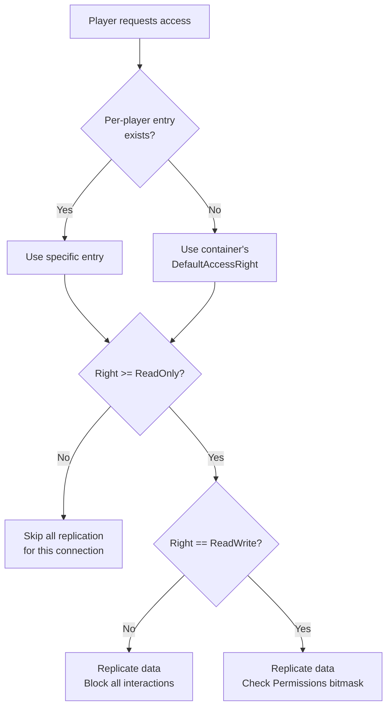

# Access rights

Access Rights are the **first gate** every container passes through before it even _thinks_ about permissions or gameplay abilities. If the local client does **not** reach "Read-Only", the server behaves as if that container simply doesn't exist for that player: no item lists, no weight numbers, no bandwidth spent.

## The Enum

```cpp
UENUM(BlueprintType)
enum class EItemContainerAccessRights : uint8
{
    None       UMETA(DisplayName="None"),        // internal value - never returned
    NoAccess   UMETA(DisplayName="No Access"),   // replicate nothing
    ReadOnly   UMETA(DisplayName="Read-Only"),   // replicate, but no interaction
    ReadWrite  UMETA(DisplayName="Read-Write")   // replicate + allow Permission checks
};
```

* **NoAccess** — _Nothing_ replicates. Not the item list, not the weight, not the per-item sub-objects. Ideal for distant chests, enemy backpacks, or hidden admin containers.
* **ReadOnly** — The client receives all replicated data, but any interaction attempt is blocked server-side _before_ permissions are even consulted. Perfect for spectators, "look-but-don't-touch" loot previews, or read-only vendors.
* **ReadWrite** — Data replicates and the player can attempt actions. Each action is then filtered by the [Permissions](permissions.md) bitmask.

***

## Evaluation Flow

When a player tries to interact with a container, the system resolves their access right in two steps:



Inside `ReplicateSubobjects`, the check is straightforward:

```cpp
if (Rights < EItemContainerAccessRights::ReadOnly)
    return; // skip every item sub-object for this connection
```

Gameplay abilities and UI checks also gate on access rights, `FAbilityData_SourceItem::GetSourceItem` returns `nullptr` if the player doesn't meet the required level, short-circuiting the ability.

### Impact on Bandwidth

The difference between `NoAccess` and `ReadOnly` is whether the server sends item data over the network at all.

| Right         | Permission Component replicated? | Inventory sub-objects replicated? | Typical use                          |
| ------------- | -------------------------------- | --------------------------------- | ------------------------------------ |
| **NoAccess**  | Yes (it's tiny)                  | **No**                            | Out-of-range chests, hidden stash    |
| **ReadOnly**  | Yes                              | Yes                               | Loot preview, spectator screen       |
| **ReadWrite** | Yes                              | Yes                               | Local player inventory, team storage |

A remote player with NoAccess won't even have the `ULyraInventoryItemInstance` objects in their `SubobjectRepKey` table, a measurable saving on saturated servers.

***

## Design Guidelines

* **Default to NoAccess** for world-spawned containers. Grant rights explicitly when the player enters an interaction sphere or opens the UI.
* **Treat ReadOnly as a UI-only state.** Abilities that modify items should require `ReadWrite` by default.
* **Don't rely on Permissions alone.** A container at `ReadWrite` with all permissions cleared still replicates all item data. If you need true secrecy, use `NoAccess`.

***

## Quick Recipes

| Situation                                             | Server code                                                                            |
| ----------------------------------------------------- | -------------------------------------------------------------------------------------- |
| **Player walks up to a chest** — preview contents     | `PermissionOwner->SetContainerAccessRight(PC, EItemContainerAccessRights::ReadOnly);`  |
| **Player presses interact** — open and allow take/put | `PermissionOwner->SetContainerAccessRight(PC, EItemContainerAccessRights::ReadWrite);` |
| **Player walks away** — stop replication              | `PermissionOwner->RemoveContainerAccessRight(PC);` _(falls back to default NoAccess)_  |
