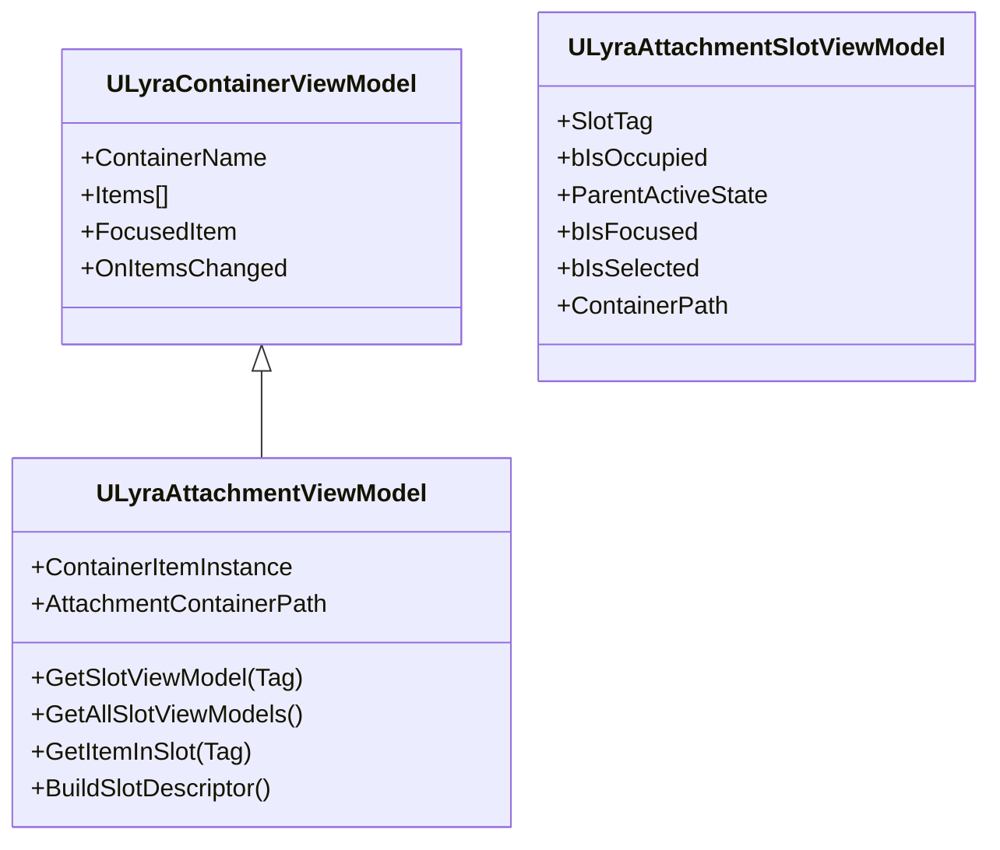

# Attachment Viewmodels

The player opens a weapon customization screen, sees their rifle with its current attachments, and drags a new scope onto the scope slot, the scope appears immediately, predicted on the client and eventually confirmed by the server. ViewModels give widgets a clean interface to attachment state, handling prediction, slot paths, and change tracking behind the scenes.

> [!INFO]
> For the underlying MVVM architecture and why ViewModels exist, see [MVVM](../../../ui/item-container-ui-system/core-architecture-and-data-structures/mvvm.md) and [Data Layers (View Models)](../../../ui/item-container-ui-system/data-layers-view-models/). ViewModels are acquired and released through the [Item Container UI Manager](../../../ui/item-container-ui-system/item-container-ui-manager/).

***

### Class Hierarchy



`ULyraAttachmentViewModel` inherits the shared container properties (items list, focused item, change delegates) and layers on tag-based slot management, parent state awareness, and nested container path tracking.

***

### Tag-Based Slots

Like equipment, attachment slots are identified by GameplayTag. The ViewModel exposes slot access through a straightforward API:

```cpp
// Get a specific slot
ULyraAttachmentSlotViewModel* ScopeSlot = AttachmentVM->GetSlotViewModel(TAG_Attachment_Slot_Scope);

// Get all slot ViewModels
TArray<ULyraAttachmentSlotViewModel*> AllSlots = AttachmentVM->GetAllSlotViewModels();

// Check what's attached (nullptr if empty)
ULyraItemViewModel* AttachedScope = AttachmentVM->GetItemInSlot(TAG_Attachment_Slot_Scope);
```

Slot ViewModels exist even when empty, an empty scope slot still renders as a "drop scope here" target. When the player attaches something, the same ViewModel updates; you do not create a new one.

> [!INFO]
> This follows the same pattern used by equipment slots. See [Persistent Slot Pattern](../../../ui/item-container-ui-system/data-layers-view-models/persistent-slot-pattern.md) for the general approach.

***

### The `ParentActiveState` Property

This is what makes attachment slots unique. Attachments inherit behavior from their parent item's equipment state:

```cpp
// Rifle is in inventory -- attachments are inactive
ScopeSlot->ParentActiveState  // EAttachmentActiveState::Inactive

// Rifle is equipped but holstered
ScopeSlot->ParentActiveState  // EAttachmentActiveState::Holstered

// Rifle is in the player's hands
ScopeSlot->ParentActiveState  // EAttachmentActiveState::Equipped
```

Use this for visual feedback, glow when the parent weapon is held, dim when holstered, hidden when inactive.

***

### Slot Properties

**Slot State:**

| Property            | Type                     | Description                                                 |
| ------------------- | ------------------------ | ----------------------------------------------------------- |
| `SlotTag`           | `FGameplayTag`           | Attachment slot tag (Scope, Grip, Magazine)                 |
| `bIsOccupied`       | `bool`                   | Whether an attachment is in this slot                       |
| `ParentActiveState` | `EAttachmentActiveState` | Parent item's equipment state (Inactive/Holstered/Equipped) |
| `bIsFocused`        | `bool`                   | Navigation cursor is here                                   |
| `bIsSelected`       | `bool`                   | Selected for interaction                                    |
| `bIsGhost`          | `bool`                   | Predicted but unconfirmed                                   |

**Proxied Item Data (when occupied):**

| Property          | Type          | When Empty |
| ----------------- | ------------- | ---------- |
| `ItemIcon`        | `UTexture2D*` | nullptr    |
| `ItemDisplayName` | `FText`       | Empty text |
| `StackCount`      | `int32`       | 0          |

**Path & Transaction:**

| Property         | Type                   | Description                                     |
| ---------------- | ---------------------- | ----------------------------------------------- |
| `ContainerPath`  | `TArray<FGameplayTag>` | Nesting depth in the attachment hierarchy       |
| `SlotDescriptor` | `FInstancedStruct`     | Pre-built descriptor for the transaction system |

***

### Nested Attachments

Attachments can have their own attachments. A tactical scope might have a laser sight module:

```
Rifle
+-- Scope (ContainerPath: [])
|   +-- Laser (ContainerPath: [Scope])
+-- Grip (ContainerPath: [])
```

The `ContainerPath` property on slot ViewModels reflects nesting depth. To display a sub-attachment's own slots, acquire a ViewModel for the attachment item itself:

```cpp
ULyraInventoryItemInstance* ScopeItem = ScopeSlotVM->GetItemInstance();
if (ScopeItem)
{
    ScopeAttachmentVM = Manager->AcquireContainerViewModel(ScopeAttachmentSource);
    LaserSlotWidget->BindToSlot(ScopeAttachmentVM->GetSlotViewModel(TAG_Attachment_Slot_Illumination));
}
```

***

### Dynamic Context Updates

When the parent item moves (e.g., a rifle moves from the player's hands to the backpack), the path to every attachment changes. The ViewModel detects the move, recalculates the `ContainerPath` and `SlotDescriptor` for every slot, and propagates the update. Drag-and-drop operations continue to work seamlessly even if the parent item is moved while the attachment window is open.

> [!INFO]
> For how the transaction system handles nested container paths, see [Runtime Container](runtime-container.md).

***

### Delegates

| Delegate    | Signature | Fires When                                                 |
| ----------- | --------- | ---------------------------------------------------------- |
| `OnChanged` | `()`      | Any attachment slot changes (attach, detach, parent state) |

***

### Drag-Drop

Slot ViewModels carry a pre-built `SlotDescriptor` that plugs directly into the transaction system:

```cpp
FInstancedStruct SourceSlot = SourceSlotVM->SlotDescriptor;
FInstancedStruct DestSlot = AttachmentSlotVM->SlotDescriptor;
ItemTransactionAbility->MoveItem(SourceSlot, DestSlot);
```

> [!INFO]
> For the full drag-and-drop flow, see [UI Transaction Pipeline](/broken/pages/ee5ae57a62fa7edb6e3fba0277b6baab5b1d6979).

***

> [!INFO]
> For the shared ViewModel architecture used across all container types, see [Data Layers (View Models)](../../../ui/item-container-ui-system/data-layers-view-models/). For ghost state styling during prediction, see [Prediction & Visuals](../../../ui/item-container-ui-system/data-layers-view-models/prediction-and-visuals.md).
