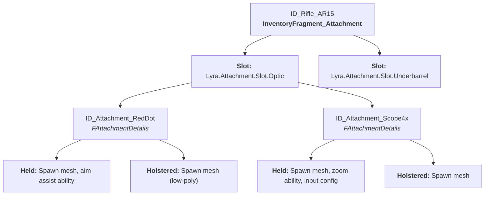

# Concept & Setup

Your AR-15 supports a red dot or a 4x scope in the optic slot, a vertical grip or a laser on the underbarrel. Each attachment changes the weapon's behavior differently depending on whether it's held or holstered, the scope grants a zoom ability only when held, while the grip's recoil reduction applies in both states. The `UInventoryFragment_Attachment` defines all of these rules as static data on the Item Definition.

***

## The Data Structure

The attachment configuration is a hierarchy of maps. At the top level, the host item declares which **slots** it offers (keyed by Gameplay Tag). Each slot declares which **attachments** are compatible (keyed by Item Definition class). Each compatible attachment defines **behaviors** for both the held and holstered states.

***

## Adding the Fragment

Add `InventoryFragment_Attachment` to the `Fragments` array of any Item Definition that should **host attachments** or **be an attachment** (or both). This signals the system to create a `UTransientRuntimeFragment_Attachment` on each item instance at runtime.

***

## Slot Tags

Attachment slots use Gameplay Tags under the `Lyra.Attachment.Slot` hierarchy. The editor filters the tag picker to only show children of this parent, preventing misconfiguration. Common examples:

* `Lyra.Attachment.Slot.Optic`
* `Lyra.Attachment.Slot.Muzzle`
* `Lyra.Attachment.Slot.Underbarrel`
* `Lyra.Attachment.Slot.Magazine`

You define new slot types simply by adding tags under this hierarchy, no code changes required.

***

## Compatible Attachments

The `CompatibleAttachments` map is the core of the configuration. It's a `TMap<FAttachmentSlotTagKey, FAttachmentSlotDetails>`:

* **Key** — a slot tag (e.g., `Lyra.Attachment.Slot.Optic`)
* **Value** — an `FAttachmentSlotDetails` struct containing another map: `TMap<TSubclassOf<ULyraInventoryItemDefinition>, FAttachmentDetails>`

This inner map says "for this slot, these specific Item Definitions are allowed, and here's what each one does."

***

## State-Dependent Behaviors

Each compatible attachment defines separate behaviors for the host item's **Held** and **Holstered** states through `FAttachmentDetails`. This is the key design insight, a scope's zoom ability should only activate when the weapon is in the player's hands.

`FAttachmentDetails` contains:

* **Attachment Icon** — optional UI icon for the slot itself (e.g., a generic scope silhouette)
* **Held Attachment Settings** — an `FAttachmentBehaviour` for when the host item is actively held
* **Holstered Attachment Settings** — an `FAttachmentBehaviour` for when the host item is holstered

FAttachmentBehaviour properties

Each behavior struct controls what happens when the host enters that state with this attachment active:

| Property             | Type                                          | Purpose                                                                                                                                                                    |
| -------------------- | --------------------------------------------- | -------------------------------------------------------------------------------------------------------------------------------------------------------------------------- |
| `AbilitySetsToGrant` | `TArray<ULyraAbilitySet*>`                    | Ability sets granted to the owner. Held example: scope zoom ability. Holstered example: rocket jump from rocket boots.                                                     |
| `ActorSpawnInfo`     | `FLyraEquipmentActorToSpawn`                  | Visual actor to spawn and attach to the host item's actor. Contains `ActorToSpawn` (class), `AttachSocket` (socket name on host), and `AttachTransform` (relative offset). |
| `InputMappings`      | `TArray<FPawnInputMappingContextAndPriority>` | Input mapping contexts added to the Enhanced Input subsystem when this behavior is active.                                                                                 |
| `InputConfig`        | `ULyraInputConfig*`                           | Input config mapping actions to ability tags via the `ULyraHeroComponent`.                                                                                                 |

The `ActorSpawnInfo`'s `AttachTransform` is relative to the specified socket on the _host item's spawned actor_, allowing precise positioning of the attachment model.

***

## Default Attachments

The `DefaultAttachments` map (`TMap<FAttachmentSlotTagKey, TSubclassOf<ULyraInventoryItemDefinition>>`) lets an item spawn with attachments pre-installed. When an instance is created, `CreateNewRuntimeTransientFragment` iterates this map and creates instances of each default attachment.

Each entry must reference a slot that exists in `CompatibleAttachments`, and the attachment definition must be listed as compatible in that slot.

***

## Configuration Walkthrough

Configuring an optic slot on a rifle, step by step:

<!-- gb-stepper:start -->
<!-- gb-step:start -->
**Define the Host Item**

Open `ID_Rifle_AR15` and add `InventoryFragment_Attachment` to its fragments.
<!-- gb-step:end -->

<!-- gb-step:start -->
**Add a Slot**

In `CompatibleAttachments`, add an entry with key `Lyra.Attachment.Slot.Optic`.
<!-- gb-step:end -->

<!-- gb-step:start -->
**Add Compatible Attachments**

In the slot's `AttachmentDetailsMap`, add entries for each allowed attachment:

**Red Dot Sight** (`ID_Attachment_RedDotSight`):

* Held Settings: `ActorSpawnInfo` → `BP_RedDot_Attached` on socket `Optic_Mount`
* Holstered Settings: `ActorSpawnInfo` → same mesh (or a low-poly version)

**4x Scope** (`ID_Attachment_Scope4x`):

* Held Settings: `ActorSpawnInfo` → `BP_Scope4x_Attached`, `AbilitySetsToGrant` → `AS_Scope4x_ZoomAbility`, `InputConfig` → `InputConfig_ScopeZoomControls`
* Holstered Settings: `ActorSpawnInfo` → `BP_Scope4x_Attached`
<!-- gb-step:end -->

<!-- gb-step:start -->
**(Optional) Set a Default**

In `DefaultAttachments`, map `Lyra.Attachment.Slot.Optic` → `ID_Attachment_IronSights` to have the rifle spawn with iron sights pre-installed.
<!-- gb-step:end -->

<!-- gb-step:start -->
**Create Supporting Assets**

Ensure the referenced Blueprint actors (`BP_RedDot_Attached`, etc.), ability sets, and input configs exist and are configured.
<!-- gb-step:end -->
<!-- gb-stepper:end -->

The [Runtime Container](runtime-container.md) page covers how these static rules are brought to life, activating and deactivating abilities, spawning and destroying visual actors, as the host item transitions between states.
