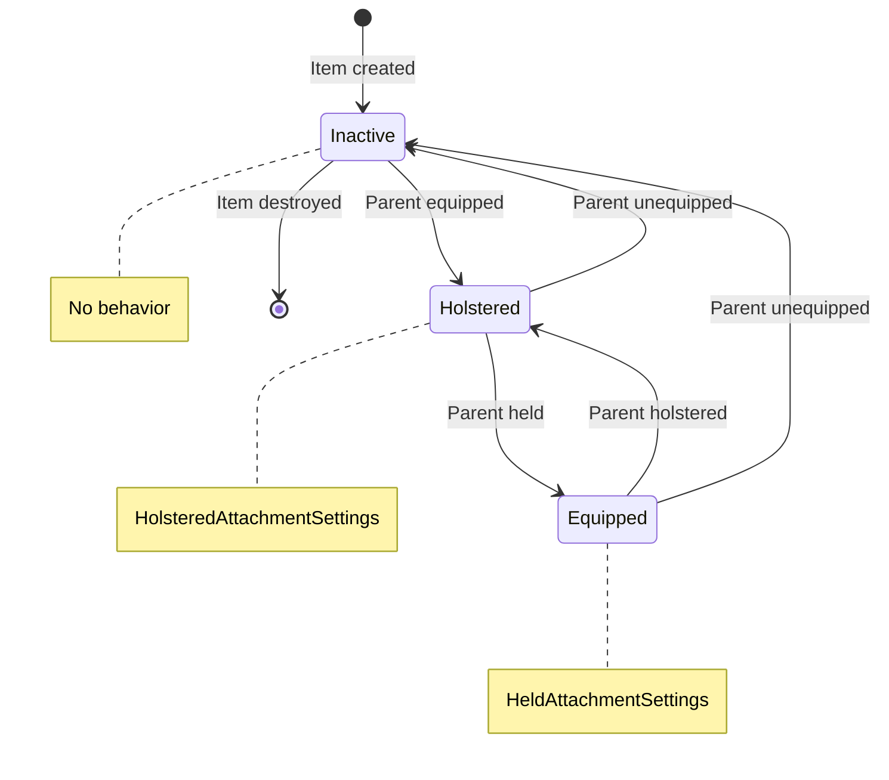

# State Behaviors

A scope on a rifle doesn't just sit there - it grants ADS abilities when you're aiming, spawns a visible mesh attached to the weapon, and adds input bindings for zoom. But when you holster the weapon? Those abilities disappear, the mesh might change, and the input goes away. When the weapon sits in your inventory, the scope does nothing at all.

This is state-aware behavior: attachments change what they do based on their parent item's equipment state.

***

### The Three States

Attachments exist in one of three states, determined entirely by their parent item:



**Inactive** - The parent item isn't equipped. It's in inventory, lying on the ground, or stored somewhere. The attachment sleeps: no actors spawn, no abilities grant, no input binds. The attachment data still exists, but it has no active behavior.

**Holstered** - The parent item is equipped but not in hand. The player has the weapon on their back, the armor on their body, the tool on their belt. Attachments use their `HolsteredAttachmentSettings` - maybe a folded mesh, maybe passive abilities, maybe nothing visible.

**Equipped** - The parent item is actively held. For weapons, this means in the player's hands, ready to use. Attachments use their `HeldAttachmentSettings` - full visual representation, active abilities, input bindings for special actions.

***

### What Changes Per State

Each state can have completely different behavior:

#### Actors

A scope might spawn `BP_RedDot_InHand` with full detail when the weapon is held, but `BP_RedDot_Holstered` (a smaller, simplified mesh) when holstered on the player's back. Or it might spawn nothing when holstered - just disappear from view.

Actors always attach to the **parent item's spawned actor**, not the pawn. The scope attaches to the rifle mesh, which attaches to the player's hand or back.

#### Abilities

A red dot scope might grant aim assist abilities when the weapon is held. When holstered? No abilities, you can't aim with a weapon on your back.

Armor plates work differently. Since armor is never "held" (you wear it, you don't wield it), the abilities live in `HolsteredAttachmentSettings`. Damage reduction is active whenever the vest is equipped.

#### Input

Zoom controls, firing mode toggles, special attachment actions - these only make sense when the weapon is equipped. Input mappings and input configs apply in held or holstered state.

Input only applies on the locally controlled client. The server grants abilities, but input is purely client-side.

***

### Behavior Configuration

Each attachment defines two behavior configurations in the host item's `CompatibleAttachments` map:

```
ID_Attachment_RedDot:
  HeldAttachmentSettings:
    ActorSpawnInfo:
      ActorToSpawn: BP_RedDot_InHand
      AttachSocket: Scope_Socket
    AbilitySetsToGrant: [GAS_RedDot_AimAssist]
    InputMappings: [IMC_ScopeZoom]

  HolsteredAttachmentSettings:
    ActorSpawnInfo:
      ActorToSpawn: BP_RedDot_Holstered
      AttachSocket: Scope_Socket_Back
    AbilitySetsToGrant: []   # No abilities when holstered
```

The `FAttachmentBehaviour` struct contains everything that can change per state:

* `ActorSpawnInfo` - What actor to spawn and where to attach it
* `AbilitySetsToGrant` - Which ability sets to grant
* `InputMappings` - Input mapping contexts to add
* `InputConfig` - Input configuration for ability bindings

***

### When State Changes

When the player draws or holsters a weapon, here's what happens to each attachment:



#### Remove old behavior

The runtime container removes everything from the previous state:

* Destroys the spawned actor
* Removes granted abilities using stored handles
* Removes input contexts using stored bind handles



#### Apply new behavior

The container applies everything for the new state:

* Spawns the new actor (if configured) and attaches it
* Grants abilities (server only) and stores handles for cleanup
* Adds input mappings (owning client only) and stores handles

This happens automatically when the parent item moves between equipment states. You don't need to manually trigger attachment updates.



#### Nested Attachments

If a scope has its own attachments (like a laser sight), the state change propagates recursively. When the weapon goes from holstered to held, the entire hierarchy transitions together:



Weapon's attachments switch to held behavior



Each attachment with its own attachments propagates the change



The entire hierarchy transitions together



***

### Practical Examples

<div class="gb-stack">
<details class="gb-toggle">

<summary>Weapon Grip</summary>

A tactical grip reduces recoil - but only when you're actually shooting:

```
HeldAttachmentSettings:
  AbilitySetsToGrant: [GAS_Grip_RecoilReduction]  # Active when aiming
  ActorSpawnInfo:
    ActorToSpawn: BP_TacticalGrip
    AttachSocket: grip_socket

HolsteredAttachmentSettings:
  AbilitySetsToGrant: []    # No passive bonus
  ActorSpawnInfo:
    ActorToSpawn: BP_TacticalGrip_Folded
    AttachSocket: grip_socket_back
```

</details>
<details class="gb-toggle">

<summary>Armor Module</summary>

An armor plate grants damage reduction whenever you're wearing the vest:

```
HeldAttachmentSettings:
  # Armor isn't "held" - this stays empty
  AbilitySetsToGrant: []
  ActorSpawnInfo: {}

HolsteredAttachmentSettings:
  AbilitySetsToGrant: [GAS_ArmorPlate_DamageReduction]  # Always active
  ActorSpawnInfo:
    ActorToSpawn: BP_ArmorPlate
    AttachSocket: chest_plate_socket
```

Since armor is never wielded, only the holstered settings matter. The held settings exist for completeness but remain empty.

</details>
<details class="gb-toggle">

<summary>Scope with No Holstered Visual</summary>

Sometimes you don't want any mesh when holstered:

```
HeldAttachmentSettings:
  ActorSpawnInfo:
    ActorToSpawn: BP_Scope
    AttachSocket: scope_socket

HolsteredAttachmentSettings:
  ActorSpawnInfo: {}   # No actor spawns
```

The scope appears when aiming and disappears when the weapon is on your back.

</details>
</div>
