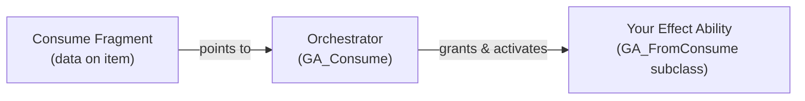

# Consumable Items

A consumable item runs a gameplay effect in exchange for consuming one or more items from the stack. Healing, applying a buff, eating food, the effect is entirely up to you. The system provides the pipeline: you configure the item, write the effect, and everything else (orchestration, networking, item removal) is handled automatically.

***

#### How It Works

When a player presses "Use" on an item, three pieces work together:



| Piece                                       | What It Is                                                                                                                       | Who Creates It                          |
| ------------------------------------------- | -------------------------------------------------------------------------------------------------------------------------------- | --------------------------------------- |
| **Consume Fragment**                        | A fragment on the item definition that marks it as usable, sets the cost, and points to an effect ability                        | You, add it to the item definition      |
| **Orchestrator** (`GA_Consume`)             | A built-in ability that resolves the item, reads the fragment, grants your effect ability temporarily, and manages the lifecycle | The system, you never touch this        |
| **Effect Ability** (`FromConsume` subclass) | A Gameplay Ability where you implement the actual effect, healing, spawning, buffing, whatever the item does                     | You, create a Blueprint or C++ subclass |

Why not just activate the effect ability directly? The orchestrator sits in between so that every consumable shares a single entry point (`Ability.Inventory.UseItem`), abilities are granted temporarily and cleaned up after use, and the Finish Policy (whether the player is blocked from using another item) works without any custom logic in your effect ability.

> [!INFO]
> For the full internal architecture (orchestrator flow, ability task lifecycle, sequence diagram), see [**Consume Action Orchestator**](consume-action-orchestrator.md)**.**

***

#### Quick Start



**Step 1: Make the Item Consumable**

Add `InventoryFragment_Consume` to your item definition and set three properties:

| Property                | What to Set                                                                  |
| ----------------------- | ---------------------------------------------------------------------------- |
| **Ability To Activate** | Your `FromConsume` ability class                                             |
| **Amount To Consume**   | How many items to remove per use (usually 1)                                 |
| **Finish Policy**       | When the player can use another item (see [Finish Policy](./#finish-policy)) |



**Step 2: Implement the Effect**

Create a Blueprint (or C++ class) that inherits from `ULyraGameplayAbility_FromConsume`. Your ability does three things:

1. Run your effect (apply a Gameplay Effect, play a montage, spawn an actor, etc.)
2. Call `ConsumeItem()` when the cost should be paid
3. Call `EndAbility()` when the effect is complete

```
ActivateAbility
  → Do your effect
  → ConsumeItem()   ← deducts stack, removes item if depleted
  → EndAbility()    ← required to finish
```



<details class="gb-toggle">

<summary>Blueprint example of a Consumable Ability (<code>GA_Consume_DirtyWater</code>)</summary>


</details>

***

#### What Happens When You Call `ConsumeItem()`

When your ability calls `ConsumeItem()`:

1. **Stack Decremented** - Item count reduced by `AmountToConsume`
2. **Auto-Removal** - If stack reaches 0, item is automatically removed from inventory
3. **Effects Triggered** - `PlayConsumeEffects()` fires for VFX/sounds
4. **Server Confirmation**- Transaction sent to server for validation
5. **Result Callback** - `OnConsumeSucceeded` or `OnConsumeFailed` fires

> [!INFO]
> The item transaction uses client prediction for responsive gameplay. For details on how this works, see [Client Prediction](../../../item-container/prediction/).

***

#### Finish Policy

The **Finish Policy** controls when the player can use another consumable after using this one:

| Policy                 | Behavior                                | Example                                            |
| ---------------------- | --------------------------------------- | -------------------------------------------------- |
| `EndImmediately`       | Player can immediately use another item | Instant buffs, quick items                         |
| `WaitForConsumeEffect` | Blocked until `ConsumeItem()` is called | Items with a brief wind-up before the cost is paid |
| `BlockOtherConsumes`   | Blocked until the ability fully ends    | Channeled items, montages that lock the player in  |

***

#### Sub pages

* **Consume Fragment** - Configuring items to be consumable (properties, action menu, runtime flow)
* **FromConsume Ability** - Implementing the effect logic (key functions, common patterns, debugging)
* **Consume Action Orchestator** - Internal architecture for curious developers (orchestrator, ability task, sequence diagram)

