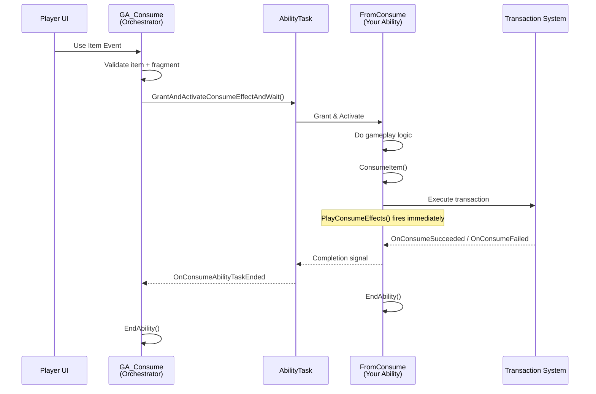

# Consume Action Orchestrator

> [!INFO]
> **This page is optional.** You don't need to understand the internal architecture to use consumable items. This is for developers who want to know what happens under the hood.

***

### Architecture Overview

The consumable system has three layers:

| Layer             | Component                          | Role                              |
| ----------------- | ---------------------------------- | --------------------------------- |
| **Data**          | `UInventoryFragment_Consume`       | Configures the item as consumable |
| **Orchestration** | `ULyraGameplayAbility_Consume`     | Handles the "use item" request    |
| **Effect**        | `ULyraGameplayAbility_FromConsume` | Your custom effect logic          |

You only interact with the **Data** and **Effect** layers. The orchestration layer works automatically.

***

### The Orchestrator: `GA_Consume`

When the player presses "Use" on an item, `ULyraGameplayAbility_Consume` is activated. It:



#### Resolve the item instance

Resolves the item instance from the slot address.



#### Validate the fragment and ability

Validates the item has a Consume Fragment with a valid ability.



#### Spawn internal task

Spawns an internal task to manage the effect ability lifecycle.



#### Wait based on Finish Policy

Waits based on the Finish Policy.



#### End when task completes

Ends automatically when the task completes.



The orchestrator never applies effects, removes items, or plays animations. It's purely for flow control.

***

### The Task: `ActivateConsumeEffectAndWait`

The orchestrator delegates to an internal **Ability Task**. This task:



#### Grant the ability

Grants the FromConsume ability temporarily.



#### Activate with `SourceObject`

Activates it with the item as the SourceObject.



#### Listen for completion signals

Listens for completion signals:

* `OnConsumeSucceeded` - consume transaction confirmed
* `OnConsumeFailed` - consume transaction failed
* `OnGameplayAbilityEnded` - ability ended (fallback)



#### Cleanup

Cleans up by removing the granted ability from the ASC.



You never interact with this task directly.

***

### Finish Policy Behavior

The Finish Policy controls when the orchestrator ends:

| Policy                 | Task Behavior                                                   | Orchestrator Ends            |
| ---------------------- | --------------------------------------------------------------- | ---------------------------- |
| `EndImmediately`       | Activates ability and detaches                                  | Immediately after activation |
| `WaitForConsumeEffect` | Waits for `OnConsumeSucceeded`/`OnConsumeFailed` or ability end | After consume confirmation   |
| `BlockOtherConsumes`   | Waits for ability to fully end                                  | Only when ability ends       |

***

## Sequence Diagram

***

### Why This Structure?

You might wonder: why not activate the effect ability directly?

**Benefits of the orchestrator pattern:**

* **Single entry point** - All items use the same `Ability.Inventory.UseItem` tag
* **Consistent blocking** - Finish Policy works without custom logic
* **Clean lifecycle** - Abilities are granted temporarily and cleaned up
* **Server prediction** - Transaction system handles networking automatically
* **Decoupled design** - Effect abilities don't know about the orchestration

***

### Key Implementation Details

#### The orchestrator is lightweight

It doesn't contain game logic. All it does is:

* Find the item
* Check the fragment
* Launch the task
* Wait for completion

#### Effect abilities own their behavior

Your `FromConsume` subclass controls:

* What effects to apply
* When to call `ConsumeItem()`
* When to call `EndAbility()`
* What VFX/sounds to play

#### Transaction handles item removal

When `ConsumeItem()` is called, it creates an item transaction that:

* Modifies the stack count
* Removes the item if depleted
* Uses client prediction for responsiveness
* Confirms with server for authority

***
