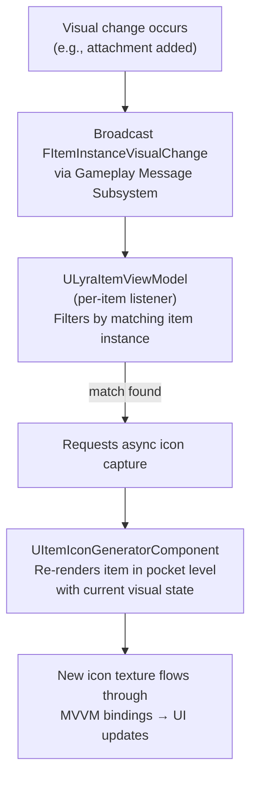

# Icon fragment

The `UInventoryFragment_Icon` owns how an item presents its display icon. An item's icon is either an authored texture or a runtime render of the item's mesh, and this fragment is where that choice is made. Every asset reference on the fragment is soft, so a dedicated server never loads cosmetic textures or meshes.

## Purpose

* **Authored icons:** Point the item at a `UTexture2D` and the inventory UI shows it. The simple path, right for most items.
* **Generated icons:** Have the icon rendered at runtime from the item's 3D mesh, so the picture always matches the item's current visual state. A rifle's icon can show exactly the scope and grip currently attached, without authoring a texture for every combination.
* **A single resolution point:** UI code never reads this fragment directly. It asks `ULyraItemIconLibrary`, which knows which fragment supplies the icon, so the icon's physical home can change without touching call sites.

## Static Configuration (`UInventoryFragment_Icon`)

Add this fragment to an `ULyraInventoryItemDefinition` and choose the icon source:

* **`Source` (`EItemIconSource`)**: How the icon is produced.
  * **`StaticTexture`** (default): The icon is an authored texture.
  * **`Generated`**: The icon is rendered at runtime from the item's mesh through the icon generator.

With **`StaticTexture`** selected:

* **`StaticIcon` (`TSoftObjectPtr<UTexture2D>`)**: The texture shown in inventory slots.

With **`Generated`** selected:

* **`SkeletalMesh` / `StaticMesh` (soft references)**: Optional mesh override for the generated render. A set skeletal mesh wins over a set static mesh. When neither is set, the render falls back to the mesh from the item's [Inspect Fragment](/broken/pages/oBeeJn2sxD1ohSXCQDGf), then its [Pickup Fragment](pickup-item-fragment.md).
* **`IconRotation` (`FRotator`)**: Model rotation applied when capturing the render, so you can frame the item at a flattering angle.
* **`FitToScreenRatio` (`float`, Default: 1.0)**: How much of the capture frame the model fills, where one fills it exactly.
* **`bCacheGeneratedIcon` (`bool`, Default: true)**: Whether generated renders are cached and reused for identical loadouts. Disable for items whose appearance varies in ways that the loadout cache key cannot see.

## How icons are resolved at runtime

Consumers resolve icons through `ULyraItemIconLibrary` rather than reading the fragment:

* **`GetItemDisplayIcon` / `GetItemDisplayIconFromClass` / `GetItemDisplayIconForItem`**: Return the static display icon for an item definition, definition class, or live item instance, or null when it has none.
* **`PrefersGeneratedIcon` / `PrefersGeneratedIconFromClass`**: Whether the item wants its display icon rendered at runtime rather than authored.
* **`ShouldCacheGeneratedIcon`**: Whether a generated render for this item may be cached and reused.

The item view models follow this flow: they show the static icon from the library, and when the fragment prefers a generated icon and the local player controller carries a `UItemIconGeneratorComponent`, they request an asynchronous render and swap in the finished texture when the callback fires.

## Generated icons

Generated mode feeds the [Item Inspection System](/broken/pages/2717bf12a1bc94fe37d4f66233a875647c53e74a)'s rendering pipeline: the item is staged in an isolated pocket level, captured to a render target, and read back into a `UTexture2D`, complete with every attachment currently mounted on the item. The [Async Icon Generation](/broken/pages/dd34df0567a761b86bad295be4f3d8f595f436c0) page covers the pipeline, queueing, and caching in depth.

Two things worth knowing when enabling it:

* The stage needs a mesh to render. Give the item a mesh through this fragment's override, an [Inspect Fragment](/broken/pages/bd7ab59d605c8d29f49724d9622049a618cd5537), or a [Pickup Fragment](/broken/pages/4d52b7054b63c744ba2db221689d8060a312055b).
* Generation is asynchronous and runs on the requesting client. The slot shows no icon until the render arrives, which usually takes a frame or two on first request and is instant afterwards when caching is enabled.

### Real-time icon regeneration

A generated icon captured once would go stale the moment a player modifies the item. The icon system solves this with an event-driven regeneration pipeline, add a scope to a rifle, and the inventory icon updates to show the scope, automatically.

When any system changes an item's visual appearance, an attachment is added or removed, equipment visuals are modified, a skin is applied, it broadcasts an `FItemInstanceVisualChangeMessage` through the **Gameplay Message Subsystem** on the channel:

```
Lyra.Inventory.Message.ItemVisualChange
```

Each item's ViewModel listens for messages on this channel and filters by its own item instance. When a matching message arrives, the ViewModel requests a new asynchronous icon capture. The `UItemIconGeneratorComponent` re-renders the item inside its pocket level with the current visual state, including all attachments in their current configuration, and the resulting texture feeds back through the MVVM binding layer. The UI widget picks up the change and displays the updated icon with no manual refresh needed.



> [!SUCCESS]
> You do not need to manually trigger icon updates. Any system that modifies item visuals just needs to broadcast the `FItemInstanceVisualChangeMessage`, the rest of the chain is automatic.

The `InventoryFragment_Icon` keeps an item's picture in one place, from a hand-authored texture to a live render of the item and its attachments. Pair it with the [Item Details Fragment](/broken/pages/7b032228a3e27b74b2e5fe90d05964a5514cd694) for the item's name, weight, and stacking data.
