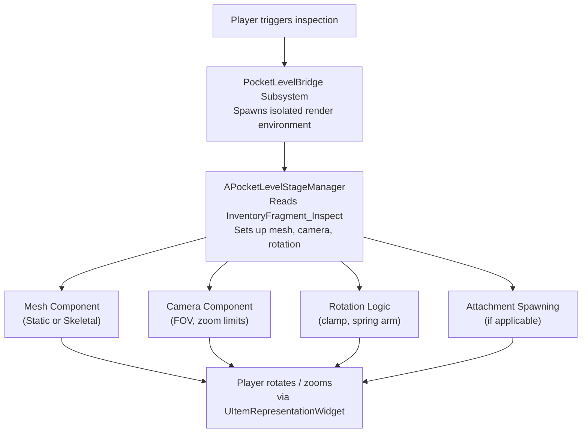

# Inspect Fragment

A flat 2D icon tells the player they have a shotgun. But let them grab it, spin it around, zoom in on the engravings, and tilt it to catch the light - now they _feel_ like they have a shotgun. That is the difference 3D item inspection makes.

`InventoryFragment_Inspect` is the data fragment that bridges your item definitions to the 3D inspection viewport. It tells the system which mesh to display, how the camera should behave, and how far the player can rotate the model. The heavy lifting happens in the [Item Inspection system](../item-inspection-system/), this fragment is the per-item configuration that feeds it.

***

### What It Does

* **Visual Representation** - Specifies the Static Mesh or Skeletal Mesh rendered in the 3D inspection viewport.
* **Camera Control** - Configures FOV limits and zoom behavior for the inspection camera.
* **Rotation Control** - Defines how the player can rotate the model: free rotation, axis clamping, spring arm mode, and reset behavior.

***

### Configuration

Add `InventoryFragment_Inspect` to a `ULyraInventoryItemDefinition` and configure the following sections.

#### Visual Mesh

| Property           | Description                                                                                |
| ------------------ | ------------------------------------------------------------------------------------------ |
| **`StaticMesh`**   | The static mesh to display in the inspection view.                                         |
| **`SkeletalMesh`** | The skeletal mesh to display (use this for animated items like weapons with moving parts). |

> [!INFO]
> Set one or the other, whichever represents the item's 3D appearance. Setting both is not necessary.

#### Camera (Zoom)

| Property            | Description                                             |
| ------------------- | ------------------------------------------------------- |
| **`bCanZoom`**      | Whether the player can zoom in/out during inspection.   |
| **`InitialFOV`**    | Field of view when inspection begins.                   |
| **`MaxZoomInFOV`**  | Minimum FOV (closest zoom). Smaller values = more zoom. |
| **`MaxZoomOutFOV`** | Maximum FOV (widest view).                              |

#### Rotation

| Property                        | Description                                                                    |
| ------------------------------- | ------------------------------------------------------------------------------ |
| **`bCanRotate`**                | Whether the player can rotate the item model.                                  |
| **`bRotateSpringArm`**          | Enables unrestricted rotation using a virtual spring arm (orbiting the item).  |
| **`bResetRotationOnLoseFocus`** | Snaps the item back to its default rotation when the player stops interacting. |
| **`bClampXRotationAxis`**       | Limits rotation on the X axis to the range defined below.                      |
| **`bClampYRotationAxis`**       | Limits rotation on the Y axis to the range defined below.                      |
| **`RotationXAxisClamp`**        | Min/max angles for X-axis rotation.                                            |
| **`RotationYAxisClamp`**        | Min/max angles for Y-axis rotation.                                            |
| **`DefaultInspectionRotation`** | The initial rotation applied to the item when inspection opens.                |

### Generated Icons

Icon generation is configured on the [Icon Fragment](icon-fragment.md), not here: the icon's source, mesh, capture rotation, framing, and caching all live on `InventoryFragment_Icon`. The two fragments are deliberately independent. The icon mesh represents the item in the inventory, this fragment's mesh is the full 3D model the player examines, and the two can differ, so each fragment carries its own mesh and neither reads the other's.

***

### Runtime Flow

This fragment is primarily a **data container**, it does not execute game logic itself. Other systems read its properties during the inspection pipeline:

<!-- gb-stepper:start -->
<!-- gb-step:start -->
#### Player Triggers Inspection

The player initiates inspection through the UI (typically firing a Gameplay Ability System event). This kicks off the `PocketWorlds` pipeline.
<!-- gb-step:end -->

<!-- gb-step:start -->
#### Pocket Level Spawns

The inspection system (via `UPocketLevelBridgeSubsystem`) spawns the appropriate pocket level, an isolated rendering environment, and retrieves the `APocketLevelStageManager` inside it.
<!-- gb-step:end -->

<!-- gb-step:start -->
#### Stage Manager Reads the Fragment

The `APocketLevelStageManager::Initialise` function receives the `ULyraInventoryItemInstance` being inspected. It calls `FindFragmentByClass` to locate the `InventoryFragment_Inspect` and reads:

* **Mesh** - Sets the `StaticMesh` or `SkeletalMesh` on the stage's mesh component.
* **Camera** - Configures FOV, zoom limits, and initial zoom from the fragment's camera properties.
* **Rotation** - Applies `DefaultInspectionRotation`, sets up clamping, and configures spring arm behavior.
* **Attachments** - If the item also has an `InventoryFragment_Attachment`, the stage manager recursively spawns and attaches visuals for those.
<!-- gb-step:end -->

<!-- gb-step:start -->
#### Player Interacts

The `UItemRepresentationWidget` reads `bCanZoom` and `bCanRotate` to enable or disable input. When the player drags (rotate) or scrolls (zoom), inputs are relayed to the stage manager, which applies the clamp and limit values from the fragment.
<!-- gb-step:end -->
<!-- gb-stepper:end -->

***

### Architecture at a Glance

> [!SUCCESS]
> This fragment configures a single item's inspection behavior. For the full architecture, pocket levels, stage managers, widget integration, and icon generation, see the [Item Inspection System](../item-inspection-system/) section.
