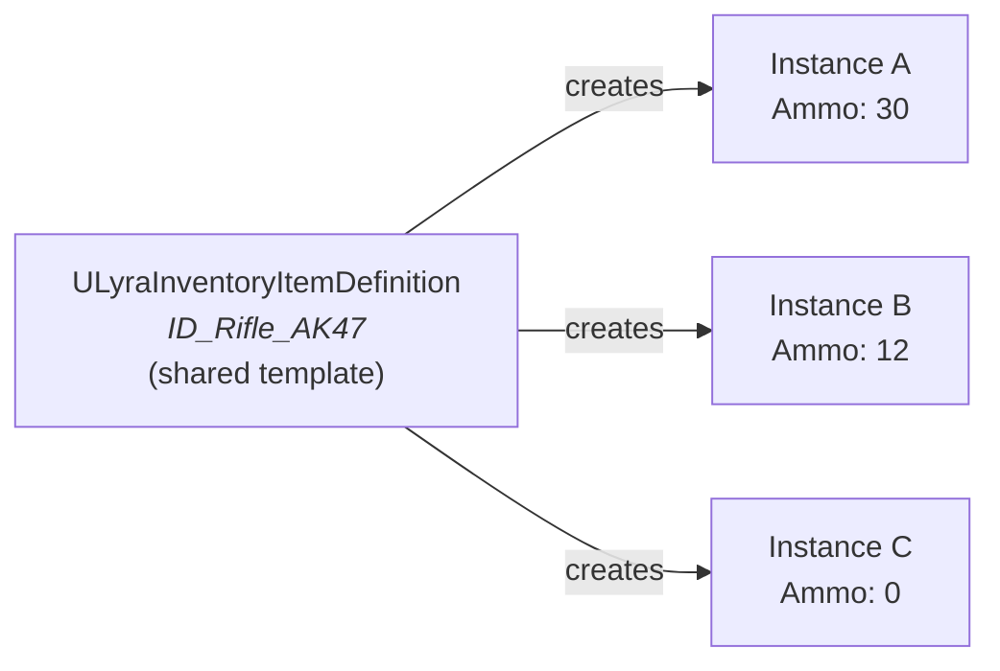
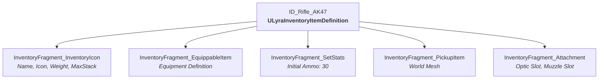

# Item Definition

Every item in the game starts as a definition. A `ULyraInventoryItemDefinition` is the static template that describes what an "Assault Rifle" or a "Health Potion" _is_, its name, its icon, whether it stacks, what abilities it grants, how it appears in the world. It never changes at runtime. When a player picks up that rifle, the system creates a live _instance_ from this template, and the instance carries mutable state like ammo count or durability.

The definition itself is a Blueprint class, you create it in the Content Browser, configure its defaults, and every instance spawned from it shares that configuration. Think of it as the cookie cutter, not the cookie.

### Key Properties

| Property      | Type                                  | Purpose                                              |
| ------------- | ------------------------------------- | ---------------------------------------------------- |
| `DisplayName` | `FText`                               | User-facing name, supports localization              |
| `Fragments`   | `TArray<ULyraInventoryItemFragment*>` | Instanced fragment array, the core of the definition |

The `Fragments` array is marked `UPROPERTY(Instanced)`, so each definition gets its own unique copies of its fragment objects. Fragment order generally doesn't matter.

***

## What Makes a Definition Useful: Fragments

A definition on its own only holds a `DisplayName`. Its real power comes from the **Fragments** array, instanced `ULyraInventoryItemFragment` objects that each handle one aspect of the item's identity:

Adding or removing fragments changes what the item can do without touching any other code. A healing potion might only need `InventoryIcon`, `SetStats`, and `Consume`. A weapon needs those plus `EquippableItem`, `PickupItem`, and `Attachment`. This is composition over inheritance, covered in depth on the [Item Fragments](item-fragments.md) page.

***

## Creating an Item Definition

<!-- gb-stepper:start -->
<!-- gb-step:start -->
**Create the Blueprint Class**

In the Content Browser, right-click and select **Blueprint Class**. Search for `LyraInventoryItemDefinition` as the parent. Name it with an `ID_` prefix (e.g., `ID_Rifle_AK47`, `ID_HealthPotion`).
<!-- gb-step:end -->

<!-- gb-step:start -->
**Configure Defaults**

Open the Blueprint and edit its **Class Defaults**. Set the `DisplayName` and add fragments to the `Fragments` array. Click the `+` icon, pick a fragment class from the dropdown, then configure its properties inline.
<!-- gb-step:end -->
<!-- gb-stepper:end -->

  <video controls style="max-width: 100%; height: auto;">
    <source src=".gitbook/assets/create_item_definition.mp4" type="video/mp4">
    Your browser does not support the video tag.
  </video>

***
