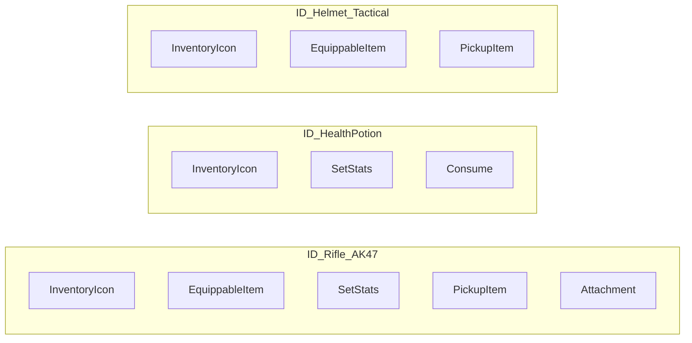

# Item Fragments

A rifle needs a mesh, an icon, ammo tracking, equipment bindings, and attachment slots. A health potion needs an icon, a stack count, and consume logic. Rather than building deep class hierarchies where `WeaponItem` inherits from `EquippableItem` inherits from `StackableItem`, the system uses **composition**: each concern is a self-contained `ULyraInventoryItemFragment`, and you assemble the combination you need on each [Item Definition](item-definition.md).



Adding a fragment to an item definition is all it takes to opt in to that behavior. No base class changes, no code modifications to existing items. New fragment types can be created in C++ and immediately used across any definition.

***

## How Fragments Participate in the System

Fragments aren't passive data containers. The base class `ULyraInventoryItemFragment` defines virtual functions that the inventory, equipment, and container systems call at key moments. These fall into three groups:

### Lifecycle Hooks

These fire when something happens to an item instance that carries this fragment.

| Virtual Function                    | When It Fires                                                                                                                                                                                                                                   |
| ----------------------------------- | ----------------------------------------------------------------------------------------------------------------------------------------------------------------------------------------------------------------------------------------------- |
| `OnInstanceCreated`                 | A new item instance is created from a definition containing this fragment. Use for initial setup (e.g., `SetStats` applies initial tag counts here).                                                                                            |
| `CreateNewTransientFragment`        | Called during instance creation to produce struct-based per-instance data. Return `true` and fill the `FInstancedStruct` output if your fragment needs lightweight instance state. See [Transient Data Fragments](transient-data-fragments.md). |
| `CreateNewRuntimeTransientFragment` | Same purpose but creates a full `UObject` for complex instance state. See [Transient Runtime Fragments](transient-runtime-fragments.md).                                                                                                        |

### Validation & Interaction

These let fragments influence container operations and item combinations.

| Virtual Function        | Purpose                                                                                                                                                                           |
| ----------------------- | --------------------------------------------------------------------------------------------------------------------------------------------------------------------------------- |
| `CanAddItemToContainer` | Impose custom restrictions on whether this item can enter a specific container. Reduce `AllowedAmount` and optionally set an `OutMessage` to explain why.                         |
| `CanCombineItems`       | Pre-validate whether this fragment can handle a combine operation (one item dropped onto another). Return `true` if compatible.                                                   |
| `CombineItems`          | Execute the actual combination logic. Called on each fragment of the **destination** item. The `FItemCombineContext` provides source/dest items, containers, and prediction keys. |

#### Data Contribution

These calculate values that containers and UI aggregate across all fragments on an item.

| Virtual Function           | Purpose                                                                                                                                                                                |
| -------------------------- | -------------------------------------------------------------------------------------------------------------------------------------------------------------------------------------- |
| `GetWeightContribution`    | How much weight this fragment adds to the item total. `InventoryIcon` returns its configured `Weight * stack count`. `Attachment` sums attached item weights. Most fragments return 0. |
| `GetItemCountContribution` | How much this fragment contributes toward container item-count limits. Typically only `InventoryIcon` returns 1; others return 0.                                                      |

#### Type Resolution

These tell the system which per-instance data types are associated with this fragment.

| Virtual Function                 | Returns                                                                                          |
| -------------------------------- | ------------------------------------------------------------------------------------------------ |
| `GetTransientFragmentDataStruct` | The `UScriptStruct*` of the fragment's struct-based transient data type                          |
| `GetTransientRuntimeFragment`    | The `TSubclassOf<UTransientRuntimeFragment>` of the fragment's UObject-based transient data type |

***

### Finding Fragments

Fragments live in the `Fragments` array on the `ULyraInventoryItemDefinition`. You typically access static fragment data through the definition's CDO, either directly or through an item instance convenience method.

<!-- tabs:start -->
#### **Blueprint**


#### **C++**
<div class="gb-code-title">Example.cpp</div>

```cpp
// Example of using ItemDef
void ExampleClass::ItemDefExample(TSubclassOf<ULyraInventoryItemDefinition> ItemDef)
{
    if (!IsValid(ItemDef))
        return;

    const ULyraInventoryItemDefinition* ItemDefinition = ItemDef.GetDefaultObject();
    const UInventoryFragment_InventoryIcon* InventoryIconFragment = ItemDefinition->FindFragmentByClass<UInventoryFragment_InventoryIcon>();
}

// Example of using the ItemInstance
void ExampleClass::ItemInstanceExample(ULyraInventoryItemInstance* ItemInstance)
{
    if (!IsValid(ItemInstance))
        return;

    const ULyraInventoryItemDefinition* ItemDefinition = ItemInstance->GetItemDef().GetDefaultObject();
    const UInventoryFragment_Attachment* AttachmentFragment = ItemInstance->FindFragmentByClass<UInventoryFragment_Attachment>();
}
```


<!-- tabs:end -->

These search the definition's `Fragments` array and return the first match of the specified class. The `UInventoryFunctionLibrary::FindItemDefinitionFragment` Blueprint helper provides the same functionality.

***

### Extensibility

Fragments are designed to be extended. Creating a new fragment type means:

1. Subclass `ULyraInventoryItemFragment` in C++
2. Add static properties as `UPROPERTY(EditDefaultsOnly)`
3. Override whichever virtual functions your fragment needs
4. Optionally define associated [transient data](transient-data-fragments.md) for per-instance state

The [Fragment Injector](../modularity-fragment-injector.md) system takes this further, game feature plugins can inject fragments into existing item definitions without modifying the original assets, keeping cross-plugin dependencies clean.

See [Creating Custom Fragments](creating-custom-fragments.md) for a full walkthrough.
