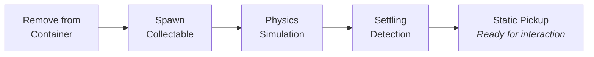
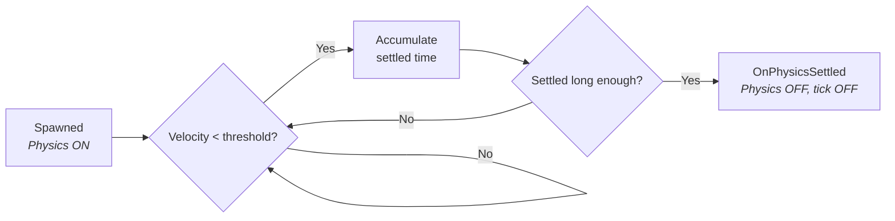

# Dropping Items & World Collectable Lifecycle

A player drops a rifle from their inventory. What actually happens? The server removes the item from the container, spawns a physics-enabled actor in the world, gives it an impulse so it tumbles forward, monitors its velocity until it settles, then locks it in place as a static, interactable pickup. This page walks through that entire lifecycle.

***

## The Lifecycle at a Glance



<!-- gb-stepper:start -->
<!-- gb-step:start -->
**Drop Action (Server)**

A gameplay ability or UI action triggers the drop. The server resolves the `ULyraInventoryItemInstance` from the player's inventory, verifies it has a `UInventoryFragment_PickupItem` (which provides the world mesh), removes the item from the container, and calls one of the drop functions to spawn the collectable.
<!-- gb-step:end -->

<!-- gb-step:start -->
**Spawn & Physics**

The system spawns an `AWorldCollectableBase` subclass at a valid location. The item's mesh is configured for physics simulation with gravity and collision enabled. An optional initial impulse sends it tumbling forward. On clients, `OnRep_StaticInventory` triggers `RebuildVisual()` to display the correct mesh.
<!-- gb-step:end -->

<!-- gb-step:start -->
**Settling**

The server ticks the collectable, checking velocity each frame. Once velocity drops below a threshold (default: 4 cm/s) and stays there for a configurable duration (default: 0.5s), `OnPhysicsSettled()` fires. Physics is disabled, collision switches to query-only, actor tick stops, and the interaction widget is positioned.
<!-- gb-step:end -->

<!-- gb-step:start -->
**Ready for Interaction**

The settled collectable is now a static pickup. Players can look at it, see its interaction prompt, and trigger a pickup ability. The [Client Predicted Pickup Ability](client-predicted-pickup-ability.md) handles the rest, adding items to the player's inventory and destroying the collectable if empty.
<!-- gb-step:end -->
<!-- gb-stepper:end -->

***

## Drop Functions

All dropping goes through `UPickupableStatics`, a Blueprint function library. Two functions cover the common cases:

### Dropping from a Character

`DropItem` finds a valid spawn location in front of the dropper. It samples multiple positions within a configurable arc and distance, checks for overlaps, and falls back to a capsule sweep or emergency position if needed.

```cpp
AWorldCollectableBase* UPickupableStatics::DropItem(
    const AActor* Dropper,
    const FItemPickup& Inventory,
    TSubclassOf<AWorldCollectableBase> StaticCollectableClass,
    TSubclassOf<AWorldCollectableBase> SkeletalCollectableClass,
    const FDropParams& Params);
```

### Dropping at a Location

`DropItemAtLocation` spawns at an explicit world position, useful for scripted spawns, loot from killed enemies, or designer-placed drops.

```cpp
AWorldCollectableBase* UPickupableStatics::DropItemAtLocation(
    const UObject* WorldContextObject,
    const FItemPickup& Inventory,
    TSubclassOf<AWorldCollectableBase> StaticCollectableClass,
    TSubclassOf<AWorldCollectableBase> SkeletalCollectableClass,
    const FVector& Location,
    const FDropParams& Params,
    bool bProjectToGround = true);
```

Both functions are **server-only** (`BlueprintAuthorityOnly`). They automatically select between static and skeletal mesh collectable classes based on the item's `UInventoryFragment_PickupItem`.

<div class="gb-stack">
<details class="gb-toggle">

<summary>FDropParams reference</summary>

| Field                        | Type                        | Default | Purpose                                                 |
| ---------------------------- | --------------------------- | ------- | ------------------------------------------------------- |
| `MinDist`                    | float                       | 75 cm   | Minimum forward distance from dropper                   |
| `MaxDist`                    | float                       | 200 cm  | Maximum forward distance from dropper                   |
| `MaxYawOffset`               | float                       | 45 deg  | Max yaw scatter from dropper's facing                   |
| `MinRelativeEyeHeight`       | float                       | -10 cm  | Min vertical offset relative to dropper's eye           |
| `MaxRelativeEyeHeight`       | float                       | 30 cm   | Max vertical offset relative to eye                     |
| `MaxTries`                   | int32                       | 10      | Max attempts to find a non-overlapping spot             |
| `InitialImpulse`             | FVector                     | Zero    | Impulse applied after spawning                          |
| `OverrideInteractionProfile` | UPickupInteractionProfile\* | nullptr | Override the collectable's default interaction behavior |

</details>
<details class="gb-toggle">

<summary>Utility helpers on UPickupableStatics</summary>

Beyond dropping, the library provides helpers for querying pickups:

| Function                              | Purpose                                                               |
| ------------------------------------- | --------------------------------------------------------------------- |
| `GetFirstPickupableFromActor`         | Find the `IPickupable` interface on an actor or its components        |
| `ResolvePickupFragment`               | Get the `UInventoryFragment_PickupItem` from an `FItemPickup`         |
| `SelectCollectableClassFromInventory` | Choose static vs. skeletal collectable based on the item's mesh type  |
| `PickupHasItems`                      | Check if an `FItemPickup` contains any items                          |
| `GetPickupEntryCount`                 | Number of entries in a pickup                                         |
| `GetPickupTotalStackCount`            | Total item count across all entries                                   |
| `GetAllPickupItems`                   | Retrieve all item entries from a pickup                               |
| `CalculateContainerCapacityForItem`   | Calculate how many items of a type a container can accept             |
| `BuildPickupToInventoryTransaction`   | Build a transaction request for adding pickup contents to a container |

</details>
</div>

***

## The World Collectable Actor

`AWorldCollectableBase` is the actor that represents items in the world. Two subclasses handle the visual:

| Subclass                     | Root Component           | Use Case                                    |
| ---------------------------- | ------------------------ | ------------------------------------------- |
| `AWorldCollectable_Static`   | `UStaticMeshComponent`   | Most items, weapons, consumables, resources |
| `AWorldCollectable_Skeletal` | `USkeletalMeshComponent` | Items that need skeletal animation          |

Both share the same base behavior: inventory storage, physics settling, interaction, replication, and client prediction support.

### Inventory & Visuals

The collectable stores its items in a replicated `StaticInventory` (`FItemPickup`). When this replicates to clients, `OnRep_StaticInventory` calls `RebuildVisual()`, which reads the `UInventoryFragment_PickupItem` to select the appropriate mesh. If no mesh is found, subclasses can fall back to a `DefaultPlaceholderMesh`.

### Interaction

`AWorldCollectableBase` implements `IInteractableTarget`. When a player looks at the collectable, `GatherInteractionOptions` builds options from the assigned `InteractionProfile` data asset. If no profile is set, a default "Collect" option is provided. The `InteractionWidgetComponent` provides the world-space position for the interaction prompt UI.

### Physics Settling

After spawning with physics enabled, the server monitors the collectable:



When settled, the actor transitions to a lightweight state:

* Physics disabled, mobility set to static
* Collision becomes query-only (overlap for interaction traces, block for world static/dynamic)
* Actor tick disabled
* Interaction widget positioned at the item's visual bounds

<details class="gb-toggle">

<summary>Settling configuration</summary>

| Property                      | Default               | Purpose                                     |
| ----------------------------- | --------------------- | ------------------------------------------- |
| `SettlingVelocityThresholdSq` | 16.0 (4 cm/s squared) | Velocity must stay below this               |
| `SettlingTimeRequiredSeconds` | 0.5s                  | How long velocity must stay below threshold |

</details>

### Client Prediction Support

When the [Client Predicted Pickup Ability](client-predicted-pickup-ability.md) predicts a pickup, it calls `HideForPrediction()` on the collectable to provide instant visual feedback without destroying the actor (only the server can do that). If the server rejects the pickup, `RestoreFromRejectedPrediction()` makes it visible again.

### Container Interface

`AWorldCollectableBase` implements `ILyraItemContainerInterface`, making it a valid source and destination for the transaction system. This means items can be moved to/from world collectables using the same transaction pipeline as any other container.
