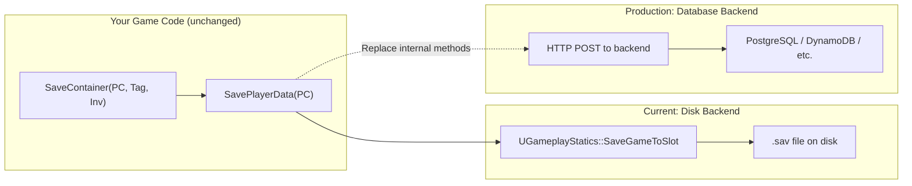

# Extending The Save System

The save system is designed to be extended without modifying its core. Custom containers persist their config through an interface. Custom fragments opt into saving through virtual overrides. Arbitrary game data uses a generic key-value store. And if you outgrow local disk saves, the storage backend can be swapped for a database without changing any caller code.

***

### Saving Custom Container Config

If you create a new container type (a shop inventory, a crafting station, a quest reward pool) and it has configuration that should persist, layout, capacity, allowed items, implement `ILyraSaveableInterface`:

```cpp
UCLASS()
class UMyCustomContainer : public UActorComponent,
    public ILyraItemContainerInterface,
    public ILyraSaveableInterface
{
    // Your container implementation...

    // ILyraSaveableInterface
    virtual TArray<FInstancedStruct> GetSaveableConfig() override;
    virtual void ApplySavedConfig(const TArray<FInstancedStruct>& SavedConfig) override;
};
```

Define a struct for your config:

```cpp
USTRUCT(BlueprintType)
struct FMyContainerConfig
{
    GENERATED_BODY()

    UPROPERTY()
    int32 SlotCount = 10;

    UPROPERTY()
    TArray<FGameplayTag> AllowedCategories;
};
```

Then implement the two methods:

<details class="gb-toggle">

<summary>Implementation Example</summary>

```cpp
TArray<FInstancedStruct> UMyCustomContainer::GetSaveableConfig()
{
    TArray<FInstancedStruct> Config;

    FMyContainerConfig MyConfig;
    MyConfig.SlotCount = CurrentSlotCount;
    MyConfig.AllowedCategories = AllowedCategories;
    Config.Add(FInstancedStruct::Make(MyConfig));

    return Config;
}

void UMyCustomContainer::ApplySavedConfig(const TArray<FInstancedStruct>& SavedConfig)
{
    for (const FInstancedStruct& Entry : SavedConfig)
    {
        if (const FMyContainerConfig* MyConfig = Entry.GetPtr<FMyContainerConfig>())
        {
            CurrentSlotCount = MyConfig->SlotCount;
            AllowedCategories = MyConfig->AllowedCategories;
        }
    }
}
```

</details>

The save system calls `GetSaveableConfig()` during `SerializeContainer` and stores the result in `FSavedContainerData::SpecificData`. During `LoadContainerInto`, it calls `ApplySavedConfig()` **before** adding any items, so the container is properly configured to receive them.

> [!INFO]
> The existing containers already implement this: `ULyraInventoryManagerComponent` saves weight/count limits, `ULyraTetrisInventoryManagerComponent` adds grid layout, and `ULyraEquipmentManagerComponent` saves available held slots.

***

### Saving Runtime Fragment State

UObject-based runtime fragments (`UTransientRuntimeFragment`) are recreated from the item definition every time an item is instantiated. By default, nothing from the previous session carries over, the fragment starts fresh.

To persist state across saves, override three methods:

```cpp
UCLASS()
class UMyRuntimeFragment : public UTransientRuntimeFragment
{
    // Return true to opt into saving
    virtual bool WantsSave_Implementation() const override { return true; }

    // Serialize your state into an FInstancedStruct
    virtual FInstancedStruct SaveFragmentData_Implementation() const override;

    // Restore your state from saved data
    virtual void LoadFragmentData_Implementation(const FInstancedStruct& Data) override;
};
```

<details class="gb-toggle">

<summary>Example: Attachment Fragment</summary>

The attachment system's `UTransientRuntimeFragment_Attachment` implements `ILyraItemContainerInterface`, it holds attached items. Its save implementation serializes all attached items as an `FSavedContainerData`:

```cpp
bool UTransientRuntimeFragment_Attachment::WantsSave_Implementation() const
{
    return true;
}

FInstancedStruct UTransientRuntimeFragment_Attachment::SaveFragmentData_Implementation() const
{
    FSavedContainerData Data = ULyraSaveSubsystem::SerializeContainer(
        FGameplayTag(), this);  // 'this' implements ILyraItemContainerInterface
    return FInstancedStruct::Make(Data);
}

void UTransientRuntimeFragment_Attachment::LoadFragmentData_Implementation(
    const FInstancedStruct& Data)
{
    const FSavedContainerData* ContainerData = Data.GetPtr<FSavedContainerData>();
    if (!ContainerData) return;

    ULyraSaveSubsystem* SaveSub = /* get subsystem */;
    for (const FSavedItemData& SavedItem : ContainerData->Items)
    {
        ULyraInventoryItemInstance* Item = SaveSub->DeserializeItem(SavedItem);
        if (Item)
        {
            AddItemToSlot(SavedItem.CurrentSlot, Item, FPredictionKey(), true);
        }
    }
}
```

This recursively saves attachments on attachments, each attached item's own fragments (including further attachment fragments) are serialized through the same `SerializeItem` path.

</details>

> [!INFO]
> These methods are `BlueprintNativeEvent`, so Blueprint-only runtime fragments can override them too, no C++ required.

***

### Struct Fragment Persistence

Struct-based transient fragments (`FTransientFragmentData`) are saved automatically, every `FInstancedStruct` in the item's `TransientFragments` array is copied into `FSavedItemData::SavedFragmentData`. No opt-in needed.

However, if your struct fragment contains **UObject pointers** or **nested data that needs special handling**, override these virtuals:

| Virtual                           | Purpose                                        | When to Override                                                     |
| --------------------------------- | ---------------------------------------------- | -------------------------------------------------------------------- |
| `PrepareForSave()`                | Clear UObject pointers before serialization    | Your struct has `TObjectPtr` members                                 |
| `HasNestedSaveData()`             | Return `true` if this fragment has nested data | Your struct serializes child data in PrepareForSave                  |
| `RestoreFromSavedCopy(SavedCopy)` | Restore nested data into the live fragment     | Your struct has nested items or containers that need deserialization |

<details class="gb-toggle">

<summary>Example: Container Fragment</summary>

`FTransientFragmentData_Container` holds a `TObjectPtr<ULyraTetrisInventoryManagerComponent> ChildInventory`. Before saving, it serializes the child inventory's items and nulls the pointer:

```cpp
void FTransientFragmentData_Container::PrepareForSave()
{
    if (ChildInventory)
    {
        SavedChildInventory = ULyraSaveSubsystem::SerializeContainer(
            FGameplayTag(), ChildInventory);
    }
    ChildInventory = nullptr;  // Prevent stale GC reference
}

bool FTransientFragmentData_Container::HasNestedSaveData() const
{
    return SavedChildInventory.Items.Num() > 0;
}

void FTransientFragmentData_Container::RestoreFromSavedCopy(
    const FTransientFragmentData& SavedCopy)
{
    // Deserialize saved items into the live child inventory
    const auto& Saved = static_cast<const FTransientFragmentData_Container&>(SavedCopy);
    for (const FSavedItemData& ChildItem : Saved.SavedChildInventory.Items)
    {
        ULyraInventoryItemInstance* Item = /* deserialize */;
        if (Item && ChildInventory)
        {
            ChildInventory->AddItemToSlot(ChildItem.CurrentSlot, Item,
                FPredictionKey(), true);
        }
    }
}
```

The deserializer calls `HasNestedSaveData()` to detect fragments that need special restoration, then calls `RestoreFromSavedCopy()` instead of overwriting the live fragment (which already has a valid `ChildInventory` pointer from creation).

</details>

***

### Saving Non-Container Object Config

`ILyraSaveableInterface` isn't limited to containers. Any UObject, an actor, a component, a subsystem, can implement it and persist config through `SaveObjectConfig` / `LoadObjectConfig`:

```cpp
UCLASS()
class UMySpawnManager : public UActorComponent, public ILyraSaveableInterface
{
    GENERATED_BODY()

public:
    UPROPERTY(EditAnywhere)
    float RespawnInterval = 30.f;

    UPROPERTY(EditAnywhere)
    int32 MaxActiveSpawns = 10;

    // ILyraSaveableInterface
    virtual TArray<FInstancedStruct> GetSaveableConfig() const override
    {
        FMySpawnConfig Config;
        Config.RespawnInterval = RespawnInterval;
        Config.MaxActiveSpawns = MaxActiveSpawns;
        TArray<FInstancedStruct> Result;
        Result.Add(FInstancedStruct::Make(Config));
        return Result;
    }

    virtual void ApplySavedConfig(const TArray<FInstancedStruct>& SavedConfig) override
    {
        for (const FInstancedStruct& Entry : SavedConfig)
        {
            if (const FMySpawnConfig* Config = Entry.GetPtr<FMySpawnConfig>())
            {
                RespawnInterval = Config->RespawnInterval;
                MaxActiveSpawns = Config->MaxActiveSpawns;
            }
        }
    }
};
```

Then save and load with two calls:

```cpp
// Save
SaveSubsystem->SaveObjectConfig(PC, MySpawnManagerTag, SpawnManager);
SaveSubsystem->SavePlayerData(PC);

// Load
SaveSubsystem->LoadObjectConfig(PC, MySpawnManagerTag, SpawnManager);
```

Under the hood, `SaveObjectConfig` calls `GetSaveableConfig()`, wraps the result in an `FSavedObjectConfig`, and stores it via `SaveCustomData`. `LoadObjectConfig` reverses the process and calls `ApplySavedConfig()`. The save system never knows what your config struct contains.

> [!INFO]
> For containers, you don't need `SaveObjectConfig` / `LoadObjectConfig`, the container path (`SaveContainer` / `LoadContainerInto`) handles `ILyraSaveableInterface` automatically via `FSavedContainerData::SpecificData`.

***

### Saving Arbitrary Game Data

For non-item data, use `SaveCustomData` and `LoadCustomData`. These store `FInstancedStruct` values under `FGameplayTag` keys in the same save file.

**Use cases:**

* Player currency (gold, gems, premium tokens)
* Quest progress or completion flags
* Unlocked recipes or blueprints
* Player preferences or progression stats

**Blueprint workflow:**

1. Create a User Defined Struct (e.g., `S_QuestProgress`)
2. Define a gameplay tag (e.g., `Save.QuestProgress`)
3. `SaveCustomData(PC, Tag, InstancedStruct)` to store
4. `LoadCustomData(PC, Tag)` to retrieve
5. `SavePlayerData(PC)` to persist to disk

No C++ required. The save system treats the struct as an opaque blob, it doesn't need to know what's inside.

> [!WARNING]
> Avoid storing `TObjectPtr` or raw `UObject*` in custom data structs. These become stale references after map travel. Use soft references (`TSoftObjectPtr`, `TSoftClassPtr`) or gameplay tags for cross-session identification.

***

### Replacing the Storage Backend

The current implementation writes `.sav` files to the local disk (or the server's disk for dedicated servers). This works for development and single-server deployments, but production games with multiple server instances need a shared backend, a database, cloud storage, or a custom web service.

The save subsystem is the right abstraction boundary for this swap. The public API (`SavePlayerData`, `GetOrCreateSaveGame`, `SaveContainer`, etc.) doesn't change. Only the internal storage methods need replacing:



#### Approach

1. **Subclass `ULyraSaveSubsystem`** — override `SavePlayerData`, `SavePlayerDataSync`, and `LoadPlayerSaveRemote` (or make them virtual first)
2. **Serialize to binary or JSON** — `ULyraPlayerSaveGame` is a `USaveGame` with `UPROPERTY` fields, so UE's serialization handles conversion
3. **Send to your backend** — POST the serialized data to a REST endpoint, keyed by the player's platform ID
4. **Load from your backend** — GET by player ID, deserialize into a `ULyraPlayerSaveGame`

The caller code (`SaveContainer`, `LoadContainerInto`, etc.) is completely unaware of the storage change. The `APlayerController*` API continues to work, the subsystem just stores data somewhere different.

> [!SUCCESS]
> For most projects, the disk-based implementation is sufficient through development and early production. Migrate to a backend when you need multiple server instances accessing the same player data.

### A Note on World-State Persistence

This save system is **per-player**, every operation is keyed by an `APlayerController*`. It's designed for data that belongs to a specific player: their inventory, equipment, currency, progression.

It is **not** designed for world-state persistence, saving which loot crates have been opened, what items are still on the ground, or the state of placed structures. World persistence requires a different keying model (map + actor identity rather than player identity) and a different lifecycle (tied to map load/unload rather than player login/logout).

If your game needs world-state persistence (survival base building, persistent open worlds, sandbox servers), that would be a separate subsystem with its own save file. The item serialization helpers (`SerializeItem`, `DeserializeItem`, `SerializeContainer`) can be reused since they're stateless, but the save lifecycle and storage would be independent.
