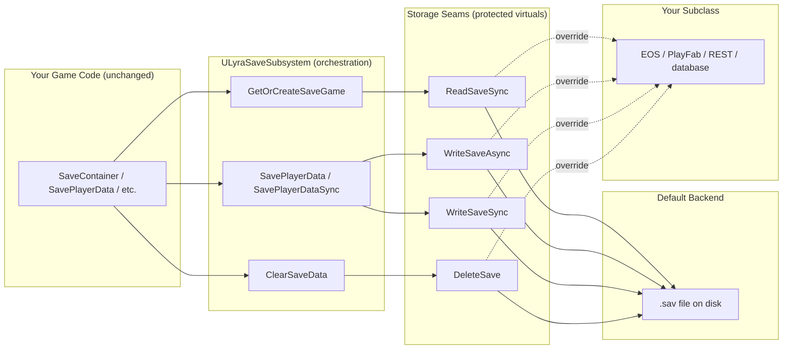

# Extending The Save System

The save system is designed to be extended without modifying its core. Custom containers persist their config through an interface. Custom fragments opt into saving through virtual overrides. Arbitrary game data uses a generic key-value store. And if you outgrow local disk saves, the storage backend can be swapped for a database without changing any caller code.

***

## Saving Custom Container Config

If you create a new container type (a shop inventory, a crafting station, a quest reward pool) and it has configuration that should persist, layout, capacity, allowed items, implement `ILyraSaveableInterface`:

```cpp
UCLASS()
class UMyCustomContainer : public UActorComponent,
    public ILyraItemContainerInterface,
    public ILyraSaveableInterface
{
    // Your container implementation...

    // ILyraSaveableInterface
    virtual TArray<FInstancedStruct> GetSaveableConfig() override;
    virtual void ApplySavedConfig(const TArray<FInstancedStruct>& SavedConfig) override;
};
```

Define a struct for your config:

```cpp
USTRUCT(BlueprintType)
struct FMyContainerConfig
{
    GENERATED_BODY()

    UPROPERTY()
    int32 SlotCount = 10;

    UPROPERTY()
    TArray<FGameplayTag> AllowedCategories;
};
```

Then implement the two methods:

<details class="gb-toggle">

<summary>Implementation Example</summary>

```cpp
TArray<FInstancedStruct> UMyCustomContainer::GetSaveableConfig()
{
    TArray<FInstancedStruct> Config;

    FMyContainerConfig MyConfig;
    MyConfig.SlotCount = CurrentSlotCount;
    MyConfig.AllowedCategories = AllowedCategories;
    Config.Add(FInstancedStruct::Make(MyConfig));

    return Config;
}

void UMyCustomContainer::ApplySavedConfig(const TArray<FInstancedStruct>& SavedConfig)
{
    for (const FInstancedStruct& Entry : SavedConfig)
    {
        if (const FMyContainerConfig* MyConfig = Entry.GetPtr<FMyContainerConfig>())
        {
            CurrentSlotCount = MyConfig->SlotCount;
            AllowedCategories = MyConfig->AllowedCategories;
        }
    }
}
```

</details>

The save system calls `GetSaveableConfig()` during `SerializeContainer` and stores the result in `FSavedContainerData::SpecificData`. During `LoadContainerInto`, it calls `ApplySavedConfig()` **before** adding any items, so the container is properly configured to receive them.

> [!INFO]
> The existing containers already implement this: `ULyraInventoryManagerComponent` saves weight/count limits, `ULyraTetrisInventoryManagerComponent` adds grid layout, and `ULyraEquipmentManagerComponent` saves available held slots.

***

## Saving Runtime Fragment State

UObject-based runtime fragments (`UTransientRuntimeFragment`) are recreated from the item definition every time an item is instantiated. By default, nothing from the previous session carries over, the fragment starts fresh.

To persist state across saves, override three methods:

```cpp
UCLASS()
class UMyRuntimeFragment : public UTransientRuntimeFragment
{
    // Return true to opt into saving
    virtual bool WantsSave_Implementation() const override { return true; }

    // Serialize your state into an FInstancedStruct
    virtual FInstancedStruct SaveFragmentData_Implementation() const override;

    // Restore your state from saved data
    virtual void LoadFragmentData_Implementation(const FInstancedStruct& Data) override;
};
```

<details class="gb-toggle">

<summary>Example: Attachment Fragment</summary>

The attachment system's `UTransientRuntimeFragment_Attachment` implements `ILyraItemContainerInterface`, it holds attached items. Its save implementation serializes all attached items as an `FSavedContainerData`:

```cpp
bool UTransientRuntimeFragment_Attachment::WantsSave_Implementation() const
{
    return true;
}

FInstancedStruct UTransientRuntimeFragment_Attachment::SaveFragmentData_Implementation() const
{
    FSavedContainerData Data = ULyraSaveSubsystem::SerializeContainer(
        FGameplayTag(), this);  // 'this' implements ILyraItemContainerInterface
    return FInstancedStruct::Make(Data);
}

void UTransientRuntimeFragment_Attachment::LoadFragmentData_Implementation(
    const FInstancedStruct& Data)
{
    const FSavedContainerData* ContainerData = Data.GetPtr<FSavedContainerData>();
    if (!ContainerData) return;

    ULyraSaveSubsystem* SaveSub = /* get subsystem */;
    for (const FSavedItemData& SavedItem : ContainerData->Items)
    {
        ULyraInventoryItemInstance* Item = SaveSub->DeserializeItem(SavedItem);
        if (Item)
        {
            AddItemToSlot(SavedItem.CurrentSlot, Item, FPredictionKey(), true);
        }
    }
}
```

This recursively saves attachments on attachments, each attached item's own fragments (including further attachment fragments) are serialized through the same `SerializeItem` path.

</details>

> [!INFO]
> These methods are `BlueprintNativeEvent`, so Blueprint-only runtime fragments can override them too, no C++ required.

***

## Struct Fragment Persistence

Struct-based transient fragments (`FTransientFragmentData`) are saved automatically, every `FInstancedStruct` in the item's `TransientFragments` array is copied into `FSavedItemData::SavedFragmentData`. No opt-in needed.

However, if your struct fragment contains **UObject pointers** or **nested data that needs special handling**, override these virtuals:

| Virtual                           | Purpose                                        | When to Override                                                     |
| --------------------------------- | ---------------------------------------------- | -------------------------------------------------------------------- |
| `PrepareForSave()`                | Clear UObject pointers before serialization    | Your struct has `TObjectPtr` members                                 |
| `HasNestedSaveData()`             | Return `true` if this fragment has nested data | Your struct serializes child data in PrepareForSave                  |
| `RestoreFromSavedCopy(SavedCopy)` | Restore nested data into the live fragment     | Your struct has nested items or containers that need deserialization |

<details class="gb-toggle">

<summary>Example: Container Fragment</summary>

`FTransientFragmentData_Container` holds a `TObjectPtr<ULyraTetrisInventoryManagerComponent> ChildInventory`. Before saving, it serializes the child inventory's items and nulls the pointer:

```cpp
void FTransientFragmentData_Container::PrepareForSave()
{
    if (ChildInventory)
    {
        SavedChildInventory = ULyraSaveSubsystem::SerializeContainer(
            FGameplayTag(), ChildInventory);
    }
    ChildInventory = nullptr;  // Prevent stale GC reference
}

bool FTransientFragmentData_Container::HasNestedSaveData() const
{
    return SavedChildInventory.Items.Num() > 0;
}

void FTransientFragmentData_Container::RestoreFromSavedCopy(
    const FTransientFragmentData& SavedCopy)
{
    // Deserialize saved items into the live child inventory
    const auto& Saved = static_cast<const FTransientFragmentData_Container&>(SavedCopy);
    for (const FSavedItemData& ChildItem : Saved.SavedChildInventory.Items)
    {
        ULyraInventoryItemInstance* Item = /* deserialize */;
        if (Item && ChildInventory)
        {
            ChildInventory->AddItemToSlot(ChildItem.CurrentSlot, Item,
                FPredictionKey(), true);
        }
    }
}
```

The deserializer calls `HasNestedSaveData()` to detect fragments that need special restoration, then calls `RestoreFromSavedCopy()` instead of overwriting the live fragment (which already has a valid `ChildInventory` pointer from creation).

</details>

***

## Saving Non-Container Object Config

`ILyraSaveableInterface` isn't limited to containers. Any UObject, an actor, a component, a subsystem, can implement it and persist config through `SaveObjectConfig` / `LoadObjectConfig`:

```cpp
UCLASS()
class UMySpawnManager : public UActorComponent, public ILyraSaveableInterface
{
    GENERATED_BODY()

public:
    UPROPERTY(EditAnywhere)
    float RespawnInterval = 30.f;

    UPROPERTY(EditAnywhere)
    int32 MaxActiveSpawns = 10;

    // ILyraSaveableInterface
    virtual TArray<FInstancedStruct> GetSaveableConfig() const override
    {
        FMySpawnConfig Config;
        Config.RespawnInterval = RespawnInterval;
        Config.MaxActiveSpawns = MaxActiveSpawns;
        TArray<FInstancedStruct> Result;
        Result.Add(FInstancedStruct::Make(Config));
        return Result;
    }

    virtual void ApplySavedConfig(const TArray<FInstancedStruct>& SavedConfig) override
    {
        for (const FInstancedStruct& Entry : SavedConfig)
        {
            if (const FMySpawnConfig* Config = Entry.GetPtr<FMySpawnConfig>())
            {
                RespawnInterval = Config->RespawnInterval;
                MaxActiveSpawns = Config->MaxActiveSpawns;
            }
        }
    }
};
```

Then save and load with two calls:

```cpp
// Save
SaveSubsystem->SaveObjectConfig(PC, MySpawnManagerTag, SpawnManager);
SaveSubsystem->SavePlayerData(PC);

// Load
SaveSubsystem->LoadObjectConfig(PC, MySpawnManagerTag, SpawnManager);
```

Under the hood, `SaveObjectConfig` calls `GetSaveableConfig()`, wraps the result in an `FSavedObjectConfig`, and stores it via `SaveCustomData`. `LoadObjectConfig` reverses the process and calls `ApplySavedConfig()`. The save system never knows what your config struct contains.

> [!INFO]
> For containers, you don't need `SaveObjectConfig` / `LoadObjectConfig`, the container path (`SaveContainer` / `LoadContainerInto`) handles `ILyraSaveableInterface` automatically via `FSavedContainerData::SpecificData`.

***

## Saving Arbitrary Game Data

For non-item data, use `SaveCustomData` and `LoadCustomData`. These store `FInstancedStruct` values under `FGameplayTag` keys in the same save file.

**Use cases:**

* Player currency (gold, gems, premium tokens)
* Quest progress or completion flags
* Unlocked recipes or blueprints
* Player preferences or progression stats

**Blueprint workflow:**

1. Create a User Defined Struct (e.g., `S_QuestProgress`)
2. Define a gameplay tag (e.g., `Save.QuestProgress`)
3. `SaveCustomData(PC, Tag, InstancedStruct)` to store
4. `LoadCustomData(PC, Tag)` to retrieve
5. `SavePlayerData(PC)` to persist to disk

No C++ required. The save system treats the struct as an opaque blob, it doesn't need to know what's inside.

> [!WARNING]
> Avoid storing `TObjectPtr` or raw `UObject*` in custom data structs. These become stale references after map travel. Use soft references (`TSoftObjectPtr`, `TSoftClassPtr`) or gameplay tags for cross-session identification.

***

## Replacing the Storage Backend

The default implementation writes `.sav` files to local disk or the server's disk for dedicated servers. For multi-instance dedicated servers, cross-device cloud saves, or live-service progression you'll want to swap in a real backend, a cloud service like EOS or PlayFab, a custom REST API, a database.

The subsystem is built around this. The byte-level I/O is factored into a small set of protected virtual methods, the **storage seams**. Subclass `ULyraSaveSubsystem` and override the seams; the orchestration around them, cache, key construction, local-vs-remote dispatch, stays in the parent class.



### **The Override Surface**

Four byte-level seams cover all storage I/O:

| Seam             | Purpose                                                                                                                                                                                                             |
| ---------------- | ------------------------------------------------------------------------------------------------------------------------------------------------------------------------------------------------------------------- |
| `ReadSaveSync`   | Synchronously load (or create) a save game for a player. Default dispatches local players to `ULocalPlayerSaveGame::LoadOrCreateSaveGameForLocalPlayer` and remote players to `UGameplayStatics::LoadGameFromSlot`. |
| `WriteSaveAsync` | Persist asynchronously. Default uses `AsyncSaveGameToSlotForLocalPlayer` / `UGameplayStatics::AsyncSaveGameToSlot`.                                                                                                 |
| `WriteSaveSync`  | Persist synchronously, blocking until complete. Default uses `SaveGameToSlotForLocalPlayer` / `UGameplayStatics::SaveGameToSlot`.                                                                                   |
| `DeleteSave`     | Delete the underlying save. Default uses `UGameplayStatics::DeleteGameInSlot`.                                                                                                                                      |

Two extra hooks support backends that need them:

| Hook              | Purpose                                                                                                                                                                                                                               |
| ----------------- | ------------------------------------------------------------------------------------------------------------------------------------------------------------------------------------------------------------------------------------- |
| `OnSaveLoaded`    | Called once when a save game enters the cache. Override for migration (rewriting stale soft class paths), telemetry, or post-load fixups.                                                                                             |
| `PrimeCache`      | Insert a pre-loaded save game into the cache. Use this when your backend can only read asynchronously, return a fresh empty save from `ReadSaveSync` and call `PrimeCache` from your async fetch callback when the real bytes arrive. |
| `InvalidateCache` | Drop one cached entry so the next access re-reads from storage.                                                                                                                                                                       |

`MakeCacheKey` and `MakeSlotName` are protected helpers if your override needs to construct keys consistent with the parent.

<details class="gb-toggle">

<summary>Subclass Skeleton</summary>

```cpp
UCLASS()
class UMyBackendSaveSubsystem : public ULyraSaveSubsystem
{
    GENERATED_BODY()

protected:
    // Synchronous read. Most cloud backends can't do this — return a fresh empty
    // save here and use PrimeCache from a separate async fetch.
    virtual ULyraPlayerSaveGame* ReadSaveSync(
        const APlayerController* PC,
        const FString& BaseSlotName) override
    {
        return Cast<ULyraPlayerSaveGame>(
            UGameplayStatics::CreateSaveGameObject(ULyraPlayerSaveGame::StaticClass()));
    }

    virtual void WriteSaveAsync(
        const APlayerController* PC,
        ULyraPlayerSaveGame* SaveGame,
        const FString& BaseSlotName) override
    {
        // Serialize SaveGame to a byte array and send to your backend.
        // TArray<uint8> Bytes;
        // UGameplayStatics::SaveGameToMemory(SaveGame, Bytes);
        // YourBackend->UploadAsync(PlayerKey(PC), BaseSlotName, Bytes);
    }

    virtual void WriteSaveSync(
        const APlayerController* PC,
        ULyraPlayerSaveGame* SaveGame,
        const FString& BaseSlotName) override
    {
        // Most networked backends have no sync write. Write to disk locally to
        // satisfy the sync guarantee, fire async cloud upload alongside.
        Super::WriteSaveSync(PC, SaveGame, BaseSlotName);
        WriteSaveAsync(PC, SaveGame, BaseSlotName);
    }

    virtual void DeleteSave(
        const APlayerController* PC,
        const FString& BaseSlotName) override
    {
        Super::DeleteSave(PC, BaseSlotName);
        // YourBackend->DeleteAsync(PlayerKey(PC), BaseSlotName);
    }

public:
    // Call from your login-completed handler when cloud bytes arrive.
    void OnRemoteSaveFetched(
        const APlayerController* PC,
        const FString& BaseSlotName,
        const TArray<uint8>& Bytes)
    {
        ULyraPlayerSaveGame* SaveGame = Cast<ULyraPlayerSaveGame>(
            UGameplayStatics::LoadGameFromMemory(Bytes));
        if (SaveGame)
        {
            PrimeCache(PC, BaseSlotName, SaveGame);
        }
    }
};
```

</details>

The caller code, `SaveContainer`, `LoadContainerInto`, `SavePlayerData`, etc., never sees the storage change. The `APlayerController*` API continues to work the same.

### **Considerations for Network and Cloud Backends**

The seams are simple. The harder questions live in policy. Each consideration below is the buyer's call when designing the override.

#### **Sync-over-async**

`WriteSaveSync` blocks until I/O completes. Most network backends have no synchronous variant. The pragmatic pattern is what the skeleton above does: keep the synchronous local-disk write so callers like `ServerTravel` get the guarantee they expect, and fire an async cloud upload alongside. The cloud copy lags by seconds, which is almost always acceptable. Don't spin-wait the game thread on a network callback.

#### **Asynchronous loads**

Cloud backends typically can't read synchronously either. The cleanest pattern is: return a fresh empty `ULyraPlayerSaveGame` from `ReadSaveSync` (treat first-load as "nothing cached yet"), then run a separate async fetch from a login event, the `CommonUser` plugin's login-completion delegate, an `OnPossess` hook, or your own session-ready signal. When the bytes arrive, call `PrimeCache` to populate the cache before the player needs it. Subsequent `GetOrCreateSaveGame` calls hit the cache and never touch the seam.

#### **Trust boundary**

Most cloud backends let an authenticated client write their own data. For competitive or progression-sensitive games, the client cannot be trusted with this. The dedicated server should be the writer. The framework's existing remote-player path supports this, your override calls backend APIs from the server, keying by the player's stable ID (`PlayerState->GetUniqueId()`, which is the platform-specific Product User ID on EOS or SteamID on Steam). The framework takes no position; if cheating matters in your game, write from the server.

#### **Conflict resolution**

A player on two devices will race their saves. Most backends support some form of version or etag detection on writes. Pick a policy, last-write-wins, merge by timestamp, refuse stale writes, and implement it inside `WriteSaveAsync`. The framework takes no position here either.

#### **Quotas and size**

Backends have per-file and per-player limits. A grid inventory full of stacked items with rich fragment data can run to hundreds of KB. If you're approaching a limit, split the player save across multiple slot names (e.g. `"PlayerInventory"`, `"PlayerProgression"`, `"PlayerCurrency"`) and call `SavePlayerData` per-slot. The subsystem caches each slot independently.

#### **Item-definition migration**

`FSavedItemData::IsValid()` returns false when the item's `TSoftClassPtr` no longer resolves (asset deleted, moved without a redirector), and the deserializer drops invalid entries silently. For a single-player game this is fine; for live-service, "the player's loadout silently vanished after a content update" is unacceptable. `OnSaveLoaded` is the place to walk the loaded save and rewrite stale paths into current ones before any deserialization happens.

> [!SUCCESS]
> For most projects, the default disk-based implementation is enough through development and early production. The seams are there for when you need them, not because you need them on day one.

### A Note on World-State Persistence

This save system is **per-player**, every operation is keyed by an `APlayerController*`. It's designed for data that belongs to a specific player: their inventory, equipment, currency, progression.

It is **not** designed for world-state persistence, saving which loot crates have been opened, what items are still on the ground, or the state of placed structures. World persistence requires a different keying model (map + actor identity rather than player identity) and a different lifecycle (tied to map load/unload rather than player login/logout).

If your game needs world-state persistence (survival base building, persistent open worlds, sandbox servers), that would be a separate subsystem with its own save file. The item serialization helpers (`SerializeItem`, `DeserializeItem`, `SerializeContainer`) can be reused since they're stateless, but the save lifecycle and storage would be independent.

***
