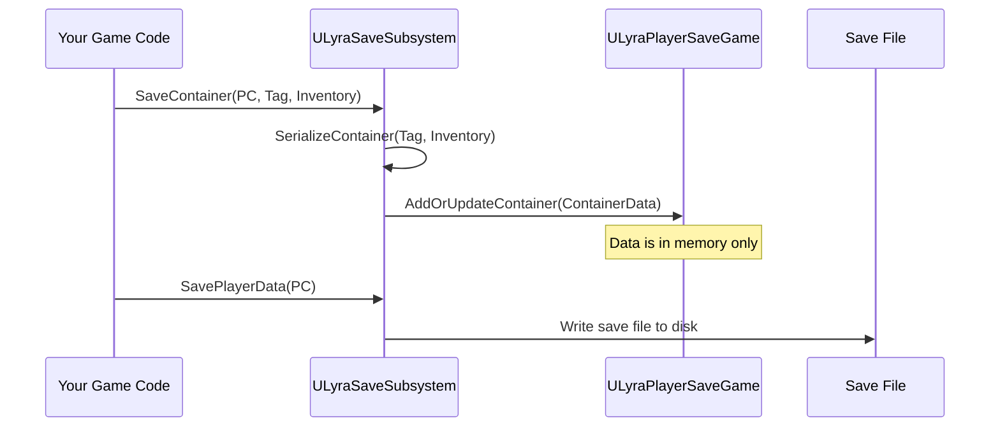
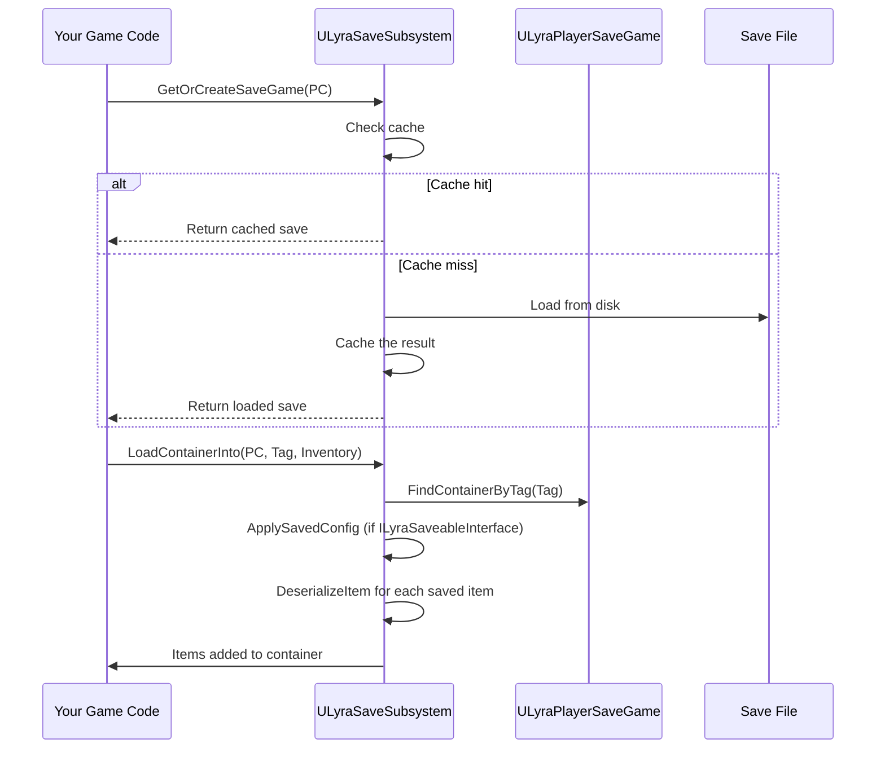
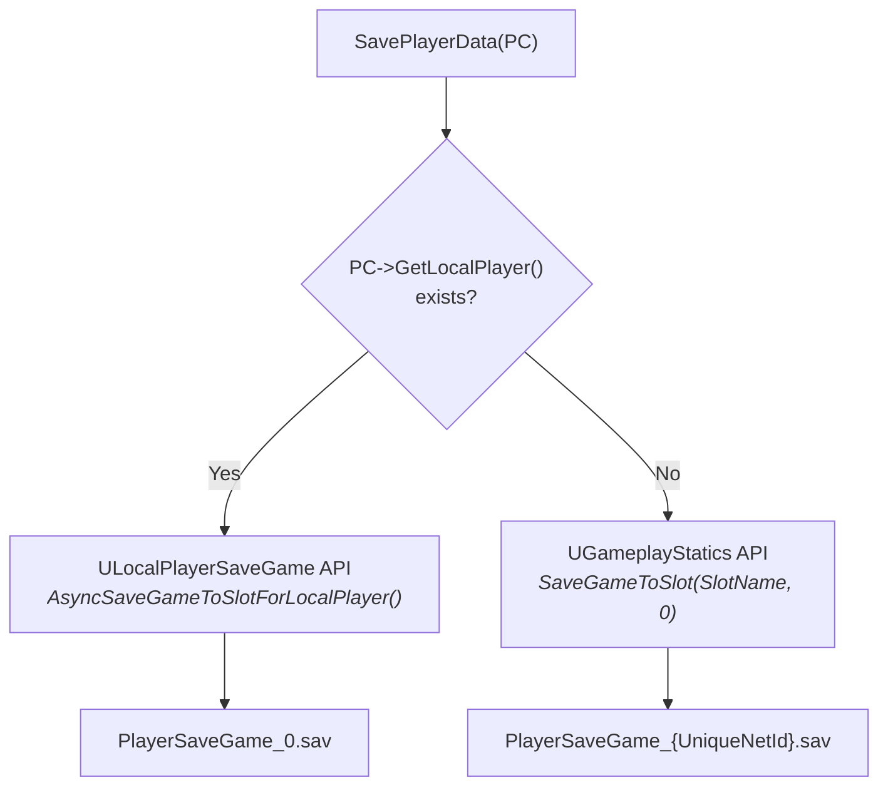

# Save Subsystem

`ULyraSaveSubsystem` is the single entry point for all save and load operations. It's a `UGameInstanceSubsystem`, so the subsystem itself persists across map transitions. The in-memory save cache, however, is automatically cleared before every map load to prevent stale UObject references, data is always reloaded from disk after travel.

Every public method takes an `APlayerController*`. The subsystem handles the rest: detecting whether the player is local or remote, choosing the right storage path, managing the in-memory cache, and cleaning up stale data on map change.

***

### How Saving Works

Saving is a two-step process: **serialize** into the in-memory save game, then **persist** to disk.



`SaveContainer` serializes the container's current state and stores it under a gameplay tag in the save game object. Nothing touches disk yet, you can call `SaveContainer` multiple times for different tags, then flush once with `SavePlayerData`.

This separation matters for atomic operations. You might serialize both inventory and equipment, update some tag entries, and then call `SavePlayerDataSync` once, ensuring all changes land on disk together.

***

### How Loading Works

Loading mirrors saving: **load from disk** (or cache), then **populate** a live container.



<!-- gb-stepper:start -->
<!-- gb-step:start -->
#### Applies config

If the target container implements `ILyraSaveableInterface`, its saved configuration (grid layout, weight limits, etc.) is restored before any items are loaded.
<!-- gb-step:end -->

<!-- gb-step:start -->
#### Deserializes items

Each `FSavedItemData` is turned back into a live `ULyraInventoryItemInstance` with its original GUID, stat tags, and fragment data.
<!-- gb-step:end -->

<!-- gb-step:start -->
#### Places items

Each item is added to the container at its saved slot position via `AddItemToSlot`.
<!-- gb-step:end -->
<!-- gb-stepper:end -->

***

### Local vs Remote Players

The subsystem transparently handles both player types. You never need to check, just pass the `APlayerController*`.



**Local players** (standalone, listen server, PIE) use Unreal's `ULocalPlayerSaveGame` API, which handles slot naming by player index.

**Remote players** (dedicated server) have no `ULocalPlayer`. The subsystem falls back to `UGameplayStatics::SaveGameToSlot` with a slot name derived from the player's platform ID (`PlayerState->GetUniqueId()`). With Steam, this is the SteamID64. With EOS, it's the ProductUserId. Both are stable across sessions.

> [!INFO]
> In PIE without a real online subsystem, remote player IDs contain random suffixes and won't persist between sessions. This is a PIE limitation, production builds with Steam or EOS have stable IDs.

***

### Cache Lifecycle

The subsystem maintains an in-memory cache (`TMap<FString, ULyraPlayerSaveGame*>`) to avoid reloading from disk on every access. Understanding when the cache is populated and cleared matters for map travel scenarios.

**Cache population:** `GetOrCreateSaveGame` checks the cache first. On a miss, it loads from disk and caches the result. All subsequent calls for the same player return the cached object.

**Cache clearing:** The subsystem binds to `FCoreUObjectDelegates::PreLoadMap` during `Initialize()`. When any map starts loading, the cache is automatically emptied. This prevents stale UObject pointers (from the old world) from persisting into the new map.

> [!WARNING]
> If you serialize containers into the save game and then trigger a map change, call `SavePlayerDataSync` **before** travel to ensure data reaches disk. The async variant (`SavePlayerData`) may not flush in time. After travel, the cache is cleared and reloaded from disk.

***

### Synchronous vs Asynchronous Saves

Two persistence methods are available:

| Method                   | Behavior                                                 | Use When                                                          |
| ------------------------ | -------------------------------------------------------- | ----------------------------------------------------------------- |
| `SavePlayerData(PC)`     | Asynchronous — returns immediately, writes in background | Normal gameplay saves (auto-save, UI close)                       |
| `SavePlayerDataSync(PC)` | Synchronous — blocks until write completes               | Before map travel, before server shutdown, critical commit points |

The synchronous variant guarantees data is on disk before the next line of code runs. Use it when you're about to do something that destroys the current world (like `ServerTravel`).

***

### Container Save and Load

The core operations for persisting item containers:

#### SaveContainer

```
SaveContainer(PC, SaveTag, Container)
```

Walks every item in the container via `ForEachItem`, serializes each into an `FSavedItemData`, captures the container's config (if it implements `ILyraSaveableInterface`), and stores the result in the save game under the given tag. **Does not write to disk**, call `SavePlayerData` afterward.

#### LoadContainerInto

```
LoadContainerInto(PC, SaveTag, Container) → bool
```

Finds the saved data for the given tag, applies saved config to the container, deserializes all items, and adds them to the container at their saved slot positions. Returns `false` if the tag doesn't exist in the save.

> [!INFO]
> These methods accept `TScriptInterface<ILyraItemContainerInterface>`, which means you can pass any container type, tetris inventories, equipment managers, attachment fragments, as long as it implements the container interface.

***

### Custom Data

For non-item data (quest progress, currency, player preferences), use the custom data API:

```
SaveCustomData(PC, Key, Data)
LoadCustomData(PC, Key) → FInstancedStruct
```

Both operate on `FGameplayTag` keys and `FInstancedStruct` values. In Blueprint, create a User Defined Struct for your data, wrap it in a `Make InstancedStruct` node, and save it under a tag. No C++ needed.

<!-- tabs:start -->
#### **Blueprint Example: Saving Player Currency**
* Create a User Defined Struct `F_PlayerCurrency` with fields: `Gold (int32)`, `Gems (int32)`
* Define a gameplay tag: `Save.PlayerCurrency`
* To save:
  * `Get Game Instance` → `Get Subsystem (ULyraSaveSubsystem)`
  * `Make InstancedStruct` from your `S_PlayerCurrency`
  * `Save Custom Data` with the tag and struct
  * `Save Player Data` to flush to disk
* To load:
  * `Load Custom Data` with the tag
  * `Get InstancedStruct Value` cast to `S_PlayerCurrency`


#### **Saving**


#### **Loading**


<!-- tabs:end -->

***

### API Reference

| Method                                      | Returns                       | Description                                                           |
| ------------------------------------------- | ----------------------------- | --------------------------------------------------------------------- |
| `GetOrCreateSaveGame(PC, SlotName)`         | `ULyraPlayerSaveGame*`        | Get or load the player's save game. Cached after first load           |
| `SavePlayerData(PC, SlotName)`              | `void`                        | Persist to disk asynchronously                                        |
| `SavePlayerDataSync(PC, SlotName)`          | `void`                        | Persist to disk synchronously (blocking)                              |
| `SaveContainer(PC, SaveTag, Container)`     | `void`                        | Serialize a container into the save game. Does not persist to disk    |
| `LoadContainerInto(PC, SaveTag, Container)` | `bool`                        | Load saved data into a live container. Returns false if tag not found |
| `SaveCustomData(PC, Key, Data)`             | `void`                        | Store arbitrary data under a gameplay tag                             |
| `LoadCustomData(PC, Key)`                   | `FInstancedStruct`            | Retrieve arbitrary data. Returns empty if not found                   |
| `ClearSaveData(PC, SlotName)`               | `void`                        | Delete save file from disk and clear cache                            |
| `ClearSaveTag(PC, SaveTag)`                 | `void`                        | Remove a specific tag entry. Does not persist until SavePlayerData    |
| `ClearCache()`                              | `void`                        | Drop all cached saves. Next access reloads from disk                  |
| `SerializeItem(Item)`                       | `FSavedItemData`              | Static. Serialize a single item instance                              |
| `DeserializeItem(SavedItem)`                | `ULyraInventoryItemInstance*` | Reconstruct a live item from saved data                               |
| `SerializeContainer(SaveTag, Container)`    | `FSavedContainerData`         | Static. Serialize a container and all its items                       |
