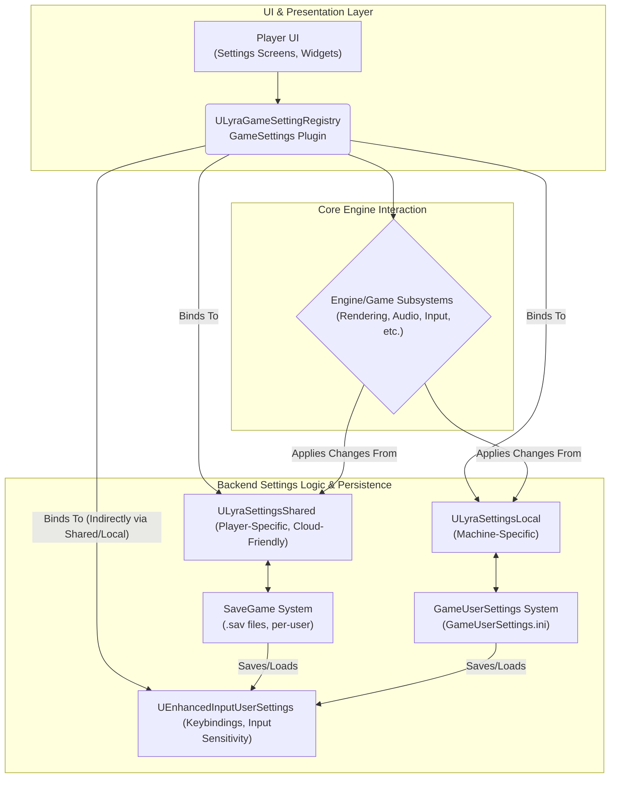

# Settings

At its core, Lyra's settings system is designed to provide a flexible and comprehensive way for players to customize their gameplay experience and for the game to adapt to different hardware configurations. This includes:

* **Player Preferences:** Allowing users to tailor aspects like controls, visual aids (colorblind modes, subtitles), audio preferences (background audio), and interface language to their liking.
* **Hardware Configuration:** Enabling the game to adjust performance-related settings such as graphics quality (resolution, texture detail, VSync), audio output devices, and frame rate limits to suit the capabilities of the player's machine.
* **Accessibility:** Providing options to make the game more accessible to a wider range of players.
* **Platform Adaptability:** Structuring settings in a way that can gracefully handle differences across various platforms (PC, consoles, mobile).

The system aims to achieve these goals by being:

* **Modular:** Breaking down settings into logical categories.
* **Data-Driven:** Allowing UI elements to be generated and managed based on defined setting objects.
* **Persistent:** Ensuring player choices are saved and restored across game sessions and potentially across devices.
* **Integrated:** Working closely with core Unreal Engine systems for a seamless experience.

***

## The Split

* **Shared settings** save per-player as a SaveGame file. Sensitivity, colorblind mode, subtitles, language preference, anything that should follow the player across machines.
* **Local settings** save per-machine as `GameUserSettings.ini`. Resolution, graphics quality, frame rate limits, audio device, anything tied to the hardware.

The UI doesn't care which backend a setting uses. The registry handles routing.

***

## The Registry

Settings aren't defined in UMG. They're created in C++ as setting objects organized into categories (Video, Audio, Gameplay, Mouse & Keyboard, Gamepad). The UI reads these objects and renders them dynamically.

This means adding a new setting is a code change, not a widget tree change.

***

## **System Architecture**

Understanding how the different pieces fit together is crucial. At a high level, Lyra's settings system can be visualized as follows:

***

## Structure of This Section

<!-- gb-stepper:start -->
<!-- gb-step:start -->
#### [Storage](storage.md)

How settings persist: the shared (SaveGame) and local (INI) backends, what each stores, and how they load.
<!-- gb-step:end -->

<!-- gb-step:start -->
#### [Input Settings](input-settings.md)

Key remapping, gamepad configuration, and Enhanced Input integration.
<!-- gb-step:end -->

<!-- gb-step:start -->
#### [Settings Registry](settings-registry.md)

How the registry drives the settings screens and how widgets bind to setting objects.
<!-- gb-step:end -->

<!-- gb-step:start -->
#### [Extending Settings](extending-settings.md)

Step-by-step guide to adding new settings: backend property, getter/setter, registry registration, and edit conditions.

<!-- gb-step:end -->
<!-- gb-stepper:end -->

***
