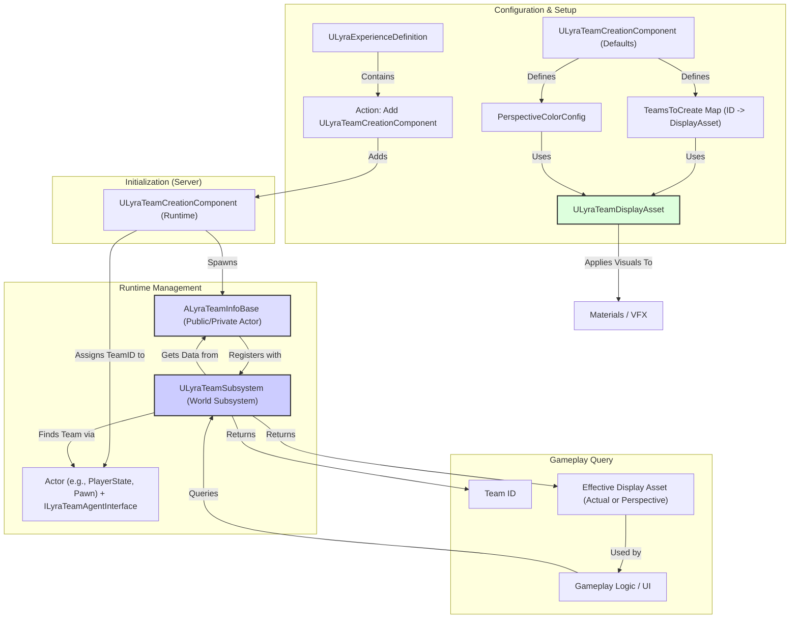

# Team

Welcome to the Team System documentation. This system provides the framework for grouping players and AI into distinct teams, managing their affiliations, applying team-specific visuals, and enabling gameplay logic based on team relationships (e.g., friendly fire, team scoring, objective ownership).

### Purpose: Organizing Players and Defining Affiliation

The core goals of the Team System are to:

1. **Establish Team Identities:** Define distinct teams within a match using unique identifiers (Team IDs).
2. **Assign Players/AI:** Associate actors (primarily Player States and Pawns via the `ILyraTeamAgentInterface`) with specific teams.
3. **Manage Affiliation:** Provide a centralized way (`ULyraTeamSubsystem`) to query the team membership of any actor and compare the relationship between different actors (same team, different teams, no team).
4. **Apply Team Visuals:** Use data assets (`ULyraTeamDisplayAsset`) to define team colors, icons, and other visual parameters, and apply them dynamically to actors based on their team or the viewer's perspective (Perspective Colors).
5. **Support Team-Based Gameplay:** Enable game modes and systems to implement team-specific rules, scoring, objectives, and logic by querying team membership and relationships.
6. **Modular Setup:** Allow team structures and assignments to be configured dynamically, often driven by the active Experience via the `ULyraTeamCreationComponent`.

### Core Concepts

* **Team ID:** A simple integer uniquely identifying each team (typically small numbers like 0, 1, 2...). `INDEX_NONE` (-1) represents no team affiliation.
* **Team Agent Interface (`ILyraTeamAgentInterface`):** An interface implemented by actors (like `ALyraPlayerState` or potentially custom Pawns/Controllers) that can belong to a team. It provides the standard way to get/set the actor's `FGenericTeamId`.
* **Team Info Actors (`ALyraTeamInfoBase`, `ALyraTeamPublicInfo`, `ALyraTeamPrivateInfo`):** Replicated `AInfo` actors representing the existence and state of a specific team in the world. Public info holds display assets, while both can hold replicated `TeamTags` (`FGameplayTagStackContainer`) for team-wide state.
* **Team Subsystem (`ULyraTeamSubsystem`):** A world subsystem acting as the central registry and query point for all team information. It tracks registered `ALyraTeamInfoBase` actors and provides functions to find an actor's team, compare teams, and access display assets.
* **Team Display Assets (`ULyraTeamDisplayAsset`):** Data Assets defining the visual properties (colors, textures, parameters) associated with a team or a perspective (Ally/Enemy).
* **Team Creation Component (`ULyraTeamCreationComponent`):** A Game State Component (often added by an Experience) responsible for spawning the `ALyraTeamInfoBase` actors and performing initial player team assignments when a match starts.
* **Perspective Colors:** An optional mode managed by the `ULyraTeamSubsystem` where team visuals are overridden based on the local viewer's relationship to an actor (Ally vs. Enemy) rather than the actor's actual team ID.

### High-Level Interaction Diagram

**Explanation:**

1. The active Experience typically adds a subclassed `ULyraTeamCreationComponent` to the Game State.
2. The Creation Component reads its configuration (which teams to create, display assets, perspective settings).
3. On the server, it spawns `ALyraTeamInfoBase` actors for each team and registers them with the `ULyraTeamSubsystem`.
4. It assigns initial Team IDs to players/AI implementing `ILyraTeamAgentInterface`.
5. During gameplay, other systems query the `ULyraTeamSubsystem` to find an actor's team ID or compare affiliations.
6. The subsystem provides team data, including the appropriate `ULyraTeamDisplayAsset` (which might be the actual team's asset or an Ally/Enemy perspective asset).
7. Visual systems use the Display Asset data to apply team colors/textures to actors and UI elements.

### Structure of this Section

This documentation section explores the team systems in detail:

1. **Core Concepts - Deep Dive:** Delving into Team IDs, the Team Agent Interface, Team Info Actors, and Team Display Assets.
2. **Team Management (`ULyraTeamSubsystem`):** Explaining the subsystem's role in tracking teams, managing agents, handling queries, and managing perspective colors.
3. **Team Creation & Assignment (`ULyraTeamCreationComponent`):** How teams are initially set up and players are assigned based on Experience configuration.
4. **Utilities & Blueprint Integration:** Covering the `ULyraTeamStatics` library and the Async Action nodes for observing team changes in Blueprints.

***

This overview introduces the Lyra Team System as a structured approach to managing player affiliations and team visuals within the game world, driven by the active gameplay Experience and managed centrally by the `ULyraTeamSubsystem`.
