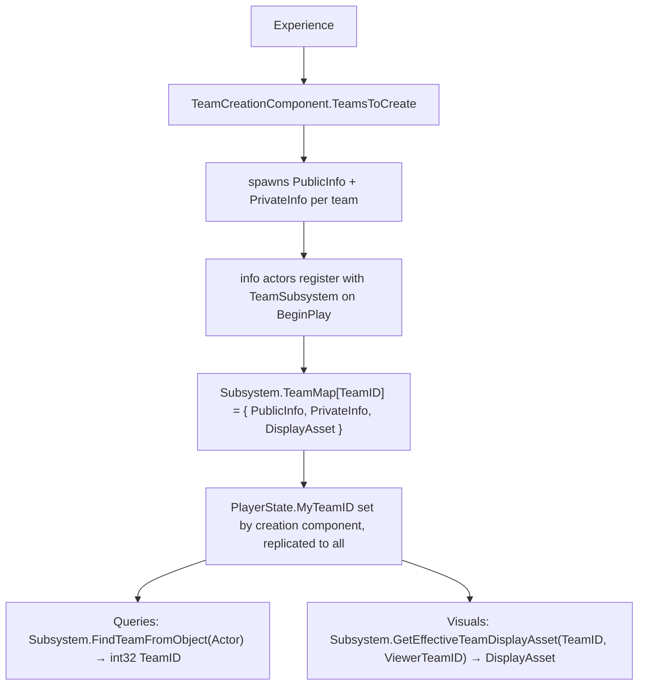

# Team Model

Before working with any team API, it helps to understand what a "team" actually is at runtime. A team is not just an integer ID passed around in gameplay code, it is a set of replicated actors, a membership interface, and a visual identity system that work together through the team subsystem. This page builds that mental model.

## What Is a Team?

Each team in a match is represented by a **pair of replicated actors** that carry the team's state:

**Public Info** (`ALyraTeamPublicInfo`) replicates to all clients. It holds the team's display asset, the visual identity that gameplay systems, materials, and UI all read from. It also inherits a `FGameplayTagStackContainer` from its base class, giving each team a replicated tag stack for team-level state like "zone captured" or "bonus active."

**Private Info** (`ALyraTeamPrivateInfo`) is intended for team-only data that opponents should not see. Currently it is empty, replication filtering is not implemented yet, so it replicates to everyone just like public info. The structure exists so that when team-only state is needed (hidden objectives, internal economy), the plumbing is already in place.

Both inherit from `ALyraTeamInfoBase`, which carries two things: a `TeamId` (replicated with `OnRep`, set once at spawn by the creation component, and never changed after) and the `TeamTags` tag stack container. Both info actors are configured as always-relevant with high net priority, ensuring every client has them as soon as they join.

You will see these actors in the World Outliner during PIE, one public and one private per team. They are spawned by the `ULyraTeamCreationComponent` on the server and persist for the duration of the match. On `BeginPlay`, each info actor registers itself with the `ULyraTeamSubsystem`, which maps the team ID to the tracking struct containing both info actors and the display asset.

### Team Membership

Actors declare team membership through the `ILyraTeamAgentInterface`. This is a C++ interface marked `CannotImplementInterfaceInBlueprint`, it must be implemented in native code. It extends Unreal's built-in `IGenericTeamAgentInterface` and adds:

* `GetOnTeamIndexChangedDelegate()` — returns a pointer to the `FOnLyraTeamIndexChangedDelegate` that fires when this actor's team changes. The delegate passes the object, old team ID, and new team ID.
* `ConditionalBroadcastTeamChanged()` — a static helper that broadcasts the delegate only if the team actually changed, avoiding redundant notifications.

The primary implementer is **`ALyraPlayerState`**. Team membership lives on the PlayerState because the PlayerState persists across respawns, when a character dies and a new pawn is spawned, the player's team affiliation is never lost. The PlayerState stores the team as a `FGenericTeamId` (`MyTeamID`) with `ReplicatedUsing=OnRep_MyTeamID`. When the server assigns or changes a player's team, the new ID replicates to all clients and the `OnRep` broadcasts the change delegate.

**`ALyraCharacter`** also implements the interface as a convenience for pawn-level queries. Rather than maintaining its own team state, the character delegates to its owning PlayerState when possessed. It listens for `OnControllerChangedTeam` and mirrors the team ID locally, broadcasting its own delegate so systems that hold a reference to the pawn (rather than the PlayerState) can still react to team changes. When the character is unpossessed, it calls `DetermineNewTeamAfterPossessionEnds()`, by default this resets to `NoTeam`, but subclasses can override it to keep the old team (useful for AI-controlled pawns that should retain affiliation).

### Display Assets

Each team's visual identity is defined by a `ULyraTeamDisplayAsset`, a `UDataAsset` subclass with three maps of named parameters:

| Map                 | Type                        | Example                                |
| ------------------- | --------------------------- | -------------------------------------- |
| `ScalarParameters`  | `TMap<FName, float>`        | `"TeamGlowIntensity"` = 2.0            |
| `ColorParameters`   | `TMap<FName, FLinearColor>` | `"TeamPrimaryColor"` = (0.1, 0.3, 0.9) |
| `TextureParameters` | `TMap<FName, UTexture*>`    | `"TeamLogo"` = a texture reference     |

<!-- tabs:start -->
#### **Scalar Parameter**

#### **Color Parameter**

#### **Texture Parameter**

<!-- tabs:end -->

The asset also carries a `TeamShortName` (`FText`) for UI labels.

Parameters are **named, not positional**. Your material reads `"TeamPrimaryColor"` and the display asset provides the value. Different teams can define different parameter sets, and consumers that use fallback defaults handle missing keys gracefully. This means you can add a `"TeamSecondaryColor"` to one team's asset without breaking teams that do not define it.

The display asset provides four `ApplyTo` methods that push all parameters into a target at once:

* `ApplyToMaterial(UMaterialInstanceDynamic*)` — sets scalar, vector, and texture parameters by name on a dynamic material instance.
* `ApplyToMeshComponent(UMeshComponent*)` — creates dynamic material instances on the mesh and applies parameters to each.
* `ApplyToNiagaraComponent(UNiagaraComponent*)` — sets Niagara user parameters by name.
* `ApplyToActor(AActor*, bIncludeChildActors)` — walks the actor's component hierarchy, applying to every mesh and Niagara component found.

<!-- tabs:start -->
#### **ApplyToMaterial**

#### **ApplyToMesh**

#### **ApplyToNiagara**

#### **ApplyToActor**

<!-- tabs:end -->

Live editing in PIE

In the editor, `ULyraTeamDisplayAsset` overrides `PostEditChangeProperty` to call `ULyraTeamSubsystem::NotifyTeamDisplayAssetModified()`. This fires the `OnTeamDisplayAssetChanged` delegate for every team using that asset, causing all observers to re-apply their visuals immediately. You can tweak a team color in the asset editor and see the change reflected in-game without restarting PIE.

  <video controls style="max-width: 100%; height: auto;">
    <source src=".gitbook/assets/Create_Team_Display_Asset.mp4" type="video/mp4">
    Your browser does not support the video tag.
  </video>

### How They Connect

The full flow from Experience definition to runtime query looks like this:

<!-- gb-stepper:start -->
<!-- gb-step:start -->
**Experience defines teams**

The `ULyraTeamCreationComponent` (a GameState component added by the [Experience](../gameframework-and-experience/)) holds a `TeamsToCreate` map, each entry is a team ID paired with an optional display asset. It also holds a `PerspectiveColorConfig` with ally/enemy display assets and a flag to enable perspective mode.
<!-- gb-step:end -->

<!-- gb-step:start -->
**Creation component spawns info actors**

On the server, after the Experience loads, the creation component iterates `TeamsToCreate` and calls `ServerCreateTeam()` for each entry. This spawns one `ALyraTeamPublicInfo` and one `ALyraTeamPrivateInfo`, sets their team IDs, and assigns the display asset to the public info actor. The info classes are configurable via `PublicTeamInfoClass` and `PrivateTeamInfoClass` properties, so game features can subclass them.
<!-- gb-step:end -->

<!-- gb-step:start -->
**Info actors register with the subsystem**

On `BeginPlay`, each info actor calls `TryRegisterWithTeamSubsystem()`, which finds the `ULyraTeamSubsystem` and calls `RegisterTeamInfo()`. The subsystem stores the info actor in an `FLyraTeamTrackingInfo` struct keyed by team ID, this struct holds pointers to the public info, private info, and the current display asset.
<!-- gb-step:end -->

<!-- gb-step:start -->
**Players receive team assignments**

The creation component assigns each joining player to a team via `ServerChooseTeamForPlayer()`, which calls the Blueprint-overridable `ServerAssignPlayerTeam()`. The default implementation uses `GetLeastPopulatedTeamID()` for balanced assignment. The team ID is set on the PlayerState, which replicates it to all clients.
<!-- gb-step:end -->

<!-- gb-step:start -->
**Gameplay queries go through the subsystem**

Any system that needs team information calls into `ULyraTeamSubsystem`. `FindTeamFromObject()` walks the object hierarchy, from pawn to controller to PlayerState, until it finds an `ILyraTeamAgentInterface` and returns its team ID. `CompareTeams()` takes two objects and returns `OnSameTeam`, `DifferentTeams`, or `InvalidArgument`. `CanCauseDamage()` wraps this comparison with friendly-fire rules.
<!-- gb-step:end -->

<!-- gb-step:start -->
**Visuals resolve through display assets**

`GetEffectiveTeamDisplayAsset(TeamId, ViewerTeamId)` returns the display asset that should be used for rendering. In normal mode, this is the team's own display asset from its public info actor. In perspective mode, it returns the ally or enemy asset based on whether the target team matches the viewer's team. Materials and UI call the `ApplyTo` methods on the result.
<!-- gb-step:end -->
<!-- gb-stepper:end -->

