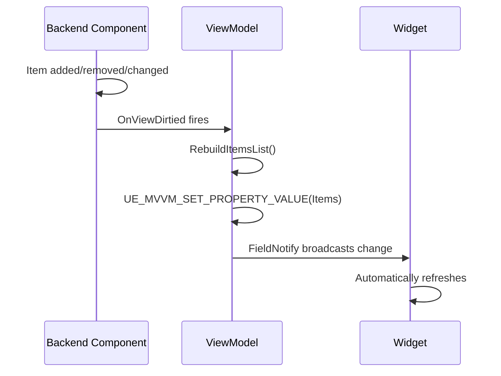
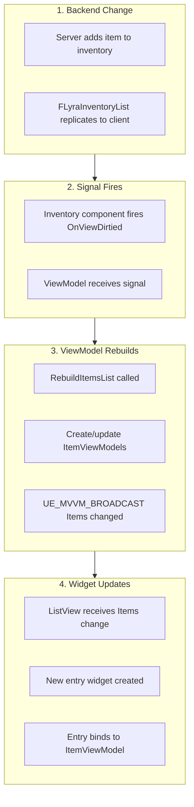
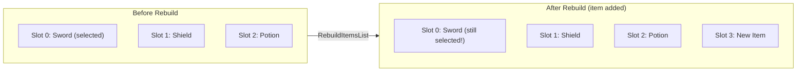
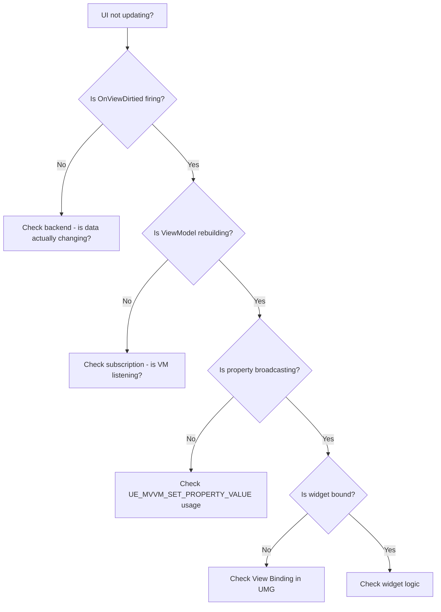

# DataFlow & Reactivity

The Item Container UI is **reactive**, when data changes in the backend, the UI updates automatically. No manual refresh calls, no polling, no "why isn't my UI updating?" debugging sessions. This page explains how that magic works.

***

### The Reactive Loop



**Key insight**: You never call `widget->Refresh()`. The ViewModel sets a property, and any widget bound to that property updates automatically.

***

### FieldNotify: Unreal's Reactive Secret

Unreal's `FieldNotify` system (used by UMG View Binding) is the foundation of reactivity. Here's how it works:

#### Declaring a Reactive Property

```cpp
UPROPERTY(BlueprintReadOnly, FieldNotify, Category = "Item")
FText DisplayName;
```

The `FieldNotify` specifier tells Unreal to track this property for binding.

#### Setting a Reactive Property

```cpp
// This macro does two things:
// 1. Sets the value
// 2. Broadcasts the change to all bound widgets
UE_MVVM_SET_PROPERTY_VALUE(DisplayName, NewName);
```

> [!WARNING]
> **Never set FieldNotify properties directly!** Using `DisplayName = NewName;` bypasses the notification system and your UI won't update.

#### Binding in Blueprint



Select a Text widget in the UMG designer.



Click "Bind" next to the Text property.



Choose "View Binding".



Select `ItemViewModel.DisplayName`.



Now whenever `DisplayName` changes, the Text widget updates automatically.


***

### How Backend Changes Reach the UI

Let's trace what happens when an item is added to inventory:



#### Step-by-Step Breakdown

**1. Backend Change**

```cpp
// On server
InventoryManager->AddItemToSlot(ItemInstance, SlotIndex);
// FLyraInventoryList marks entry dirty for replication
```

**2. Signal Fires**

```cpp
// In ULyraInventoryManagerComponent
void PostReplicatedAdd(const FLyraInventoryEntry& Entry)
{
    // Notify that our view of the inventory changed
    OnViewDirtied.Broadcast();
}
```

**3. ViewModel Rebuilds**

```cpp
// In ULyraInventoryViewModel
void HandleViewDirtied()
{
    RebuildItemsList();
}

void RebuildItemsList()
{
    TArray<ULyraItemViewModel*> NewItems;

    for (const auto& Entry : InventoryList.Entries)
    {
        // Reuse existing VM if we have one for this slot using the stable identity
        ULyraItemViewModel* ItemVM = GetOrCreateItemViewModel(Entry.SlotIndex);
        ItemVM->Initialize(Entry.Instance, Entry.StackCount);
        NewItems.Add(ItemVM);
    }

    // This broadcasts the change
    UE_MVVM_SET_PROPERTY_VALUE(Items, NewItems);
}
```

**4. Widget Updates**

```cpp
// ListView is bound to Items property
// UMG automatically calls SetListItems when Items changes
// Entry widgets are created/destroyed as needed
// Each entry widget binds to its ItemViewModel
```

***

### The "Never Manual Refresh" Philosophy

Traditional UI code is littered with manual updates:

```cpp
// BAD: Manual refresh everywhere
void OnItemPickedUp() { RefreshInventory(); }
void OnItemDropped() { RefreshInventory(); }
void OnItemMoved() { RefreshInventory(); }
void OnItemStacked() { RefreshInventory(); }
void OnInventoryOpened() { RefreshInventory(); } // Just in case...
```

With reactive binding:

```cpp
// GOOD: Just update the data
void OnItemPickedUp() { /* Backend handles it */ }
// ViewModel is subscribed to OnViewDirtied
// Widget is bound to ViewModel properties
// Everything updates automatically
```

> [!SUCCESS]
> **The Reactive Guarantee**: If the backend data changes and fires `OnViewDirtied`, the UI will update. No exceptions.

***

### Stable Identity: Preserving Selection

When the item list rebuilds, you don't want to lose selection state. The system uses **stable identity** via `SlotIndex`:



**How it works:**

```cpp
ULyraItemViewModel* GetOrCreateItemViewModel(int32 SlotIndex)
{
    // Check cache first
    if (ULyraItemViewModel* Existing = SlotViewModels.FindRef(SlotIndex))
    {
        return Existing; // Reuse! Focus/selection preserved
    }

    // Create new only if needed
    ULyraItemViewModel* NewVM = NewObject<ULyraItemViewModel>();
    SlotViewModels.Add(SlotIndex, NewVM);
    return NewVM;
}
```

The same ViewModel instance is reused for the same slot, so any state on it (focus, selection, custom properties) persists across rebuilds.

***

### Property Change Events

For more control, you can subscribe to specific property changes:

#### In Blueprints

Use the `OnFieldValueChanged` node with the property name.

#### In C++

```cpp
// Subscribe to a specific property change
ItemViewModel->FieldNotifyDelegate(
    ULyraItemViewModel::FFieldNotificationClassDescriptor::StackCount
).AddUObject(this, &UMyWidget::OnStackCountChanged);
```

### Common Events

| ViewModel            | Event/Property         | When It Fires                        |
| -------------------- | ---------------------- | ------------------------------------ |
| `ContainerViewModel` | `OnItemsChanged`       | Items added/removed/reordered        |
| `ContainerViewModel` | `OnFocusedItemChanged` | User navigates to different item     |
| `ItemViewModel`      | `OnStatTagChanged`     | Item stats change (durability, ammo) |
| `ItemViewModel`      | `bIsGhost`             | Prediction state changes             |

***

### Debugging Data Flow

If your UI isn't updating, check these points in order:



> [!INFO]
> **Quick Debug**: Add `UE_LOG` in `RebuildItemsList()` and watch the Output Log. If it's firing but the UI doesn't update, the problem is in the binding. If it's not firing, the problem is in the signal chain.

***

## Next Steps

Now that you understand how data flows, let's look at why the system uses windows instead of a single panel in [The Window Model](the-window-model.md).
