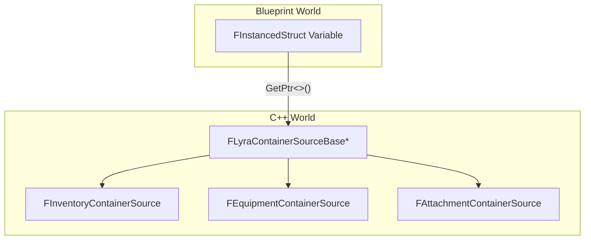
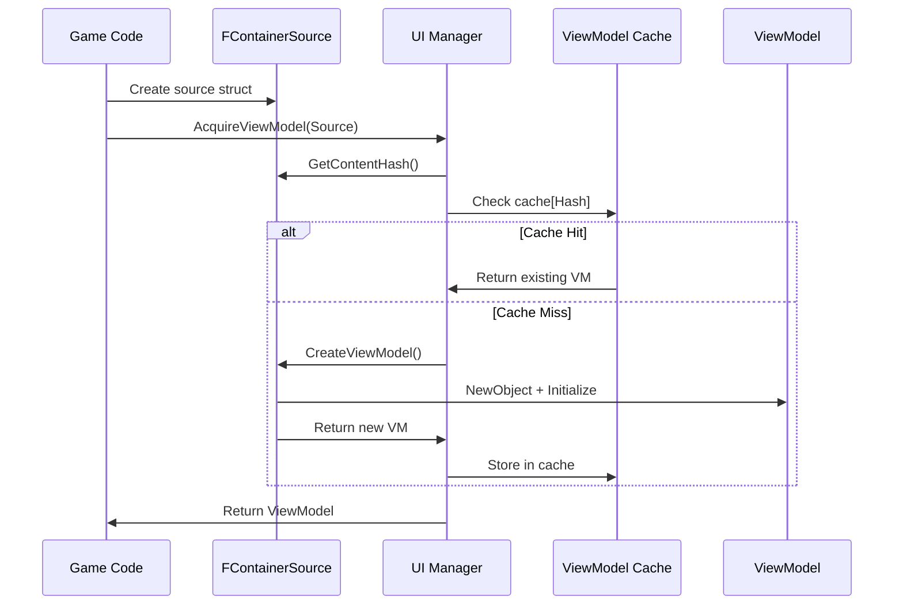

# Polymorphic Container Sources

The core of this system's flexibility lies in how we request UI data. Instead of hard-linking widgets to specific components (e.g., forcing an Inventory Window to only accept a `ULyraInventoryManagerComponent`), we use a **polymorphic descriptor pattern**.

This allows a single system, the UI Manager, to handle caching, lifecycle, and creation for any type of container, present or future.

***

### The Core Struct: `FLyraContainerSourceBase`

At the bottom of the hierarchy is `FLyraContainerSourceBase`. This is the "contract" that any container system must fulfill to participate in the UI.

```cpp
USTRUCT(BlueprintType)
struct LYRAGAME_API FLyraContainerSourceBase
{
    GENERATED_BODY()

    /** 1. What kind of ViewModel does this source need? */
    virtual UClass* GetViewModelClass() const;

    /** 2. How do we uniquely identify this specific container? */
    virtual uint32 GetContentHash() const;

    /** 3. Who owns this data? (Used for auto-cleanup) */
    virtual UObject* GetOwner() const;

    /** 4. The Factory Method: Create the data proxy. */
    virtual ULyraContainerViewModel* CreateViewModel(ULyraItemContainerUIManager* Manager) const;
};
```

This struct is never used directly. It is intended to be inherited by specific implementations, like `FInventoryContainerSource` or `FAttachmentContainerSource`.

***

### Why FInstancedStruct?

In C++, we can pass pointers to base classes easily (`Base*`). But in Blueprints, passing generic structs is impossible without casting.

We use **`FInstancedStruct`** (from the _StructUtils_ plugin) to wrap these derived structs. This gives us:

1. **Value Semantics:** We can pass it by value or reference in Blueprints without managing memory manually.
2. **Type Safety:** We can check `Slot.GetScriptStruct()` to know exactly what we are dealing with.
3. **Polymorphism:** The UI Manager accepts `const FInstancedStruct&`, but internally calls the virtual functions of `FLyraContainerSourceBase`.



***

### Implementing a Source

Let's look at how the standard Inventory implements this contract.



#### The Struct Definition

The struct holds a weak pointer to the actual data component. This ensures that if the inventory component is destroyed (e.g., character death), the source descriptor doesn't keep it alive.

```cpp
USTRUCT(BlueprintType)
struct LYRAGAME_API FInventoryContainerSource : public FLyraContainerSourceBase
{
    GENERATED_BODY()

    /** The actual data component we want to view */
    UPROPERTY(EditAnywhere, BlueprintReadWrite)
    TWeakObjectPtr<ULyraInventoryManagerComponent> InventoryComponent;

    // ... Interface Implementation below ...
};
```



#### The Factory Logic (CreateViewModel)

This is where the "magic" happens. The Source knows exactly which ViewModel class matches its data.

```cpp
ULyraContainerViewModel* FInventoryContainerSource::CreateViewModel(
    ULyraItemContainerUIManager* Manager) const
{
    // 1. Validate the data still exists
    if (!InventoryComponent.IsValid()) return nullptr;

    // 2. Create the SPECIFIC ViewModel type
    ULyraInventoryViewModel* ViewModel = NewObject<ULyraInventoryViewModel>(Manager);

    // 3. Initialize it with the component
    if (ViewModel)
    {
        ViewModel->Initialize(InventoryComponent.Get());
    }

    return ViewModel;
}
```

> [!SUCCESS]
> **Inversion of Control**: The UI Manager never needs to include `LyraInventoryViewModel.h`. It stays lightweight and compilation times stay fast.



***

### Cache Identity (GetContentHash)

The UI Manager aggressively caches ViewModels. If two different windows (e.g., "Main Inventory" and "Crafting Source") request the same inventory, they should get the **same ViewModel instance**.

To achieve this, the Source must provide a unique hash.

```cpp
virtual uint32 GetContentHash() const override
{
    // Hashing the pointer ensures uniqueness per component instance
    return GetTypeHash(InventoryComponent);
}
```

The UI Manager combines this hash with the Struct Type to form a composite key:

```
Key = HashCombine(StructType, ContentHash)
```

#### Why Hashing Matters

Consider Attachments. An item can have multiple attachment slots. If we just hashed the Item Pointer, all attachment slots would return the same ViewModel.

The `FAttachmentContainerSource` gets clever here: it doesn't just hash the item; it hashes the item **plus the hierarchy path**.

```cpp
friend uint32 GetTypeHash(const FAttachmentContainerSource& Src)
{
    // Hash combine Item + The specific slot hierarchy we are looking at
    uint32 Hash = GetTypeHash(Src.ItemInstance);

    // Include the path for nested attachments
    for (const FGameplayTag& PathTag : Src.ContainerPath)
    {
        Hash = HashCombine(Hash, GetTypeHash(PathTag));
    }

    return Hash;
}
```

> [!INFO]
> In the provided code, `FAttachmentContainerSource` currently hashes `ItemInstance`, but for nested attachments, it would need to include `RootSlot` or `ContainerPath` in the hash to differentiate nested views of the same item.

***

### Built-In Sources

The system provides these sources out of the box:

| Source Struct                | ViewModel Created          | Use Case                          |
| ---------------------------- | -------------------------- | --------------------------------- |
| `FInventoryContainerSource`  | `ULyraInventoryViewModel`  | Player inventory, chests, storage |
| `FEquipmentContainerSource`  | `ULyraEquipmentViewModel`  | Equipment slots by GameplayTag    |
| `FAttachmentContainerSource` | `ULyraAttachmentViewModel` | Item attachments (scopes, grips)  |

***

### Extensibility Example

Imagine you want to add a **Vendor System** to your game. You don't need to modify the UI Manager or the Windowing system.



#### Create the Struct

```cpp
USTRUCT(BlueprintType)
struct FVendorContainerSource : public FLyraContainerSourceBase
{
    GENERATED_BODY()

    UPROPERTY(EditAnywhere, BlueprintReadWrite)
    TWeakObjectPtr<AVendorActor> Vendor;

    UPROPERTY(EditAnywhere, BlueprintReadWrite)
    FGameplayTag CategoryFilter;  // Optional: filter by item category
};
```



#### Implement the Interface

```cpp
UClass* FVendorContainerSource::GetViewModelClass() const
{
    return UVendorViewModel::StaticClass();
}

uint32 FVendorContainerSource::GetContentHash() const
{
    return HashCombine(
        GetTypeHash(Vendor),
        GetTypeHash(CategoryFilter)
    );
}

UObject* FVendorContainerSource::GetOwner() const
{
    return Vendor.Get();
}

ULyraContainerViewModel* FVendorContainerSource::CreateViewModel(
    ULyraItemContainerUIManager* Manager) const
{
    if (!Vendor.IsValid()) return nullptr;

    UVendorViewModel* VM = NewObject<UVendorViewModel>(Manager);
    VM->Initialize(Vendor.Get(), CategoryFilter);
    return VM;
}
```



#### Use It

In your interaction ability, create the struct and pass it to the UI Manager:

```cpp
void UVendorInteractAbility::OpenVendorUI()
{
    FVendorContainerSource Source;
    Source.Vendor = TargetVendor;
    Source.CategoryFilter = FGameplayTag::EmptyTag;

    FLyraWindowOpenRequest Request;
    Request.WindowType = TAG_UI_Window_Vendor;
    Request.SourceDesc = FInstancedStruct::Make(Source);
    Request.SessionHandle = UIManager->CreateChildSession(BaseSession, TargetVendor);

    UIManager->RequestOpenWindow(Request);
}
```

The system will automatically cache it, track its lifecycle, and serve it to any widget that asks.



***

### The Complete Flow



***

## Summary

| Concept                    | Purpose                                           |
| -------------------------- | ------------------------------------------------- |
| `FLyraContainerSourceBase` | Abstract contract for all container sources       |
| `FInstancedStruct`         | Wrapper enabling Blueprint polymorphism           |
| `GetContentHash()`         | Unique identifier for caching                     |
| `CreateViewModel()`        | Factory method for creating the correct ViewModel |
| `GetOwner()`               | Object to watch for automatic cleanup             |

The polymorphic source pattern is what makes this system truly extensible. Any container type, present or future, can participate in the UI system by implementing this simple interface.

***

## Next Steps

Now that you understand how sources create ViewModels, learn about the MVVM architecture that ties it all together in [The MVVM Pattern](mvvm.md).
