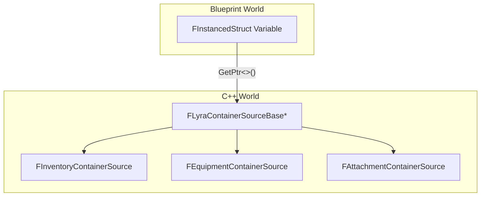
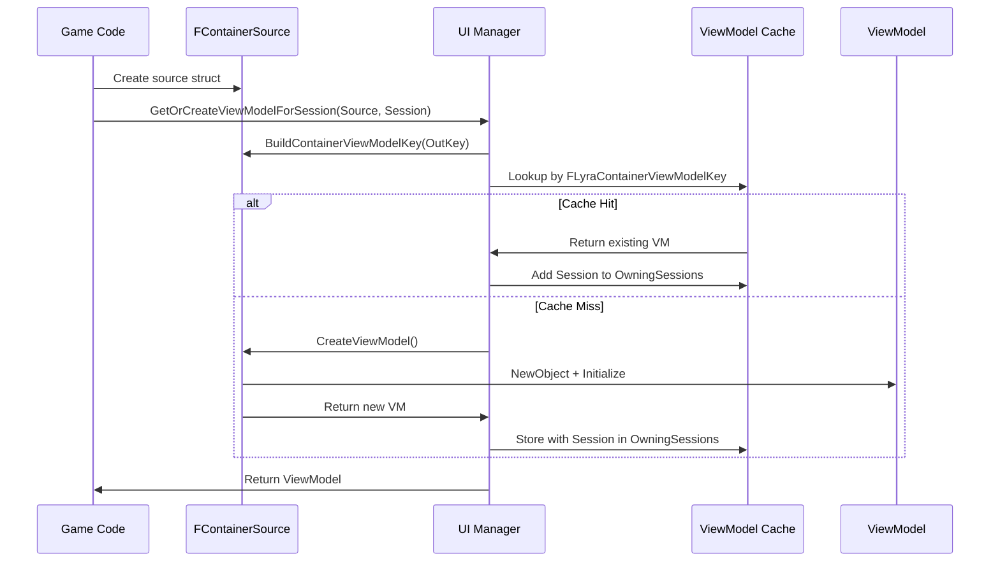

# Polymorphic Container Sources

The core of this system's flexibility lies in how we request UI data. Instead of hard-linking widgets to specific components (e.g., forcing an Inventory Window to only accept a `ULyraInventoryManagerComponent`), we use a **polymorphic descriptor pattern**.

This allows a single system, the UI Manager, to handle caching, lifecycle, and creation for any type of container, present or future.

***

## The Core Struct: `FLyraContainerSourceBase`

At the bottom of the hierarchy is `FLyraContainerSourceBase`. This is the "contract" that any container system must fulfill to participate in the UI.

```cpp
USTRUCT(BlueprintType)
struct LYRAGAME_API FLyraContainerSourceBase
{
    GENERATED_BODY()

    /** 1. What kind of ViewModel does this source need? */
    virtual UClass* GetViewModelClass() const;

    /** 2. The object used for object-keyed identity. */
    virtual UObject* GetOwner() const;

    /** 3. Populate the stable cache key for this source. */
    virtual bool BuildContainerViewModelKey(FLyraContainerViewModelKey& OutKey) const;

    /** 4. The factory method: create the data proxy. */
    virtual ULyraContainerViewModel* CreateViewModel(ULyraItemContainerUIManager* Manager) const;
};
```

This struct is never used directly. It is intended to be inherited by specific implementations, like `FInventoryContainerSource` or `FAttachmentContainerSource`.

***

## Why FInstancedStruct?

In C++, we can pass pointers to base classes easily (`Base*`). But in Blueprints, passing generic structs is impossible without casting.

We use **`FInstancedStruct`** (from the _StructUtils_ plugin) to wrap these derived structs. This gives us:

1. **Value Semantics:** We can pass it by value or reference in Blueprints without managing memory manually.
2. **Type Safety:** We can check `Slot.GetScriptStruct()` to know exactly what we are dealing with.
3. **Polymorphism:** The UI Manager accepts `const FInstancedStruct&`, but internally calls the virtual functions of `FLyraContainerSourceBase`.


```mermaid
flowchart TB
    subgraph Blueprint ["Blueprint World"]
        BP[FInstancedStruct Variable]
    end

    subgraph CPP ["C++ World"]
        BASE[FLyraContainerSourceBase*]
        INV[FInventoryContainerSource]
        EQ[FEquipmentContainerSource]
        ATT[FAttachmentContainerSource]
    end

    BP -->|"GetPtr<>()"| BASE
    BASE --> INV
    BASE --> EQ
    BASE --> ATT
```

***

## Implementing a Source

Let's look at how the standard Inventory implements this contract.

<!-- gb-stepper:start -->
<!-- gb-step:start -->
#### The Struct Definition

The struct holds a weak pointer to the actual data component. This ensures that if the inventory component is destroyed (e.g., character death), the source descriptor doesn't keep it alive.

```cpp
USTRUCT(BlueprintType)
struct LYRAGAME_API FInventoryContainerSource : public FLyraContainerSourceBase
{
    GENERATED_BODY()

    /** The actual data component we want to view */
    UPROPERTY(EditAnywhere, BlueprintReadWrite)
    TWeakObjectPtr<ULyraInventoryManagerComponent> InventoryComponent;

    // ... Interface Implementation below ...
};
```
<!-- gb-step:end -->

<!-- gb-step:start -->
#### The Factory Logic (CreateViewModel)

This is where the "magic" happens. The Source knows exactly which ViewModel class matches its data.

```cpp
ULyraContainerViewModel* FInventoryContainerSource::CreateViewModel(
    ULyraItemContainerUIManager* Manager) const
{
    // 1. Validate the data still exists
    if (!InventoryComponent.IsValid()) return nullptr;

    // 2. Create the SPECIFIC ViewModel type
    ULyraInventoryViewModel* ViewModel = NewObject<ULyraInventoryViewModel>(Manager);

    // 3. Initialize it with the component
    if (ViewModel)
    {
        ViewModel->Initialize(InventoryComponent.Get());
    }

    return ViewModel;
}
```

> [!SUCCESS]
> **Inversion of Control**: The UI Manager never needs to include `LyraInventoryViewModel.h`. It stays lightweight and compilation times stay fast.
<!-- gb-step:end -->
<!-- gb-stepper:end -->

***

## Cache Identity (`BuildContainerViewModelKey`)

The UI manager caches ViewModels so that two widgets viewing the same container share one instance. The cache is keyed by `FLyraContainerViewModelKey`, a small struct combining the source struct type with the owning object pointer and an optional item GUID. Equality is field-by-field; the hash exists only so the underlying map can bucket entries.

Each source populates the key by overriding `BuildContainerViewModelKey`. The base implementation handles the common case automatically:

```cpp
virtual bool BuildContainerViewModelKey(FLyraContainerViewModelKey& OutKey) const
{
    if (UObject* Owner = GetOwner())
    {
        OutKey.ContainerObject = Owner;
        return true;
    }
    return false;
}
```

Any source backed by a component or actor can use the default. The manager stamps `SourceStructType` itself after the override returns, so two different source types pointing at the same component still resolve to different ViewModels.

### Item-Owned Sources Need GUID Identity

Item-owned containers face a problem that direct sources don't: the underlying item pointer can be replaced during prediction reconciliation. If the cache key held a weak pointer to a specific item instance, the predicted-to-authoritative swap would orphan the ViewModel and create a new one for the same conceptual container.

`FAttachmentContainerSource` and `FTetrisChildContainerSource` solve this by keying on the item's stable GUID instead:

```cpp
bool FAttachmentContainerSource::BuildContainerViewModelKey(
    FLyraContainerViewModelKey& OutKey) const
{
    if (!ItemGuid.IsValid())
    {
        return false;
    }

    OutKey.ItemGuid = ItemGuid;
    return true;
}
```

The ViewModel resolves the current item through `ULyraItemSubsystem::FindItemByGuid` on each access, so the cached entry survives the underlying pointer swap.

***

## Built-In Sources

The system provides these sources out of the box:

| Source Struct                 | ViewModel Created               | Identity     | Use Case                                  |
| ----------------------------- | ------------------------------- | ------------ | ----------------------------------------- |
| `FInventoryContainerSource`   | `ULyraInventoryViewModel`       | Object-keyed | Player inventory, chests, storage         |
| `FEquipmentContainerSource`   | `ULyraEquipmentViewModel`       | Object-keyed | Equipment slots by GameplayTag            |
| `FWorldPickupContainerSource` | `ULyraWorldPickupViewModel`     | Object-keyed | World pickups and dropped loot            |
| `FTetrisContainerSource`      | `ULyraTetrisInventoryViewModel` | Object-keyed | Grid-shaped tetris inventories            |
| `FAttachmentContainerSource`  | `ULyraAttachmentViewModel`      | GUID-keyed   | Item attachments (scopes, grips)          |
| `FTetrisChildContainerSource` | `ULyraTetrisInventoryViewModel` | GUID-keyed   | Tetris inventories carried inside an item |

***

## Extensibility Example

Imagine you want to add a **Vendor System** to your game. You don't need to modify the UI Manager or the Windowing system.

<!-- gb-stepper:start -->
<!-- gb-step:start -->
#### Create the Struct

```cpp
USTRUCT(BlueprintType)
struct FVendorContainerSource : public FLyraContainerSourceBase
{
    GENERATED_BODY()

    UPROPERTY(EditAnywhere, BlueprintReadWrite)
    TWeakObjectPtr<AVendorActor> Vendor;

    UPROPERTY(EditAnywhere, BlueprintReadWrite)
    FGameplayTag CategoryFilter;  // Optional: filter by item category
};
```
<!-- gb-step:end -->

<!-- gb-step:start -->
#### Implement the Interface

```cpp
UClass* FVendorContainerSource::GetViewModelClass() const
{
    return UVendorViewModel::StaticClass();
}

UObject* FVendorContainerSource::GetOwner() const
{
    return Vendor.Get();
}

ULyraContainerViewModel* FVendorContainerSource::CreateViewModel(
    ULyraItemContainerUIManager* Manager) const
{
    if (!Vendor.IsValid()) return nullptr;

    UVendorViewModel* VM = NewObject<UVendorViewModel>(Manager);
    VM->Initialize(Vendor.Get(), CategoryFilter);
    return VM;
}
```

Notice that there is no `BuildContainerViewModelKey` override. The base implementation calls `GetOwner()` and uses the returned object as the cache key, which is exactly what a component-backed vendor needs. Only override when the source is item-owned and needs GUID identity, or when one component exposes multiple distinct views that need to disambiguate further.

> [!SUCCESS]
> **Inversion of Control**: The UI manager never needs to include `VendorViewModel.h`. It stays lightweight and compilation times stay fast.
<!-- gb-step:end -->

<!-- gb-step:start -->
#### Use It

In your interaction ability, create the struct and pass it to the UI Manager:

```cpp
void UVendorInteractAbility::OpenVendorUI()
{
    FVendorContainerSource Source;
    Source.Vendor = TargetVendor;
    Source.CategoryFilter = FGameplayTag::EmptyTag;
    FInstancedStruct SourceStruct = FInstancedStruct::Make(Source);

    FItemWindowSpec Spec;
    Spec.WindowType = TAG_UI_Window_Vendor;
    Spec.SourceDesc = SourceStruct;
    Spec.SessionHandle = UIManager->CreateChildSession(
        TAG_UI_Session_Vendor,
        SourceStruct,
        UIManager->GetBaseSession()
    );

    UIManager->RequestOpenWindow(Spec);
}
```

A HUD widget reading the same vendor without opening a window asks the manager directly under the base session:

```cpp
ULyraContainerViewModel* VM = UIManager->GetOrCreateViewModelForSession(
    FInstancedStruct::Make(Source),
    UIManager->GetBaseSession());
```

The system caches the ViewModel under its `FLyraContainerViewModelKey`, tracks the owning session, and serves the same instance to any other widget that asks for the same vendor.
<!-- gb-step:end -->
<!-- gb-stepper:end -->

***

## The Complete Flow


```mermaid
sequenceDiagram
    participant Code as Game Code
    participant Source as FContainerSource
    participant Manager as UI Manager
    participant Cache as ViewModel Cache
    participant VM as ViewModel

    Code->>Source: Create source struct
    Code->>Manager: GetOrCreateViewModelForSession(Source, Session)
    Manager->>Source: BuildContainerViewModelKey(OutKey)
    Manager->>Cache: Lookup by FLyraContainerViewModelKey
    alt Cache Hit
        Cache->>Manager: Return existing VM
        Manager->>Cache: Add Session to OwningSessions
    else Cache Miss
        Manager->>Source: CreateViewModel()
        Source->>VM: NewObject + Initialize
        Source->>Manager: Return new VM
        Manager->>Cache: Store with Session in OwningSessions
    end
    Manager->>Code: Return ViewModel
```

***
