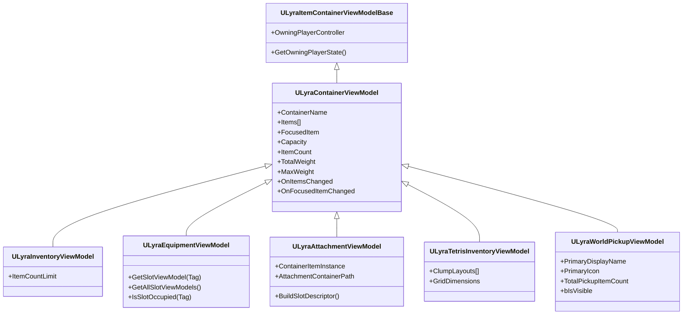

# Specialized Implementations

The core ViewModel architecture is powerful, but different game systems behave differently. A backpack doesn't work the same way as a weapon attachment point.

This page explains how the  `ULyraContainerViewModel`  is extended to handle specific gameplay mechanics.



***

## Polymorphic Container Sources

The system uses `FInstancedStruct` to work with any container type polymorphically:

```cpp
// All containers use the same API on the UI manager
ULyraContainerViewModel* GetOrCreateViewModelForSession(
    const FInstancedStruct& Source,
    FItemWindowSessionHandle SessionHandle);
```

### Built-in Sources

| Source Struct                 | Creates                         | For                                       |
| ----------------------------- | ------------------------------- | ----------------------------------------- |
| `FInventoryContainerSource`   | `ULyraInventoryViewModel`       | Inventory components                      |
| `FEquipmentContainerSource`   | `ULyraEquipmentViewModel`       | Equipment components                      |
| `FWorldPickupContainerSource` | `ULyraWorldPickupViewModel`     | World pickups and dropped loot            |
| `FTetrisContainerSource`      | `ULyraTetrisInventoryViewModel` | Grid-shaped tetris inventories            |
| `FAttachmentContainerSource`  | `ULyraAttachmentViewModel`      | Item attachments                          |
| `FTetrisChildContainerSource` | `ULyraTetrisInventoryViewModel` | Tetris inventories carried inside an item |

### Adding Custom Sources

See Custom Container Types for creating new container types (vendors, crafting, etc.). Custom sources participate in the cache by overriding `BuildContainerViewModelKey`; the polymorphic container sources page covers the key contract.

***

## The Inventory (`ULyraInventoryViewModel`)

The standard slot-indexed container. Items are tracked by a flat `SlotIndex` (0, 1, 2...), but the visual layout is a widget concern, the same VM drives `LyraInventoryListPanel` (a vertical list) and `LyraInventoryTilePanel` (a grid). Use this VM for any inventory whose slot identity is one-dimensional, regardless of how you choose to draw it. Backpacks, chests, stashes, and the standard grid-laid-out inventory all live here.

### What Makes It Unique

* **Index identity.** Items are tracked by their `SlotIndex` (0, 1, 2...). Empty slots have no items but still report `MaxSlots` so a tile panel can draw the empty squares.
* **Capacity.** Binds to `ULyraInventoryManagerComponent` and forwards `MaxSlots`, `MaxWeight`, and `ItemCountLimit` as bindable properties.
* **Aggregate stats.** Recomputes `TotalWeight` and `ItemCount` each time the list rebuilds so HUDs and capacity bars stay in sync without polling.

> [!SUCCESS]
> The `LyraInventoryTilePanel` handles empty slot visualization by reading `MaxSlots`, creating a `SlotViewModel` for each position, mapping items to slots via `FindItemForSlot()`, and marking empty slots with `bIsOccupied = false`. The `InventoryListPanel` does not, it just lists what exists.

### Initialization

<div class="gb-stack">
<details class="gb-toggle">

<summary>C++</summary>

```cpp
FInventoryContainerSource Source;
Source.InventoryComponent = PlayerInventoryComponent;

// Inside a window shell
ULyraInventoryViewModel* VM = Cast<ULyraInventoryViewModel>(
    Shell->GetOrCreateViewModel(FInstancedStruct::Make(Source))
);

// From an item-container widget without a window shell
ULyraInventoryViewModel* VM = Cast<ULyraInventoryViewModel>(
    UIManager->GetOrCreateViewModelForSession(
        FInstancedStruct::Make(Source),
        UIManager->GetBaseSession())
);
```

</details>
<details class="gb-toggle">

<summary>Blueprints</summary>


</details>
</div>

***

## Equipment (`ULyraEquipmentViewModel`)

Equipment slots are tagged, not numbered, "Head", "Chest", "Primary Weapon" instead of "Slot 0". Which slots a widget displays is a widget decision, not a ViewModel or character-config decision. The widget asks the ViewModel for whatever tags it wants to draw, and the VM creates the matching slot ViewModel on demand (`GetOrCreateSlotViewModel(Tag)`).&#x20;

Adding a new equipment slot to the UI is just adding a widget that requests its tag then requesting it in the widget graph. Slots persist whether or not an item is equipped; the "Head" slot exists even when the player is bareheaded.

### What Makes It Unique

* **Tagged slots.** Instead of an array indexed by position, the VM holds a `TMap<FGameplayTag, ULyraEquipmentSlotViewModel*>`. Every UI binds to its slot of interest by gameplay tag.
* **Permanent slot identity.** Slots exist whether or not they hold an item. Empty slots still produce a valid `SlotViewModel` so widgets can show a placeholder icon and accept drops.
* **Held state.** Tracks `ActiveHeldSlot` (the tag of the slot currently active in the character's hands) and updates the matching slot VM's highlight state so the HUD can show which weapon is drawn.

### On-Demand Slot Creation

Equipment slot ViewModels are created lazily. `GetOrCreateSlotViewModel(FGameplayTag SlotTag)` is the entry point: it returns the existing slot VM for the tag, or creates one if it does not exist yet. This lets a HUD widget ask only for the two slots it cares about while a full Character Sheet asks for every slot it draws, both share the same underlying instances.

```cpp
UFUNCTION(BlueprintCallable, Category = "Equipment")
ULyraEquipmentSlotViewModel* GetOrCreateSlotViewModel(FGameplayTag SlotTag);
```

UMG widgets should bind through this accessor rather than caching a slot VM pointer, because the slot VM may not exist until the widget first asks for it.

### Initialization

<div class="gb-stack">
<details class="gb-toggle">

<summary>C++</summary>

```cpp
FEquipmentContainerSource Source;
Source.EquipmentComponent = PlayerEquipmentComponent;

ULyraEquipmentViewModel* VM = Cast<ULyraEquipmentViewModel>(
    Shell->GetOrCreateViewModel(FInstancedStruct::Make(Source))
);
```

</details>
<details class="gb-toggle">

<summary>Blueprints</summary>


</details>
</div>

***

### Attachments (`ULyraAttachmentViewModel`)

Attachments are the "item inside another item" case, a scope on a rifle, a mag on a weapon, a charm on a backpack. The container is not a component on the world; it is an **item**, which can move between inventories at any time. This is what makes attachments the trickiest of the built-in containers.

### What Makes It Unique

* **Item-owned container.** The container is the parent item itself. The VM reads slot definitions from the `UInventoryFragment_Attachment` on that item, not from a manager component.
* **GUID-keyed identity.** The cache keys the attachment VM by the parent item's GUID rather than by a pointer, so the VM survives the predicted-to-authoritative item replacement that happens during reconciliation. See the polymorphic container sources page for the identity contract.
* **Permanent slots from the fragment.** The `CompatibleAttachments` map on the fragment defines every slot the parent item can hold (Muzzle, Optic, Mag). The VM creates a `SlotViewModel` for each one, occupied or not, so the UI can draw empty slots and accept drops.
* **Dynamic container path.** The "path" to an attachment changes whenever the parent item moves. The VM listens to `Lyra.Item.Message.ItemMoved`, recomputes the root slot and container path via `UAttachmentFunctionLibrary::GetAttachmentContainerInfo`, and propagates the new `SlotDescriptor` to every slot VM so drag-and-drop keeps working without the player having to close and reopen the window.

### Initialization

<div class="gb-stack">
<details class="gb-toggle">

<summary>C++</summary>

```cpp
// Attachments key on the owner item's GUID so the ViewModel survives prediction
// reconciliation that swaps the underlying item pointer.
FAttachmentContainerSource Source;
Source.ItemGuid = OwningItem->GetGuid();
Source.OwningPlayer = OwningPlayerController;

ULyraAttachmentViewModel* VM = Cast<ULyraAttachmentViewModel>(
    Shell->GetOrCreateViewModel(FInstancedStruct::Make(Source))
);
```

</details>
<details class="gb-toggle">

<summary>Blueprints</summary>


</details>
</div>

***

### Tetris (`ULyraTetrisInventoryViewModel`)

Tetris inventories are 2D grids where each item occupies a shape made up of several cells, in the style of Resident Evil 4 or Escape from Tarkov. The VM lives in the `TetrisInventory` game-feature plugin and binds to a `ULyraTetrisInventoryManagerComponent`.

### What Makes It Unique

* **Spatial awareness.** Items carry a `(ClumpId, GridPosition, Rotation)` triple instead of a single slot index, and each item occupies a multi-cell shape. The VM knows where shapes fit, what blocks what, and how items rotate. This is the load-bearing difference from a flat `ULyraInventoryViewModel` drawn in a grid layout — that VM is one-dimensional with a grid widget on top; this VM is two-dimensional through and through.
* **Per-item visual state.** Each item VM in the tetris grid is a `ULyraTetrisItemViewModel` (a subclass of the standard item VM) carrying spatial propertie, grid position, rotation, the precomputed masked icon material, so a tile widget binds directly to one item's bindable state instead of looking up positions externally.
* **Prediction-resilient rebinds.** When prediction reconciliation swaps the underlying component, the VM's `EnsureValidSubscription` re-binds to the new `OnViewDirtied` source automatically. Buyers do not need to do anything to make this work; it is handled by the `Initialize`/`Uninitialize` pair on the base class.
* **GUID-keyed child grids.** A tetris inventory that is itself an item inside another inventory (a backpack carried in a chest, for example) uses `FTetrisChildContainerSource` and is keyed by the carrier item's GUID rather than the component pointer. The cache returns the same VM whether you reach it through the parent inventory or through inspection of the carrier item.

### Initialization

<div class="gb-stack">
<details class="gb-toggle">

<summary>c++</summary>

For a tetris inventory backed by a component:

```cpp
// The VM resolves the grid layout (clumps, cell counts, container path) automatically.
FTetrisContainerSource Source;
Source.TetrisComponent = PlayerTetrisInventoryComponent;

// Inside a window shell
ULyraTetrisInventoryViewModel* VM = Cast<ULyraTetrisInventoryViewModel>(
    Shell->GetOrCreateViewModel(FInstancedStruct::Make(Source))
);

// From an item-container widget without a window shell
ULyraTetrisInventoryViewModel* VM = Cast<ULyraTetrisInventoryViewModel>(
    UIManager->GetOrCreateViewModelForSession(
        FInstancedStruct::Make(Source),
        UIManager->GetBaseSession())
);
```

For a tetris inventory carried inside an item (GUID-keyed so the VM survives prediction reconciliation):

```cpp
FTetrisChildContainerSource Source;
Source.ItemGuid = CarrierItem->GetGuid();
Source.OwningPlayer = OwningPlayerController;

ULyraTetrisInventoryViewModel* VM = Cast<ULyraTetrisInventoryViewModel>(
    Shell->GetOrCreateViewModel(FInstancedStruct::Make(Source))
);
```

</details>
<details class="gb-toggle">

<summary>Blueprints</summary>


</details>
</div>

***

### World Pickup (`ULyraWorldPickupViewModel`)

World pickup VMs are used for loot containers or quick swap widgets similar to apex. They represent the contents of a `AWorldCollectableBase` actor.

### What Makes It Unique

* **Primary display fields.** Exposes `PrimaryDisplayName`, `PrimaryIcon`, and `TotalPickupItemCount` as the single-glance summary for the pickup. If the pickup holds one item, these reflect that item directly; if it holds several, they reflect a combined summary so a single nameplate can stand in for the whole pile.
* **Visibility tracking.** `bIsVisible` is a bindable bool that flips false while a predicted pickup is hidden mid-reconciliation. Widgets bind to this to fade out instead of showing stale loot.
* **Actor lifetime.** Initializes from the pickup actor through `InitializeForPickup(AWorldCollectableBase*)` and tears down cleanly when the actor is destroyed. `GetPickup()` returns nullptr once the underlying actor is gone.

### Initialization

<div class="gb-stack">
<details class="gb-toggle">

<summary>C++</summary>

```cpp
FWorldPickupContainerSource Source;
Source.Pickup = NearbyPickupActor;

ULyraWorldPickupViewModel* VM = Cast<ULyraWorldPickupViewModel>(
    UIManager->GetOrCreateViewModelForSession(
        FInstancedStruct::Make(Source),
        UIManager->GetBaseSession())
);

// Bind the floating widget's name and icon to PrimaryDisplayName / PrimaryIcon.
```

</details>
<details class="gb-toggle">

<summary>Blueprints</summary>


</details>
</div>
