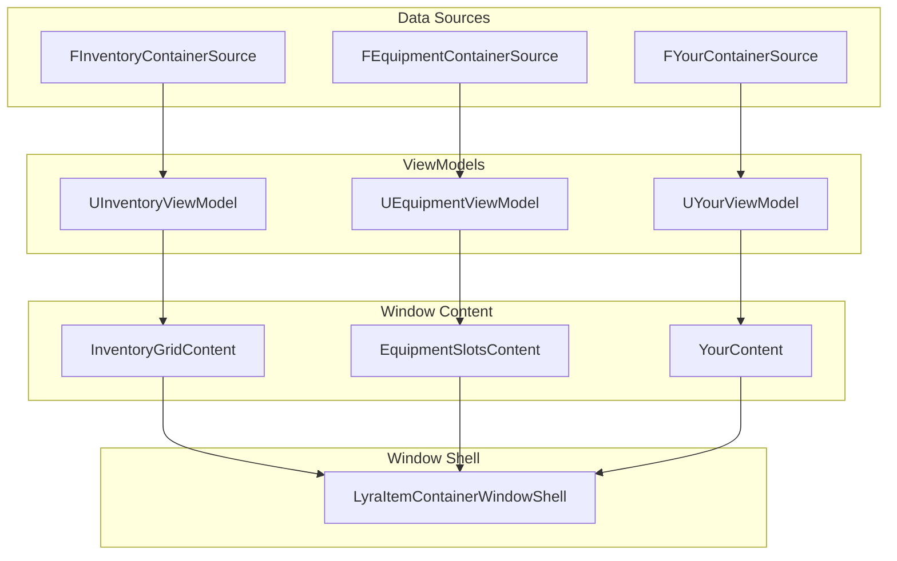

# Extension & Integration Guide

This section covers how to extend the Item Container UI system for your specific needs. Whether you're adding new container types, creating custom window layouts, or integrating with external systems, these guides will help you work within the framework's architecture.

***

### Extension Points

The Item Container UI system is designed for extensibility at multiple levels:

| Extension Point       | What You Can Do                                                           |
| --------------------- | ------------------------------------------------------------------------- |
| **Container Sources** | Define new data sources (vendors, crafting stations, vehicle inventories) |
| **ViewModels**        | Create specialized ViewModels with custom logic                           |
| **Window Content**    | Build custom layouts for displaying container contents                    |
| **Window Shells**     | Customize window chrome (title bars, borders, close behavior)             |
| **Navigation**        | Implement cross-window cursor alignment for controller support            |

***

### Quick Links

#### [Custom Container Types](custom-container-types.md)

Learn how to define new container sources and ViewModels for data types beyond standard inventories:

* Creating custom `FContainerSource` structs
* Implementing the ViewModel factory pattern
* Defining hash and owner functions for the reference system
* Examples: Vendor inventories, crafting stations, attachment grids

#### [Custom Windows](custom-windows.md)

Build specialized window layouts and chrome:

* Implementing `ILyraItemContainerWindowContentInterface`
* Multi-container windows (trade screens, comparison views)
* Custom window shells (minimal chrome, tooltips)
* Navigation support for keyboard/controller users
* Item tracking and reparenting

***

### Common Extension Scenarios

| Scenario                    | Guide                  | Key Classes                               |
| --------------------------- | ---------------------- | ----------------------------------------- |
| New inventory type (vendor) | Custom Container Types | `FContainerSource`, `UContainerViewModel` |
| Different grid layout       | Custom Windows         | Content widget implementing interface     |
| Side-by-side comparison     | Custom Windows         | Multi-source content widget               |
| Minimal tooltip window      | Custom Windows         | Custom shell subclass                     |
| Trade/exchange UI           | Custom Windows         | Composite source with two `ViewModels`    |
| Controller navigation       | Custom Windows         | Navigation interface methods              |

***

### Architecture Overview

When extending the system, keep these relationships in mind:



Key Principle: Sources create ViewModels, ViewModels provide data to Content widgets, Content widgets live inside Shells.

***

### The Window Content Interface

All content widgets must implement `ILyraItemContainerWindowContentInterface`:

```cpp
class ILyraItemContainerWindowContentInterface
{
public:
    // Receive container source, acquire ViewModel
    void SetContainerSource(const FInstancedStruct& Source);

    // Return the widget that should receive focus
    UWidget* GetFocusableContent() const;

    // Report cursor position for cross-window navigation
    bool GetCursorScreenPosition(FVector2D& OutPos) const;

    // Position cursor when receiving focus from another window
    void ReceiveNavigationEntry(FIntPoint Direction, float ScreenCoordinate);
};
```

See [The Window Content Interface](../the-windowing-system/the-window-content-interface.md) for detailed documentation.

***

### Best Practices

> [!SUCCESS]
> Use ViewModel leasing. Call `Shell->AcquireViewModelLease(Source)` for automatic cleanup when windows close.

> [!SUCCESS]
> Implement navigation methods. For full controller/keyboard support, implement all four interface methods, not just `SetContainerSource`.

> [!SUCCESS]
> Follow the polymorphic pattern. Let your container sources determine which ViewModel to create via `GetViewModelClass()`.

> [!WARNING]
> Don't bypass sessions. All windows should belong to sessions for proper lifecycle management.

> [!WARNING]
> Don't hardcode window positions. Use placement options and let the Layer handle positioning.
