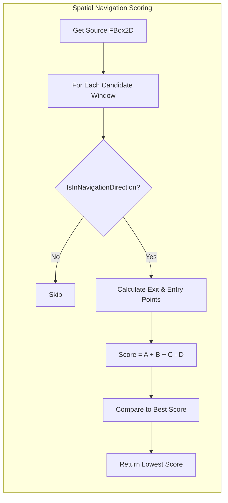

# Geometric Algorithm

At the heart of cross-window navigation is `LyraItemContainerLayer::FindWindowInDirection`. The algorithm uses **Exit/Entry Point scoring**. A geometric approach that measures the distance between where the cursor "leaves" one window and where it would "enter" each candidate, rewarding candidates that share perpendicular alignment. The result is a scoring system that "just feels right", it naturally prefers aligned, nearby windows without any magic numbers or hand-tuned thresholds.

### The Concept: Exit and Entry Points

Imagine every window has a **doorway on each edge**. When you press Right, the algorithm imagines the cursor stepping out through the source window's right-side doorway and looking for the closest doorway to step into on a neighboring window's left side. The position of each doorway is aligned with where the cursor currently sits, so if you're on row three, the exit doorway is at row three's height on the source edge, and the entry doorway is at the same height on the target edge.



**Direction Filtering (Edge-to-Edge)**

Before scoring, the algorithm filters candidates using the source and target `FBox2D` rects. The target must be **strictly beyond** the source's edge in the navigation direction:

* Moving Right: Target's left edge must be at or past the source's right edge.
* Moving Left: Target's right edge must be at or before the source's left edge.
* Moving Up: Target's bottom edge must be at or above the source's top edge.
* Moving Down: Target's top edge must be at or below the source's bottom edge.

There is no arbitrary threshold, the comparison is purely geometric, rect-to-rect. This means the cursor position does not influence which windows are considered valid; only the window boundaries matter.



**Spatial Scoring**

After filtering to valid candidates, each window is scored with four components. The window with the **lowest** score wins:

```
Score = A + B + C - D
```

* **A**: Euclidean distance from exit point to entry point (straight-line distance).
* **B**: Distance along the navigation axis (how far you have to travel).
* **C**: Distance perpendicular to the navigation axis (lateral offset).
* **D**: Overlap bonus, rewards windows that share perpendicular space with the source.

The first three components are penalties (higher = worse). The fourth is a reward (higher = better, so it is subtracted).



### The Scoring Formula

```
Score = A + B + C - D   (lower is better)
```

#### A — Euclidean Distance

The straight-line distance between the exit point on the source and the entry point on the target:

```cpp
const float A = FVector2D::Distance(ExitPoint, EntryPoint);
```

This captures the overall "closeness" of the two windows from the cursor's perspective.

#### B — Navigation Axis Distance

The distance along the direction of travel. For horizontal navigation, this is the X-axis gap; for vertical, the Y-axis gap:

```cpp
B = FMath::Abs(EntryPoint.X - ExitPoint.X);  // Horizontal navigation
B = FMath::Abs(EntryPoint.Y - ExitPoint.Y);  // Vertical navigation
```

This heavily penalizes windows that are far away in the direction you're pressing.

#### C — Perpendicular Axis Distance

The distance on the axis perpendicular to navigation. For horizontal movement, this is the Y-axis offset; for vertical, the X-axis offset:

```cpp
C = FMath::Abs(EntryPoint.Y - ExitPoint.Y);  // Horizontal navigation
C = FMath::Abs(EntryPoint.X - ExitPoint.X);  // Vertical navigation
```

This penalizes windows that are offset from the cursor's current row or column.

#### D — Overlap Bonus (Subtracted)

The perpendicular overlap between source and target windows, square-rooted for diminishing returns:

```cpp
const float D = CalculatePerpendicularOverlap(Source, Target, Direction);
```

> [!INFO]
> Why subtract D? The overlap bonus is a reward, not a penalty. A target window that shares vertical space (for horizontal navigation) with the source gets a lower score, making it more likely to be selected. This creates the "sticky lane" feelingm windows aligned in the same row are strongly preferred over windows that are offset.

The combined effect: a directly aligned window further away will beat a closer window that's significantly offset. Navigation feels predictable and spatially consistent.

***

### Exit and Entry Points

The exit and entry points are the anchor coordinates for the A, B, and C distance calculations. They represent where the cursor "leaves" the source and "arrives" at the target.

**Exit Point** — On the source window's edge facing the navigation direction. The perpendicular coordinate is clamped to the source rect so the point always sits on the window's boundary:

```cpp
// Navigating Right: exit from the right edge, Y aligned with cursor
FVector2D(Rect.Max.X, FMath::Clamp(CursorPos.Y, Rect.Min.Y, Rect.Max.Y))
```

**Entry Point** — On the target window's edge opposite to the navigation direction. Same perpendicular clamping ensures alignment:

```cpp
// Navigating Right: enter on the left edge, Y aligned with cursor
FVector2D(Rect.Min.X, FMath::Clamp(CursorPos.Y, Rect.Min.Y, Rect.Max.Y))
```

```
                       Navigating Right
              ─────────────────────────────────►

┌─────────────────────┐              ┌─────────────────────┐
│   Source Window     │              │   Target Window     │
│                     │              │                     │
│                     │              │                     │
│  [Cursor at row 3] -Exit──────Entry─►[Land here]         │
│                     │  (right      │ (left               │
│                     │   edge)      │  edge)              │
│                     │              │                     │
└─────────────────────┘              └─────────────────────┘

   Exit Point:  (Source.Max.X, CursorY)
   Entry Point: (Target.Min.X, CursorY)
```

Both points share the same Y coordinate (clamped to their respective window bounds), so the cursor maintains its vertical position across the transition.

***

### Perpendicular Overlap

`CalculatePerpendicularOverlap` measures how much two windows share along the axis perpendicular to navigation. For horizontal movement, it checks Y-axis overlap; for vertical, X-axis overlap.

```cpp
float ULyraItemContainerLayer::CalculatePerpendicularOverlap(
    const FBox2D& Source, const FBox2D& Target, EUINavigation Direction) const
{
    float OverlapStart, OverlapEnd;

    if (Direction == EUINavigation::Left || Direction == EUINavigation::Right)
    {
        // Horizontal navigation - perpendicular is Y axis
        OverlapStart = FMath::Max(Source.Min.Y, Target.Min.Y);
        OverlapEnd = FMath::Min(Source.Max.Y, Target.Max.Y);
    }
    else
    {
        // Vertical navigation - perpendicular is X axis
        OverlapStart = FMath::Max(Source.Min.X, Target.Min.X);
        OverlapEnd = FMath::Min(Source.Max.X, Target.Max.X);
    }

    const float Overlap = FMath::Max(0.0f, OverlapEnd - OverlapStart);
    return FMath::Sqrt(Overlap);  // Square root for diminishing returns
}
```

The square root provides **diminishing returns**. A window that overlaps by 100 pixels is not ten times better than one overlapping by 10 pixels, it is roughly three times better. This prevents very tall or wide windows from dominating scoring purely through size.

***

### The Implementation

```cpp
FindWindowInDirection(FromWindow, Direction, CursorScreenPos):

    SourceRect = GetWindowRect(FromWindow)
    BestTarget = none
    BestScore  = infinity

    for each CandidateWindow in ActiveWindows:
        if CandidateWindow == FromWindow: skip
        if CandidateWindow has no focusable content: skip

        TargetRect = GetWindowRect(CandidateWindow)

        // Direction filter — target must be fully past source's edge
        if not IsInNavigationDirection(SourceRect, TargetRect, Direction): skip

        // Score: A + B + C - D (lower is better)
        Score = CalculateSpatialNavigationScore(
                    SourceRect, TargetRect, CursorScreenPos, Direction)

        if Score < BestScore:
            BestScore  = Score
            BestTarget = CandidateWindow

    return BestTarget
```

### Direction Validation: Edge-to-Edge

`IsInNavigationDirection` uses `FBox2D` comparisons with no threshold. The target window must be **strictly beyond** the source's boundary:

```cpp
bool ULyraItemContainerLayer::IsInNavigationDirection(
    const FBox2D& Source, const FBox2D& Target, EUINavigation Direction) const
{
    switch (Direction)
    {
    case EUINavigation::Left:
        return Target.Max.X <= Source.Min.X;
    case EUINavigation::Right:
        return Target.Min.X >= Source.Max.X;
    case EUINavigation::Up:
        return Target.Max.Y <= Source.Min.Y;
    case EUINavigation::Down:
        return Target.Min.Y >= Source.Max.Y;
    default:
        return false;
    }
}
```

> [!WARNING]
> Overlapping windows are filtered out by design. If a window's edge falls within the source bounds, it will never pass direction validation in any direction. This is intentional, overlapping windows should be accessed via [shoulder button cycling](window-cycling.md), not directional navigation. Spatial navigation only targets windows that are fully clear of the source in the requested direction.

### Score Calculation

```cpp
float ULyraItemContainerLayer::CalculateSpatialNavigationScore(
    const FBox2D& Source, const FBox2D& Target,
    FVector2D CursorPos, EUINavigation Direction) const
{
    const FVector2D ExitPoint = GetExitPoint(Source, CursorPos, Direction);
    const FVector2D EntryPoint = GetEntryPoint(Target, CursorPos, Direction);

    // A: Euclidean distance
    const float A = FVector2D::Distance(ExitPoint, EntryPoint);

    // B and C: Axis-aligned distances
    float B, C;
    if (Direction == EUINavigation::Left || Direction == EUINavigation::Right)
    {
        B = FMath::Abs(EntryPoint.X - ExitPoint.X);  // Navigation axis
        C = FMath::Abs(EntryPoint.Y - ExitPoint.Y);  // Perpendicular axis
    }
    else
    {
        B = FMath::Abs(EntryPoint.Y - ExitPoint.Y);  // Navigation axis
        C = FMath::Abs(EntryPoint.X - ExitPoint.X);  // Perpendicular axis
    }

    // D: Overlap bonus
    const float D = CalculatePerpendicularOverlap(Source, Target, Direction);

    return A + B + C - D;
}
```

***

### Visualizing the Search



### Developer Tips for Debugging



**Check Window Geometry**

Windows must have valid cached geometry. If a window was just created, its geometry might not be available until the next frame.



**Inspect Cursor Position**

The `CursorScreenPos` used for exit/entry point calculation comes from `GetFocusedWindowCursorPosition()`, which queries the content widget's `GetCursorScreenPosition()` interface method.



**Check for Overlapping Windows**

If navigation seems to skip a window, check whether it overlaps the source window. `IsInNavigationDirection` uses `<=` / `>=` comparisons, so windows that share exactly one edge point (touching but not overlapping) are still considered valid targets. Windows that overlap by even one pixel are filtered out.



**Understand the Score Components**

If navigation picks an unexpected target, log the A, B, C, and D values for each candidate. A high C value means the target is offset from the cursor's lane. A low D value means little perpendicular overlap. The Euclidean component A acts as a tiebreaker when B and C are similar.



By using geometric scoring with `FBox2D` rects rather than hardcoded links or thresholds, the navigation system remains robust even when you dynamically move or resize windows at runtime. Drag a window to a new position, and navigation automatically adapts.
