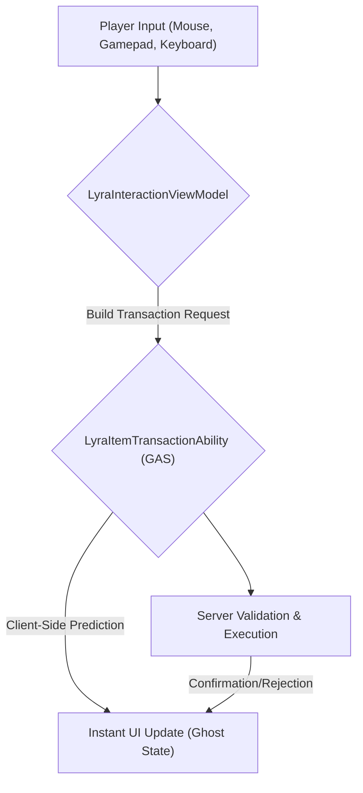

# Interaction & Transactions

This is where the rubber meets the road. All the architectural setup, manager logic, and data translation culminates here: **when the player wants to&#x20;**_**do something**_**&#x20;with an item.**

Interacting with items in a networked, flexible UI is arguably the most complex part of the system. It requires:

1. **Unified Input:** Supporting mouse, gamepad, and keyboard with the same underlying logic.
2. **Network Prediction:** Making the UI feel instant even with latency.
3. **Server Authority:** Ensuring all actions are validated and executed securely on the server.
4. **Polymorphic Handling:** Moving items between _any_ type of container.

This section delves into the intricate dance between your UI inputs, client-side prediction, and server-authoritative gameplay abilities.

***

## The Interaction Pipeline: UI to Gameplay

At its core, any item interaction, whether it's dragging a sword to an equipment slot or right-clicking to split a stack of ammo, follows a predictable path:




1. **Input Unification:** All player actions are normalized by the `LyraInteractionViewModel`. It doesn't care if you clicked, dragged, or pressed a hotkey, it processes a generic "I want to move this item to that slot" request.
2. **Transaction Request:** The `LyraInteractionViewModel` constructs a flexible `FItemTransactionRequest` containing one or more atomic operations (e.g., "Remove from here," "Add to there").
3. **GAS Execution:** This request is sent via a Gameplay Event to the `LyraItemTransactionAbility`. This ability is `LocalPredicted`, meaning the client runs it immediately _and_ sends it to the server.
4. **Client-Side Prediction:** The UI immediately updates to reflect the predicted outcome, often showing items in a "Ghost" state.
5. **Server Authority:** The server receives the request, re-validates _everything_, and then executes the transaction authoritatively.
6. **Reconciliation:** The server's replicated state either confirms the client's prediction (the "Ghost" becomes real) or rejects it (the UI rolls back).

> [!INFO]
> You can read the [Item Container Prediction](../../../item-container/prediction/) in more detail.

***

## Core Components

#### 1. The Interaction Engine (`LyraInteractionViewModel`)

This is the central hub for all UI-driven item interactions. It manages the current drag state, validates potential drops, and orchestrates the creation of transaction requests.

#### 2. The Transaction Ability (`LyraItemTransactionAbility`)

The backbone of server-authoritative, predicted item manipulation. This GAS ability receives generic transaction requests and executes them atomically across any `ILyraItemContainerInterface` implementation. It also handles the complex logic of client-side rollback and server reconciliation.

#### 3. Contextual UI Elements

* **Action Menu (`LyraItemActionMenuViewModel`):** The "right-click" menu. It dynamically populates available actions for an item based on its type and context (e.g., "Use," "Drop," "Equip").
* **Quantity Prompt (`LyraQuantityPromptViewModel`):** For operations that require user input (like splitting a stack). It provides a generic modal for quantity selection.

***

## Rejection Feedback

Transactions report back via the `Lyra.Item.Message.TransactionResult` gameplay message. The payload is an `FItemTransactionResultMessage` carrying a player-facing `FText ErrorMessage` and a structured `FGameplayTag RejectReason` drawn from the `Lyra.Item.Reject.*` hierarchy. Widgets listen directly for the scope they care about; no shared listener class is needed.

The tag hierarchy and emission flow are documented in the backend [Transaction Validation](../../../item-container/transactions/transaction-validation.md) page.

### Default pattern: show the message

The simplest response is to display the player-facing text whenever a rejection arrives. `ErrorMessage` is already written for the player, and dev-camp rejections fall back to a generic "Action couldn't complete" string, safe to show in every case.

```cpp
void UMyInventoryWidget::NativeConstruct()
{
    Super::NativeConstruct();

    UGameplayMessageSubsystem::Get(this).RegisterListener<FItemTransactionResultMessage>(
        TAG_Lyra_Item_Message_TransactionResult,
        [WeakSelf = TWeakObjectPtr<UMyInventoryWidget>(this)]
        (FGameplayTag, const FItemTransactionResultMessage& Msg)
        {
            if (UMyInventoryWidget* Self = WeakSelf.Get();
                Self && Msg.Result != EItemTransactionResult::Success && !Msg.ErrorMessage.IsEmpty())
            {
                Self->ShowToast(Msg.ErrorMessage);
            }
        });
}
```

### Branching on RejectReason

For richer UX, match on parent tags from the hierarchy. This keeps per-widget logic scoped to the categories the widget is responsible for, a crafting widget watches `Lyra.Item.Reject.Craft.*`; a tetris grid watches `Lyra.Item.Reject.Layout.*`; a permissions toast watches `Lyra.Item.Reject.Permission.*`. Widgets ignore tags outside their concern.

```cpp
static const FGameplayTag TAG_RejectLayout =
    FGameplayTag::RequestGameplayTag(TEXT("Lyra.Item.Reject.Layout"));
static const FGameplayTag TAG_RejectPermission =
    FGameplayTag::RequestGameplayTag(TEXT("Lyra.Item.Reject.Permission"));

if (Msg.RejectReason.MatchesTag(TAG_RejectLayout))
{
    ShakeTargetCell();
}
else if (Msg.RejectReason.MatchesTag(TAG_RejectPermission))
{
    PlayDeniedSound();
}
```

`MatchesTag` returns true for any leaf under the parent, so matching on `Lyra.Item.Reject.Layout` catches `Layout.CellOccupied`, `Layout.OutOfBounds`, `Layout.InvalidSlot`, and any future additions.

### Scope per widget, not a shared dispatcher

Each widget subscribes for the categories it owns. There is deliberately no central dispatcher class, because rejection categories live in different modules: `Layout`, `Shape`, `Nesting`, and `Craft` are declared by the Tetris plugin, while `Permission`, `Container`, `Stack`, and `Capacity` live in base. A plugin introducing a new category declares its tags under `Lyra.Item.Reject.*` and any widget interested in that scope subscribes directly, base UI stays unaware.

### Blueprint listeners

`FItemTransactionResultMessage` is a `BlueprintType`, so Blueprints register for the same channel via the **Listen For Gameplay Messages** node. The struct exposes `Result`, `ErrorMessage`, `RejectReason`, `ClientRequestId`, and `Instigator` as `BlueprintReadOnly`, and `RejectReason` is a regular `FGameplayTag`

***

## In This Section

We will break down the intricate details of each part of this pipeline:

* [**The Interaction Engine**](the-interaction-engine/)
  * How `LyraInteractionViewModel` unifies mouse, gamepad, and keyboard input.
  * Managing drag visuals and drop validation.
* [**UI Transaction Pipeline**](ui-transaction-pipeline.md)
  * Deep dive into `ULyraItemTransactionAbility`.
  * The structure of `FItemTransactionRequest` and atomic operations.
  * The prediction recording and rollback mechanism.
* [**Contextual UI (Actions & Prompts)**](context-menus-and-action-logic.md)
  * How `LyraItemActionMenuViewModel` discovers and filters actions.
  * The `LyraQuantityPromptViewModel` for user input.
