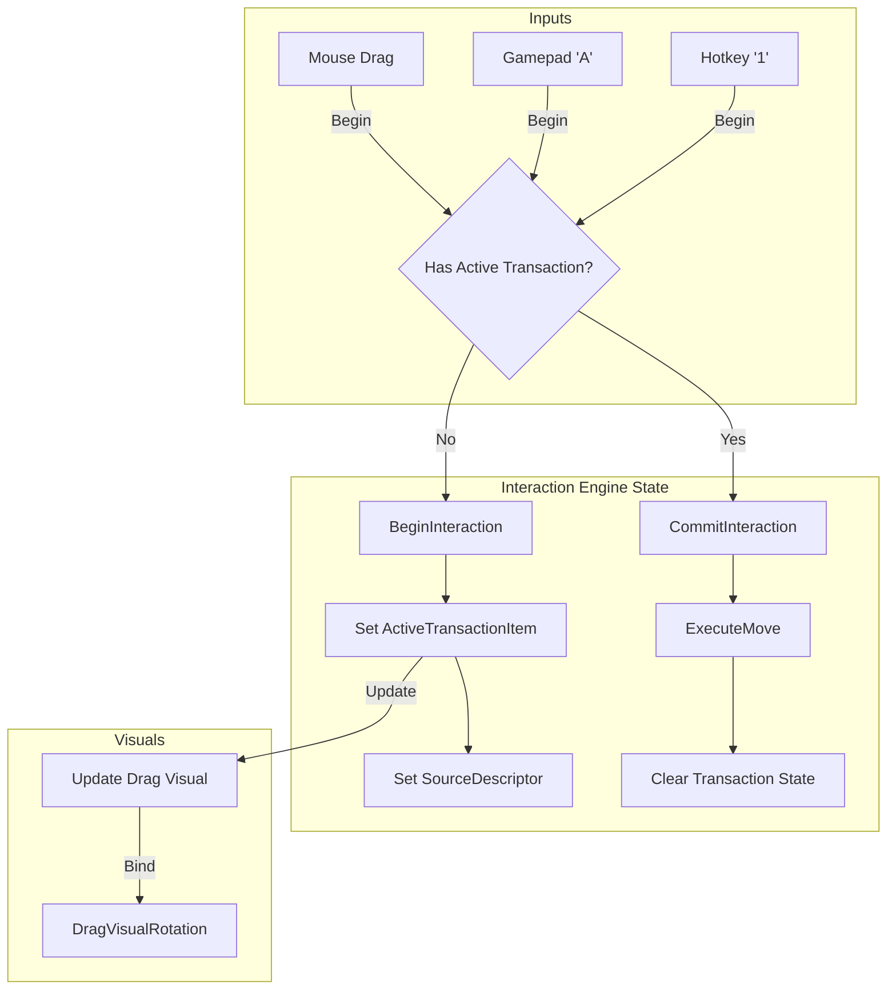
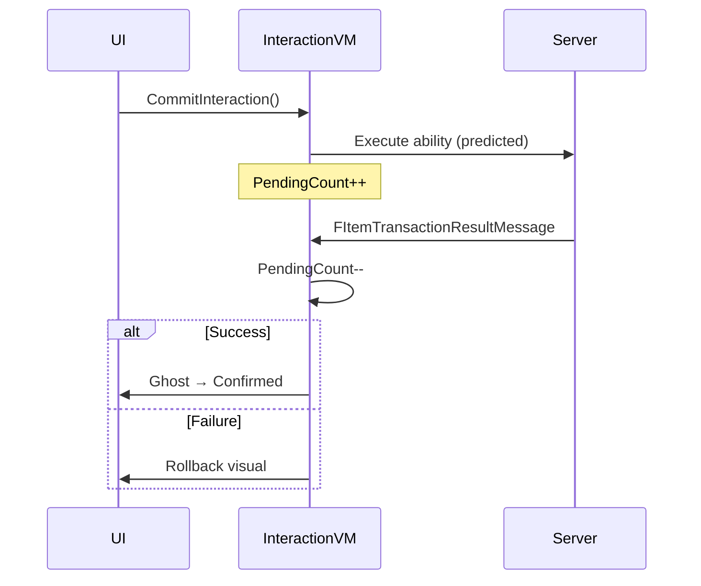

# The Interaction Engine

The `LyraInteractionViewModel` acts as the single point of entry for all UI-driven inventory interactions. Whether a player is dragging an item with a mouse, selecting it with a gamepad cursor, or using a keyboard shortcut, this class normalizes the intent into a standardized request.

### Why One Interaction ViewModel?

Without a unified system:

```cpp
// BAD: Each container handles its own drag logic
InventoryPanel->OnDragStart = [](Item) { ... };
EquipmentPanel->OnDragStart = [](Item) { ... };
AttachmentPanel->OnDragStart = [](Item) { ... };
// Now cross-container drag needs coordination...
```

With `InteractionViewModel`:

```cpp
// GOOD: One system handles all interactions
InteractionVM->BeginInteraction(Item, SourceSlot);
// ...later...
InteractionVM->CommitInteraction(DestinationSlot);
// Works across any container type
```

### Getting the Interaction ViewModel

It is a Shared ViewModel managed by the `LyraItemContainerUIManager`, meaning there is one instance per local player, accessible from any widget.

```cpp
ULyraInteractionViewModel* InteractionVM = UIManager->GetInteractionViewModel();
```

> [!INFO]
> **Why shared?** Because drag operations cross window boundaries. Dragging from inventory window to equipment window needs a single source of truth about the current transaction.

### The Unified Input Model

A key challenge in UI development is supporting multiple input devices. Mouse users expect Drag & Drop. Gamepad users expect "Click to Pickup, Click to Place."

The Interaction Engine unifies this by tracking a central **Transaction State**.

```cpp
UCLASS(BlueprintType)
class LYRAGAME_API ULyraInteractionViewModel : public ULyraItemContainerViewModelBase
{
public:
    // The "Active" item being manipulated (Dragged or Held)
    UPROPERTY(BlueprintReadOnly, FieldNotify)
    TObjectPtr<ULyraItemViewModel> ActiveTransactionItem;

    // Is the player currently holding something?
    UPROPERTY(BlueprintReadOnly, FieldNotify)
    bool bIsActiveTransaction = false;

    // ...
};
```

* **Mouse Drag:** Calls `BeginInteraction` on Drag Start and `CommitInteraction` on Drop.
* **Gamepad:** Calls `BeginInteraction` on first button press ("Pickup"). The UI shows the item attached to the cursor. Calls `CommitInteraction` on second button press ("Place").

Because both methods modify the _same_ `ActiveTransactionItem` property, you can even mix inputs seamlessly (e.g., pick up with mouse, navigate with gamepad, place with mouse).



***

### Modal Overlays

The Interaction ViewModel manages modal states with regards to interacting with systems:

```cpp
// Show a modal
void ShowModalOverlay(UWidget* ModalWidget);

// Close current modal
void CloseModalOverlay();
```

#### Modal State Properties

| Property            | Type       | Description         |
| ------------------- | ---------- | ------------------- |
| `bIsModalActive`    | `bool`     | Is a modal showing? |
| `ActiveModalWidget` | `UWidget*` | The current modal   |

#### Common Modals

* **Item Action Menu -** List of actions that can be performed on the item.
* **Quantity prompt** — How many items to move/drop?
* **Confirmation** — Are you sure you want to destroy?
* **Split prompt** — Divide stack into two

***

### Drag & Drop Flow

#### 1. Begin Drag

```cpp
void BeginInteraction(
    ULyraItemViewModel* Item,
    const FInstancedStruct& SourceDescriptor,
    FVector2D DragClickOffset = FVector2D::ZeroVector
);
```

**What happens:**

* Transaction marked active
* Item stored as `ActiveTransactionItem`
* Source slot recorded
* `OnTransactionStarted` fires

#### 2. During Drag

```cpp
// Update drag visual position
void UpdateDragPosition(FVector2D ScreenPosition);

// Check if we can drop here
bool CanPlaceAt(const FInstancedStruct& DestinationDescriptor);
```

**Drag visual properties:**

| Property             | Type        | Description                |
| -------------------- | ----------- | -------------------------- |
| `DragVisualRotation` | `float`     | Rotation for drag visual   |
| `DragVisualOffset`   | `FVector2D` | Position offset            |
| `DragVisualPivot`    | `FVector2D` | Rotation pivot point       |
| `DragClickOffset`    | `FVector2D` | Where user clicked on item |

#### 3. Commit or Cancel

```cpp
// Drop the item
void CommitInteraction(const FInstancedStruct& DestinationDescriptor);

// Cancel the drag
void CancelInteraction();
```

**On Commit:**

1. Validates destination via `CanPlaceAt()`
2. Executes move ability (with prediction)
3. Transaction ends
4. `OnTransactionCompleted` fires

**On Cancel:**

1. Transaction ends
2. No ability executed
3. `OnTransactionCancelled` fires

***

### Complete Drag Example

```cpp
// 1. User starts dragging item from inventory slot 5
InteractionVM->BeginInteraction(
    ItemAtSlot5,
    FInstancedStruct::Make(FInventorySlotDescriptor{InventoryComp, 5}),
    ClickOffset
);

// 2. User drags over equipment primary slot
bool CanDrop = InteractionVM->CanPlaceAt(
    FInstancedStruct::Make(FEquipmentSlotDescriptor{EquipmentComp, TAG_Equipment_Primary})
);
// Returns true if item can equip there

// 3. User releases over equipment slot
InteractionVM->CommitInteraction(
    FInstancedStruct::Make(FEquipmentSlotDescriptor{EquipmentComp, TAG_Equipment_Primary})
);
// Item moves from Inventory[5] to Equipment.Primary
```

***

### Direct Moves (No Drag Visual)

For keyboard-based operations, you can move items directly:

```cpp
// Move without drag visualization
void ExecuteMoveDirect(
    const FInstancedStruct& SourceDescriptor,
    const FInstancedStruct& DestinationDescriptor,
    int32 Amount = -1  // -1 = entire stack
);

// Check if move is valid
bool CanMoveBetween(
    const FInstancedStruct& Source,
    const FInstancedStruct& Destination
);
```

**Use cases:**

* Keyboard shortcut "equip" (move focused item to equipment)
* Quick transfer (Ctrl+Click to move to other container)
* Sort operations

***

### Pending Operations

After committing an interaction, the operation may be pending server confirmation:

```cpp
// Check if operations are pending
bool HasPendingOperation();
int32 GetPendingOperationCount();

// Get current transaction ID (for correlation)
FGuid GetCurrentTransactionId();
```

#### Transaction Result Handling

The system listens to `FItemTransactionResultMessage` from the server:



***

### Events Summary

| Event                    | Signature                  | When               |
| ------------------------ | -------------------------- | ------------------ |
| `OnTransactionStarted`   | `void(Item, Source)`       | Drag begins        |
| `OnTransactionCompleted` | `void(Item, Source, Dest)` | Drop succeeds      |
| `OnTransactionCancelled` | `void(Item)`               | Drag cancelled     |
| `OnStackSplitRequested`  | `void(Item, Max)`          | Split modal needed |
| `OnModalOpened`          | `void(Widget)`             | Modal shown        |
| `OnModalClosed`          | `void()`                   | Modal dismissed    |

***

### Polymorphic Slot Descriptors

The `FInstancedStruct` parameter for source/destination supports any slot type:

| Struct                      | For                           |
| --------------------------- | ----------------------------- |
| `FInventorySlotDescriptor`  | Inventory slots (index-based) |
| `FEquipmentSlotDescriptor`  | Equipment slots (tag-based)   |
| `FAttachmentSlotDescriptor` | Attachment slots (path-based) |
| `FNullSourceSlot`           | Dropping to world             |
| `FCustomSlotDescriptor`     | Your custom containers        |

This polymorphism means the Interaction ViewModel works with any container type without modification.

***
