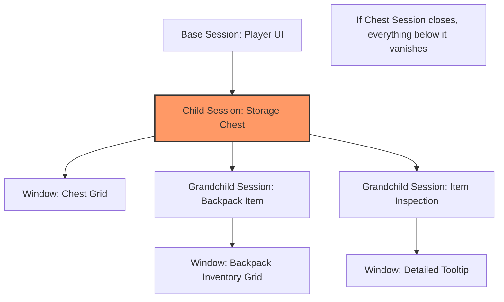

# Session Management

Windows in an inventory system are rarely independent. They exist in logical groups.

* When you open your Inventory, you often want to see your Equipment too.
* When you open a Chest, you want it to close if you walk too far away.
* When you inspect an Item, that inspection window is logically "child" to the container the item is in.

The **Session System** models these relationships as a tree structure.

### The Session Structure

A session is defined by its `Handle`, its `ParentSession`, and arrays of its `Windows` and `ChildSessions`. It also carries a `SourceContext` (`FInstancedStruct`), which preserves the data that originally triggered the session's creation.

```cpp
USTRUCT(BlueprintType)
struct FItemWindowSession
{
    FItemWindowSessionHandle Handle;       // Unique ID
    FItemWindowSessionHandle ParentSession; // Pointer to owner
    TArray<FItemWindowHandle> Windows;      // Windows in this group
    TArray<FItemWindowSessionHandle> ChildSessions; // Sub-groups
    FInstancedStruct SourceContext;         // The "Why" behind this session
};
```

### The Parent-Child Lifecycle

The primary benefit of the session system is **Cascading Logic**. When a session is closed, the system recursively traverses its children to ensure no "orphan" windows are left on the screen.

**Cascading Closure Logic:**

1. **Direct Request:** A session is told to close (e.g., the player walks too far from a chest).
2. **Recursive Search:** The manager identifies all `ChildSessions` belonging to that session.
3. **Recursive Closure:** Every child session is closed first.
4. **Window Disposal:** Every `FItemWindowHandle` registered to these sessions is sent a close request to the UI Layer.
5. **Data Cleanup:** Once all windows are removed, the UIManager releases the associated ViewModel leases.

### The Hierarchy

Every window belongs to a **Session** (`FItemWindowSession`).

#### 1. The Base Session

This represents the player's persistent UI state.

* **Created:** When the inventory layer (`LyraItemContainerLayer`) is activated.
* **Content:** Player Inventory, Equipment, Currency.
* **Lifetime:** Exists as long as the inventory screen is open.

#### 2. Child Sessions

These represent temporary, context-dependent UI.

* **Example:** A Loot Chest.
* **Parent:** The Base Session (or another child).
* **Source Context:** The Chest Actor or Component.

If the Base Session closes (e.g., player closes inventory), the Chest window must also close.

#### 3. Nested Sessions (Grandchildren)

* **Example:** Right-clicking an item in the Chest to "Inspect" it.
* **Parent:** The Chest Session.
* **Source Context:** The Item Instance.

If the Chest window closes (e.g., player walks away), the Inspection window must also close.



### Session Lifecycle

The `UIManager` maintains a map of all active sessions: `TMap<FGuid, FItemWindowSession>`.

#### Creating a Session

You typically create a session when opening a new root window (like a Chest).

```cpp
// 1. Define the source context (The Chest's Inventory using FInventoryContainrSouce)
FInstancedStruct ChestSource = ...;

// 2. Create the session attached to the Base Session
FItemWindowSessionHandle ChestSession = UIManager->CreateChildSession(
    SessionTags::Chest,
    ChestSource,
    UIManager->GetBaseSession()
);

// 3. Open the window inside this session
WindowSpec.SessionHandle = ChestSession;
UIManager->RequestOpenWindow(WindowSpec);
```

#### Closing a Session (`CloseSession`)

When a session is closed, the Manager performs a **Cascade Closure**:

1. **Recursion:** It finds all `ChildSessions` of the target session and calls `CloseSession` on them first.
2. **Window Cleanup:** It iterates all `Windows` registered to the session and broadcasts `OnWindowCloseRequested`.
3. **Data Cleanup:** It removes the session from the registry.

This ensures that closing a parent "cleanly" removes the entire branch of the UI tree.

### Dynamic Reparenting

The most complex part of session management is handling items moving between containers.

**Scenario:**

1. Player opens a Backpack (Session A).
2. Player inspects an Item inside the Backpack (Window B, linked to Session A).
3. Player drags the Backpack into a Chest.

The Backpack is no longer in the player's inventory; it is now inside the Chest. The "path" to the data has changed.

The UI Manager handles this via `HandleItemReparenting`:

1. It listens for `Lyra.Item.Message.ItemMoved`.
2. It checks if any open windows are tracking that Item ID.
3. It finds the _new_ parent container (The Chest).
4. It **Reparents** the session: The Backpack Session is now a child of the Chest Session.

If the Chest is closed later, the Backpack (and its inspection window) will correctly close with it.

***

### Session Best Practices

> [!SUCCESS]
> **Always use sessions** for external containers. Never open a chest window in the base session, it should close when the player walks away.

> [!SUCCESS]
> **Track items** when inspecting them. If a player is looking at a gun's attachments and sells the gun, the window should close automatically.

> [!WARNING]
> **Don't close parent sessions prematurely.** If you close the base session while a chest session is active, the chest session closes too (which is usually correct, but be aware).
