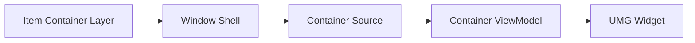

# Minimum Path

This page is the smallest mental model needed to display a container in UI.

You do not need to understand dynamic reparenting, close reasons, startup windows, or geometric navigation to make a basic inventory panel work.

## The Pipeline



## Windowed Inventory

Use this path when your inventory is shown inside a draggable window.

<!-- gb-stepper:start -->
<!-- gb-step:start -->
#### Create the window host widget

Create a widget Blueprint derived from `ULyraItemContainerWindowHost`.
<!-- gb-step:end -->

<!-- gb-step:start -->
#### Bind the window canvas

Bind a `WindowCanvas` panel in that Blueprint.
<!-- gb-step:end -->

<!-- gb-step:start -->
#### Add content widget classes

Add your inventory window tag and content widget to the host's `ContentWidgetClasses` array (or override `GetContentWidgetClassForWindowType` for dynamic selection).
<!-- gb-step:end -->

<!-- gb-step:start -->
#### Implement the content interface

Your content widget implements `ILyraItemContainerWindowContentInterface`.
<!-- gb-step:end -->

<!-- gb-step:start -->
#### Resolve the ViewModel in `SetContainerSource`

In `SetContainerSource`, call:

```cpp
ULyraItemContainerWindowShell* Shell =
    ULyraItemContainerWindowShell::GetOwningWindowShell(this);

ULyraInventoryViewModel* InventoryVM = Cast<ULyraInventoryViewModel>(
    Shell ? Shell->GetOrCreateViewModel(Source) : nullptr);
```
<!-- gb-step:end -->

<!-- gb-step:start -->
#### Bind widgets to the ViewModel

Bind your list, tile, or item widgets to the returned ViewModel.
<!-- gb-step:end -->
<!-- gb-stepper:end -->

## Static Inventory Screen

Use this path when your game has one inventory screen and no draggable windows.

Ask the UI manager for the ViewModel under the base session:

```cpp
ULyraItemContainerUIManager* UIManager =
    GetOwningLocalPlayer()->GetSubsystem<ULyraItemContainerUIManager>();

ULyraInventoryViewModel* InventoryVM = Cast<ULyraInventoryViewModel>(
    UIManager->GetOrCreateViewModelForSession(
        FInstancedStruct::Make(Source),
        UIManager->GetBaseSession()));
```

For widgets with their own open/close lifetime, create a child session on construct and close that session on destruct. Do not manually release ViewModels; they are owned by sessions.

## What Is Optional

These systems are powerful but not required for a simple inventory panel:

* Window sessions beyond the base session.
* Startup windows.
* Dynamic window reparenting.
* Cross-window spatial navigation.
* Custom container sources.
* Tetris placement logic.
