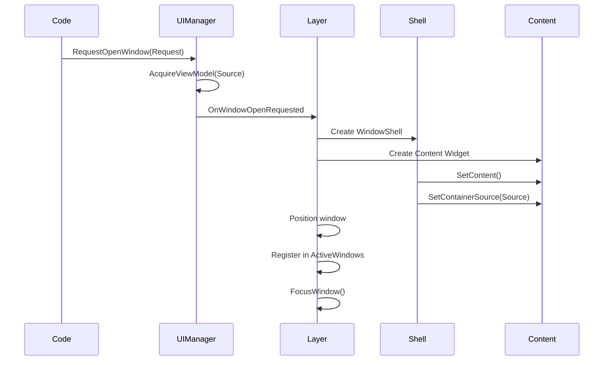
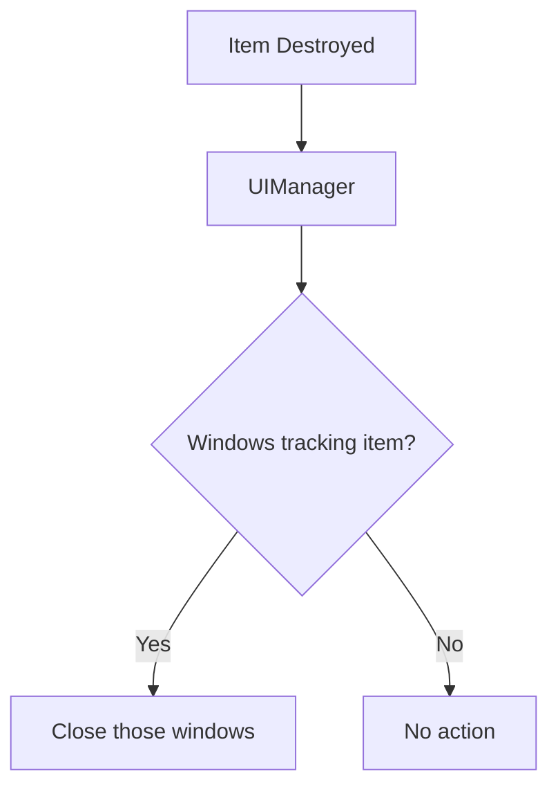
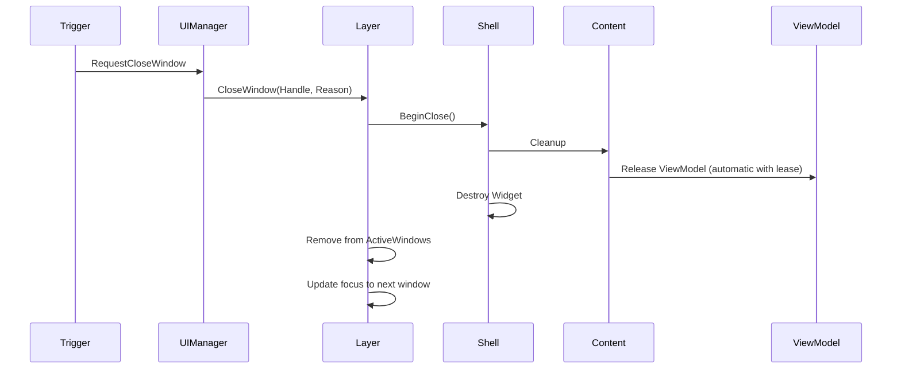
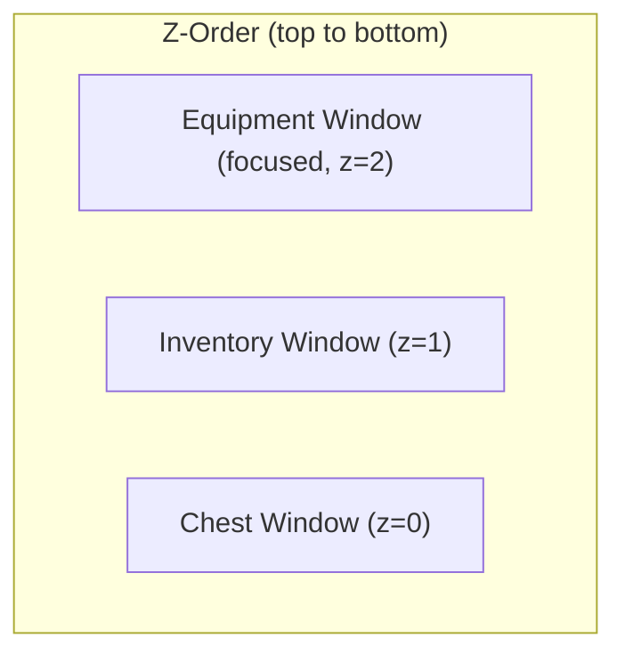

# Window Lifecycle

Windows are the containers for your item container UI. They can be opened, closed, dragged, focused, and layered. This page explains how windows are created, managed, and destroyed.

***

### Opening Windows

#### The Request Pattern

Windows are opened via requests to the UI Manager:

```cpp
FLyraWindowOpenRequest Request;
Request.WindowType = MyWindowTypeTag;           // Identifies content widget class
Request.SourceDesc = ContainerSource;           // The container to display
Request.SessionHandle = ParentSessionHandle;    // Which session owns this window
Request.Placement = EWindowPlacement::Automatic;

UIManager->RequestOpenWindow(Request);
```

#### Window Placement Options

| Placement          | Behavior                                 |
| ------------------ | ---------------------------------------- |
| `Automatic`        | System chooses position (avoids overlap) |
| `CenterScreen`     | Centered on screen                       |
| `RelativeToSource` | Near the triggering UI element           |
| `Explicit`         | Uses `Request.ExplicitPosition`          |
| `Cascade`          | Offset from previous window              |

#### What Happens on Open



#### Content Widget Interface

Content widgets must implement `ILyraItemContainerWindowContentInterface`:

```cpp
class ILyraItemContainerWindowContentInterface
{
    // Called to set the container source - acquire ViewModel here
    virtual void SetContainerSource(const FInstancedStruct& Source) = 0;

    // Return the widget that should receive focus
    virtual UWidget* GetFocusableContent() const = 0;

    // Return current cursor position for cross-window navigation
    virtual bool GetCursorScreenPosition(FVector2D& OutPos) const = 0;

    // Position cursor when receiving focus from another window
    virtual void ReceiveNavigationEntry(FIntPoint Direction, float ScreenCoordinate) = 0;
};
```

See [The Window Content Interface](the-window-content-interface.md) for details.

***

### Closing Windows

Windows can close in several ways:

#### Manual Close

```cpp
// User clicks close button
WindowShell->RequestClose();

// Or programmatically
UIManager->RequestCloseWindow(WindowHandle);
```

#### Session Close

When a session closes, all windows in that session close:

```cpp
// Close an entire session
UIManager->CloseSession(SessionHandle);
// All windows registered to this session are destroyed
```

#### Automatic Close (Lifecycle Events)

The UI Manager monitors lifecycle events and closes windows automatically:

| Event                        | Result                           |
| ---------------------------- | -------------------------------- |
| **Item destroyed**           | Windows tracking that item close |
| **Item moved**               | Windows may reparent or close    |
| **Container access revoked** | Windows for that container close |
| **Player moves away**        | External container windows close |



#### Close Sequence



***

### Focus and Z-Order

#### Focus Management

Only one window has focus at a time. The focused window:

* Receives keyboard/controller input
* Appears on top (highest z-order)
* Shows focus visuals

```cpp
// Bring window to front and focus
Layer->FocusWindow(WindowHandle);

// Get currently focused window
FItemWindowHandle Focused = Layer->GetFocusedWindow();

// Get windows in focus order (oldest to newest)
TArray<FItemWindowHandle> Windows = Layer->GetWindowsByFocusOrder();
```

#### Z-Order

The Layer tracks when each window was last focused and uses this for z-order:

```cpp
// Each window has a timestamp for when it was last focused
TMap<FGuid, double> WindowFocusTimes;
```

Windows stack based on **last focus time**, most recently focused on top:



When a window is focused, the Layer:



#### Update focus timestamp

The window's focus timestamp is updated.



#### Recalculate z-order

Z-order is recalculated for all windows based on focus times.



#### Update Canvas ZOrder

The `UCanvasPanelSlot::ZOrder` for each window is updated.



#### Request content focus

`Shell->RequestContentFocus()` is called to focus the window's content.



***

### Window Dragging

Windows can be dragged by their title bar:

#### Drag Constraints

| Constraint          | Description                           |
| ------------------- | ------------------------------------- |
| **Screen bounds**   | Window can't be dragged off screen    |
| **Minimum visible** | At least N pixels must remain visible |
| **Snap to edge**    | Optional snapping to screen edges     |

#### Drag Operations

The Layer handles window drag operations:

```cpp
// Called by Shell when drag starts
Layer->BeginWindowDrag(WindowHandle, StartPosition);

// Called during drag
Layer->UpdateWindowDrag(CurrentPosition);

// Called when drag ends
Layer->EndWindowDrag();
```

During dragging:

* The dragged window is brought to front
* Position is clamped to canvas bounds
* Coordinates are translated between screen and canvas local space

***

### Opening Windows Example

<!-- tabs:start -->
#### **Blueprints**


#### **C++**
```cpp
void UMyGameplayCode::OpenInventoryWindow()
{
    ULyraItemContainerUIManager* UIManager =
        ULocalPlayer::GetSubsystem<ULyraItemContainerUIManager>(GetLocalPlayer());

    FInventoryContainerSource Source;
    Source.InventoryComponent = PlayerInventoryComponent;

    FLyraWindowOpenRequest Request;
    Request.WindowType = TAG_UI_Window_Inventory;
    Request.SourceDesc = FInstancedStruct::Make(Source);
    Request.SessionHandle = UIManager->GetOrCreateBaseSession();

    UIManager->RequestOpenWindow(Request);
}
```

<!-- tabs:end -->

***

### Window Types (GameplayTags)

Window types are identified by `GameplayTags`, this will be discussed in more detail in the [Item Container Layer](/broken/pages/3abc32b6a7989ab09aac6dda0a7f3992dc39bbbc):

```cpp
// In your GameplayTags file
UE_DEFINE_GAMEPLAY_TAG(TAG_UI_Window_Inventory, "UI.Window.Inventory");
UE_DEFINE_GAMEPLAY_TAG(TAG_UI_Window_Equipment, "UI.Window.Equipment");
UE_DEFINE_GAMEPLAY_TAG(TAG_UI_Window_Container, "UI.Window.Container");
UE_DEFINE_GAMEPLAY_TAG(TAG_UI_Window_Attachment, "UI.Window.Attachment");
```

The Layer maps tags to content widget classes:

```cpp
// Configuration in Layer or Data Asset
TMap<FGameplayTag, TSubclassOf<UUserWidget>> WindowTypeToContentClass;
```
