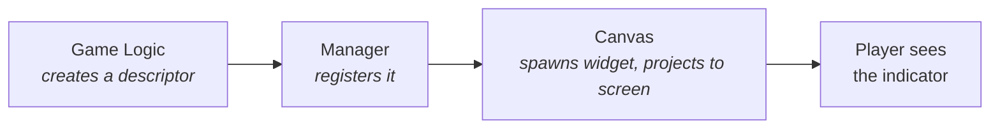

# Lyra Indicator System

The UI Indicator System in Lyra is a foundational framework for providing players with clear, contextual visual cues about important game elements. Its primary function is to display dynamic UI elements (indicators) that can track actors, components, or specific points in the game world, projecting their location onto the player's screen. This is crucial for maintaining player awareness, especially for elements that might be off-screen or require special emphasis, such as distant objectives, incoming threats, or interactive items.

## How It Works

The system has four layers, each with a single job:

| Layer          | Class                                        | Job                                                                                    |
| -------------- | -------------------------------------------- | -------------------------------------------------------------------------------------- |
| **Data**       | `UIndicatorDescriptor`                       | Describes one indicator, what it tracks, how to project it, which widget to display    |
| **Management** | `ULyraIndicatorManagerComponent`             | Registry on the player controller, tracks all active descriptors                       |
| **Rendering**  | `SActorCanvas` (hosted by `UIndicatorLayer`) | Spawns/pools widgets, projects 3D→2D, handles clamping and arrows, arranges and paints |
| **Projection** | `FIndicatorProjection`                       | Pure math, converts a 3D world position to 2D screen coordinates                       |

The **widget** itself (a UMG `UUserWidget` implementing `IIndicatorWidgetInterface`) is what the player actually sees. It receives bind/unbind calls and notifications about clamping and display mode changes, but has no knowledge of the projection pipeline.

## Documentation Guide

| Page                                                                    | What You'll Learn                                                  |
| ----------------------------------------------------------------------- | ------------------------------------------------------------------ |
| [Core Concepts & Architecture](core-concepts-and-architecture.md)       | The full lifecycle from registration to rendering, with diagrams   |
| [Component Deep Dive](component-deep-dive.md)                           | What each class does and the properties you'll configure           |
| [Customization & Advanced Topics](customization-and-advanced-topics.md) | Extending descriptors, custom projection modes, performance tuning |
