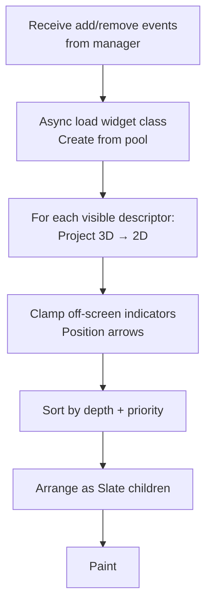

# Component Deep Dive

The previous page showed the lifecycle, registration, projection, rendering. This page covers what each component actually exposes and how to configure it.

***

## `UIndicatorDescriptor` — The Data Hub

The descriptor is a `UObject` that holds everything the system needs to display one indicator. You configure it when creating the indicator, and the rendering pipeline reads from it every frame.

### Targeting

| Property              | Type               | Purpose                                                |
| --------------------- | ------------------ | ------------------------------------------------------ |
| `Component`           | `USceneComponent*` | The scene component in the world this indicator tracks |
| `ComponentSocketName` | `FName`            | Optional socket on the component for precise tracking  |

### Visuals

| Property               | Type                          | Purpose                                                               |
| ---------------------- | ----------------------------- | --------------------------------------------------------------------- |
| `IndicatorWidgetClass` | `TSoftClassPtr<UUserWidget>`  | The UMG widget class to instantiate (soft ref, async loaded)          |
| `IndicatorWidget`      | `TWeakObjectPtr<UUserWidget>` | The live widget instance (populated by `SActorCanvas` after creation) |

### Projection & Positioning

The descriptor controls how the 3D target maps to 2D screen space.

| Property                    | Type                                          | Purpose                                                               |
| --------------------------- | --------------------------------------------- | --------------------------------------------------------------------- |
| `ProjectionMode`            | `EActorCanvasProjectionMode`                  | How to calculate the screen position (see table below)                |
| `WorldPositionOffset`       | `FVector`                                     | 3D offset applied to the target _before_ projection                   |
| `ScreenSpaceOffset`         | `FVector2D`                                   | 2D offset applied _after_ projection                                  |
| `HAlignment` / `VAlignment` | `EHorizontalAlignment` / `EVerticalAlignment` | How the widget aligns relative to its projected point                 |
| `BoundingBoxAnchor`         | `FVector`                                     | Normalized (0–1) anchor within bounding box for bbox projection modes |

### **Projection modes:**

| Mode                         | Behavior                                                                            |
| ---------------------------- | ----------------------------------------------------------------------------------- |
| `ComponentPoint`             | Projects the component's world location (+ offset). Simplest and fastest.           |
| `ComponentBoundingBox`       | Projects a point within the component's 3D bounding box (using `BoundingBoxAnchor`) |
| `ActorBoundingBox`           | Same as above but uses the owning actor's bounds                                    |
| `ComponentScreenBoundingBox` | Projects the component's 3D bbox to 2D, then finds a point within the 2D rect       |
| `ActorScreenBoundingBox`     | Same as above but uses the actor's bounds                                           |
| `ScreenLocked`               | Ignores 3D entirely, uses `ScreenLockedPosition` (normalized 0–1 screen coords)     |

### Screen Edge Behavior

| Property                  | Type   | Purpose                                                          |
| ------------------------- | ------ | ---------------------------------------------------------------- |
| `bClampToScreen`          | `bool` | Clamp to screen edge when off-screen or behind camera            |
| `bShowClampToScreenArrow` | `bool` | Show an arrow pointing toward the off-screen target when clamped |

### Visibility & Lifetime

| Property                                  | Type   | Purpose                                             |
| ----------------------------------------- | ------ | --------------------------------------------------- |
| `bVisible`                                | `bool` | Whether the indicator is processed and drawn        |
| `bAutoRemoveWhenIndicatorComponentIsNull` | `bool` | Auto-remove if the target component becomes invalid |

### Sorting

| Property   | Type    | Purpose                                                                          |
| ---------- | ------- | -------------------------------------------------------------------------------- |
| `Priority` | `int32` | Sorting tiebreaker after depth. Lower numbers render in front at similar depths. |

### Associated Data

| Property     | Type       | Purpose                                                                                                                                                              |
| ------------ | ---------- | -------------------------------------------------------------------------------------------------------------------------------------------------------------------- |
| `DataObject` | `UObject*` | Generic slot for custom data. Widgets access this (after casting) to display entity-specific information. See [Customization](customization-and-advanced-topics.md). |

### Key Functions

| Function                | Purpose                                                           |
| ----------------------- | ----------------------------------------------------------------- |
| `UnregisterIndicator()` | Tells the manager to remove this indicator                        |
| `SwitchTo2DMode()`      | Switches to `ScreenLocked`, stores original mode, notifies widget |
| `SwitchTo3DMode()`      | Restores original projection mode, notifies widget                |

***

## `ULyraIndicatorManagerComponent` — The Registry

A `UControllerComponent` on the player controller that tracks all active indicators for that player. It's the only entry point for adding and removing indicators.

```cpp
// Get the manager
ULyraIndicatorManagerComponent* Manager =
    ULyraIndicatorManagerComponent::GetComponent(PlayerController);

// Add an indicator
Manager->AddIndicator(MyDescriptor);

// Remove it later
MyDescriptor->UnregisterIndicator();
// or: Manager->RemoveIndicator(MyDescriptor);
```

The manager broadcasts two delegates that `SActorCanvas` subscribes to:

| Delegate             | Fires When                                                               |
| -------------------- | ------------------------------------------------------------------------ |
| `OnIndicatorAdded`   | `AddIndicator` is called                                                 |
| `OnIndicatorRemoved` | `RemoveIndicator` is called (or `UnregisterIndicator` on the descriptor) |

***

## `UIndicatorLayer` & `SActorCanvas` — The Rendering Pipeline

`UIndicatorLayer` is a simple UMG widget you place in your HUD layout. Its only job is to host `SActorCanvas`, the Slate widget that does the actual work.

#### What `SActorCanvas` Does Each Frame



The canvas manages a `FUserWidgetPool` to efficiently reuse UMG widget instances. When an indicator is removed, the widget goes back to the pool rather than being destroyed.

<details class="gb-toggle">

<summary>UIndicatorLayer configuration</summary>

| Property                       | Type          | Default | Purpose                                                                                                                         |
| ------------------------------ | ------------- | ------- | ------------------------------------------------------------------------------------------------------------------------------- |
| `ArrowBrush`                   | `FSlateBrush` | —       | Default appearance for screen-edge arrows                                                                                       |
| `bDrawIndicatorWidgetsInOrder` | `bool`        | `false` | If true, draws in strict sorted order (breaks Slate batching, only enable if depth/priority sorting alone causes visual issues) |

</details>

***

## `FIndicatorProjection` — The Math

A struct with a single static `Project` method that converts 3D world positions to 2D screen coordinates. `SActorCanvas` calls this for every visible 3D indicator each frame.

```cpp
static void Project(
    const UIndicatorDescriptor& Descriptor,
    const FSceneViewProjectionData& ViewData,
    const FVector2f& ScreenSize,
    FVector& OutScreenPositionWithDepth);
```

The output `Z` component is depth (distance from camera), used for sorting. The method handles all projection modes listed above, including behind-camera detection, points behind the camera are pushed to screen edges to prevent them from appearing inverted in the center.

***

## `UIndicatorLibrary` — Blueprint Helpers

A `UBlueprintFunctionLibrary` with a single convenience function:

```cpp
static ULyraIndicatorManagerComponent* GetIndicatorManagerComponent(AController* Controller);
```

This is a Blueprint-callable wrapper around `ULyraIndicatorManagerComponent::GetComponent`, saving a manual component lookup.
